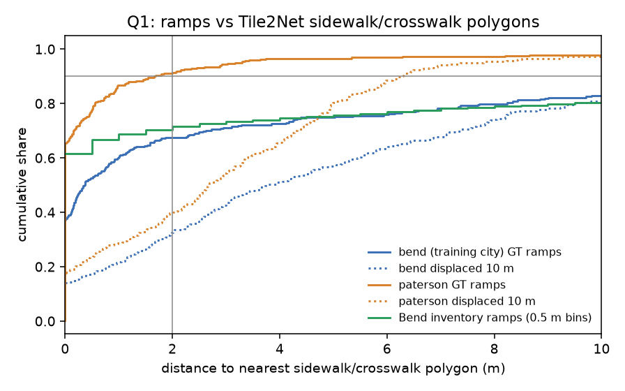
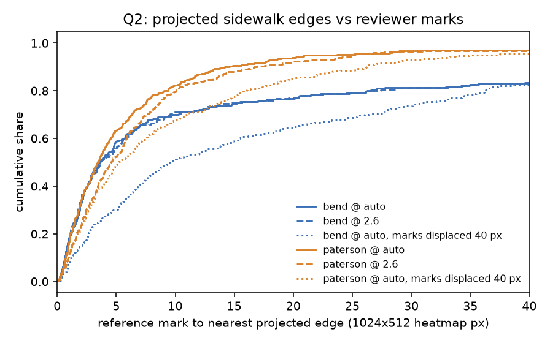
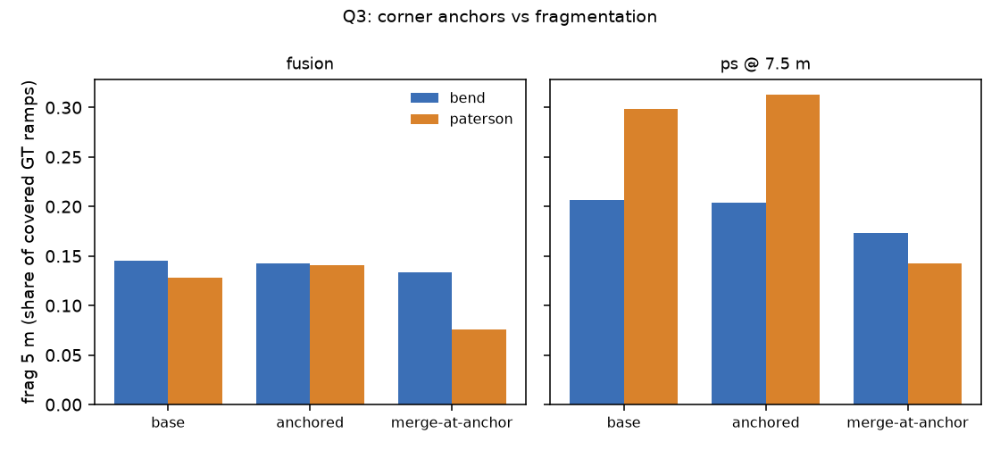
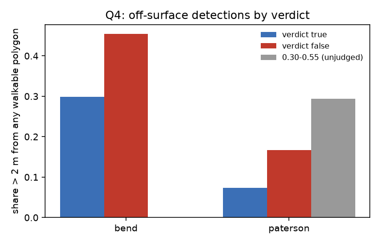

# Sidewalks from aerial imagery (Tile2Net), projected into panos (issue #104)

A study, not production. Nothing here is wired into the pipeline, and no dependency was
added to `requirements.txt`. Tile2Net runs in its own environment on the GPU host.
`scripts/aerial_sidewalks.py` reads its polygons as data.

**Bend is a RampNet training city.** Every Bend number built on RampNet GT or on the
run's detections carries that caveat. Paterson is the held-out city. The Bend inventory
(#79) is image-free.

The rules were pre-registered on #104 before any GT-joined number existed:
[#104 (comment)](https://github.com/ProjectSidewalk/sidewalk-auto-labeler/issues/104#issuecomment-5880437702).
They are committed as code in `q1_verdict`, `q3_verdict`, `q4_verdict` and the constants at
the top of the script
([54e8852](https://github.com/ProjectSidewalk/sidewalk-auto-labeler/commit/54e8852)).
The review of PR #109
([review](https://github.com/ProjectSidewalk/sidewalk-auto-labeler/pull/109#pullrequestreview-5407437329))
added a chance row to Q2 and a hole audit to Q1. Both are descriptive, and no answer changed.

## Answers

| question | pre-registered rule | answer |
|---|---|---|
| Q1 mask quality | USABLE iff ≥ 0.90 of Bend inventory ramps lie within 2 m of a sidewalk/crosswalk polygon | **NOT USABLE**: 0.703 (n = 12,504). Ramps installed before the 2019 flight: 0.859, still short |
| Q2 projection error | none (descriptive) | median 3.4 px (Paterson) and 3.6 px (Bend, training city) at `auto`, in 1024×512 heatmap px, against a chance floor of 5.2 and 9.6 px |
| Q3 corner anchors | an arm must cut frag 5 m by ≥ 0.03 in both cities, with coverage and dual separation each down ≤ 1 pt | **NO**: all four (base, arm) cells fail |
| Q4 precision signal | FILTER iff (i) ≥ 0.90 of true detections on surface in every city and (ii) pooled False − True off-surface share ≥ 0.15 with CI > 0; < 30 False → not established | **NOT ESTABLISHED (underpowered)**: only 17 False detections pooled. Clause (i) also fails in Bend (0.70). |

In short, Tile2Net's polygons fit the streets well where they exist. In Paterson they
contain or touch nine in ten ramps. Their projected edges land a median 3.4 px from a
reviewer mark, about 1.8 px closer than the same mark moved sideways. Bend's polygons are
too often missing, mostly because more than half of the far ramps were built after the
2019 flight. Even the ramps that predate it reach only 0.86. Corner anchors do not fix
fragmentation without merging dual ramps. The precision question cannot be answered at
this GT size.

## Q1: mask quality

Share of ramps within d of a sidewalk or crosswalk polygon (0 m inside). "Chance" is the
same points displaced 10 m in a seeded random direction.

| set | n | inside | ≤ 1 m | ≤ 2 m | ≤ 3 m | chance ≤ 2 m |
|---|---:|---:|---:|---:|---:|---:|
| Paterson GT ramps | 323 | 0.653 | 0.867 | **0.913** | 0.944 | 0.396 |
| Bend GT ramps (training city) | 298 | 0.373 | 0.604 | **0.675** | 0.711 | 0.326 |
| Bend inventory, all in area (the rule) | 12,504 | 0.464 | 0.667 | **0.703** | 0.726 | 0.217 |
| Bend inventory, visible pool (≤ 20 m from a pano) | 12,065 | 0.474 | 0.682 | 0.719 | 0.743 | 0.222 |
| Bend inventory, installed before 2019 | 8,789 | 0.587 | 0.828 | 0.859 | 0.877 | 0.263 |
| Bend inventory, installed 2019 | 383 | 0.347 | 0.535 | 0.601 | 0.637 | 0.146 |
| Bend inventory, installed 2020 or later | 2,653 | 0.098 | 0.176 | 0.225 | 0.261 | 0.087 |
| Bend inventory, install date unknown | 679 | 0.356 | 0.571 | 0.604 | 0.633 | 0.168 |
| Bend inventory, in an input with no polygon at all | 278 | 0 | 0 | 0 | 0 | 0 |
| Bend inventory, excluding those inputs | 12,226 | 0.474 | 0.682 | 0.719 | 0.742 | 0.222 |

The rows below the rule's are descriptive and post hoc (added in review); the rule reads
only "all in area".



- **The failure is missing polygons, not misplaced ones.** Most ramps sit inside or within
  1 m of a polygon. The rest are far away: Bend inventory ramps beyond 1 m have a median
  distance of 12.8 m (p90 122 m). The gallery shows the same thing. Where Tile2Net drew a
  Bend sidewalk, the projected edge hugs the curb.
- **Most of the missing polygons are newer than the imagery.** The inventory records an
  install date for each ramp. 2,056 of the 3,715 ramps more than 2 m from a polygon (55%)
  were installed in 2020 or later, after the 2019 flight. Only 0.225 of those post-flight
  ramps are within 2 m. An install date can also mark a rebuilt ramp on an existing corner,
  and that small share suggests few of them are. Ramps installed before the flight reach
  0.859. **That is still below the 0.90 bar, so the date gap does not rescue the mask.**
- **Empty inputs are new streets, not imagery or pipeline holes.** Tile2Net segments one
  stitched block of 4×4 z19 tiles (about 220 m in Bend) at a time. 25 of the 1,153 blocks
  that hold inventory ramps contain no polygon of any class, road included. They hold 278
  ramps (up to 36 in one block), and 274 of those were installed after 2019; the other 4 in
  2019. The imagery there is not blank. Bend has 1,565 blank tiles (two repeated byte
  patterns of 177 and 190 bytes), all in the north-west corner of the bounding box and
  outside the run's area polygon, and none lies in such a block. No inventory ramp sits on
  a blank tile, on a tile outside Tile2Net's grid or on a grid tile that was never fetched. All 3,264 stitched inputs were inferred. The review counted
  holes per z17 cell with no road polygon (503 ramps). Counted per Tile2Net input with no
  polygon of any class, the number is 278, and the conclusion is the same. Excluding them,
  the inventory reads 0.719.
- **Paterson would pass the bar that Bend fails.** In Paterson, 0.91 of GT ramps are within
  2 m, against a 0.40 chance floor. That is a dense Northeastern grid, like the cities in
  Tile2Net's paper. Bend is suburban and high-desert, and it grew fast after its 2019
  image.
- **By capture year (Bend GT, descriptive):** 2024 panos 0.68 (n = 245), 2018 panos 0.94
  (n = 16), 2019 panos 0.62 (n = 13). The bins are too small to read on their own. The
  inventory's install dates, above, are the stronger evidence for the date gap. Paterson
  (2020 orthos) shows no such pattern: 0.94 for 2025 panos (n = 133), 0.84 for 2024 panos
  (n = 69).
- Sidewalk polygons alone, without crosswalks, reach 0.86 (Paterson) and 0.63 (Bend)
  within 2 m. Tile2Net emitted no footpath polygons in either city, so "walkable" (Q4)
  equals sidewalk ∪ crosswalk here.

## Q2: projection error

The measure is the distance from each reference mark to the nearest projected
sidewalk/crosswalk edge, in 1024×512 heatmap px (1 px = 0.35°), in judged panos whose 25 m
disk is fully covered. **Chance** is the same mark moved 40 px (14°) left or right, with the
side seeded per mark, in the same pano and against the same edges.

| city | height | reference | marks | with an edge in range | px p50 | chance p50 | p50 − chance | px p90 | share ≤ 5 px (chance) | dy p50 |
|---|---|---|---:|---:|---:|---:|---:|---:|---|---:|
| Paterson | auto | all | 395 | 390 | 3.4 | 5.2 | −1.8 | 14.6 | 0.63 (0.48) | +0.3 |
| Paterson | auto | box centre | 109 | 109 | 3.9 | 4.3 | −0.4 | 18.9 | 0.60 (0.53) | +0.2 |
| Paterson | 2.6 m | all | 395 | 390 | 4.6 | 6.0 | −1.4 | 17.0 | 0.52 (0.43) | +1.4 |
| Paterson | 2.6 m | box centre | 109 | 109 | 5.1 | 5.5 | −0.5 | 24.8 | 0.49 (0.44) | +1.6 |
| Bend (training city) | auto | all (peaks + missed clicks) | 327 | 300 | 3.6 | 9.6 | −6.0 | 83.0 | 0.59 (0.30) | −0.4 |
| Bend (training city) | 2.6 m | all | 327 | 300 | 3.7 | 9.9 | −6.2 | 83.0 | 0.56 (0.32) | +0.0 |

"With an edge in range" is the number of marks whose pano has at least one projected edge
sample. Every px and share is over those marks only. The rest (5 in Paterson, 27 in Bend)
sit in panos with no sidewalk or crosswalk polygon within 25 m, which is Q1's missing
polygons again. Leaving them out flatters Bend.



- **Where a polygon exists, the projected edge lands closer to the ramp than chance.** In
  Paterson the margin is 1.8 px at the median. The metric mixes mask error with height,
  heading and GPS error by construction, so it is an upper bound on the projection error
  alone. A share of 0.63 within 5 px reads against a 0.48 chance floor.
- **The chance floor is high in Paterson because its edges are dense.** A point dropped
  anywhere near the street is already a median 5.2 px from some edge. Bend's sparser
  polygons put chance at 9.6 px.
- **The `auto` vs 2.6 m difference is mostly the metric, not the height.** The metric is
  the distance to the *nearest* edge. A lower camera height packs the projected edges
  closer together in the pano, which lowers the distance for any point. In Paterson, `auto`
  beats 2.6 m by 1.17 px over all marks, but chance moves by 0.83 px too, leaving 0.34 px
  that is specific to the ramps. At the box centres nothing is left (−0.39 vs −0.46 px).
  This is **not** independent support for #79's per-rig heights.
- **The dy shift is the better height evidence, and it is weak.** At 2.6 m the nearest
  edge sits a median 1.4 px lower in the pano than the mark (a larger dip below the
  horizon), against 0.3 px at `auto`. Too-tall a camera height pushes projected ground
  points down, so that shift has the expected sign. It is a sub-2-px shift on 390 marks,
  measured against a nearest-edge choice, so it is a consistency check rather than a test.
- Bend's p90 of 83 px is Q1's missing polygons again: the nearest edge is on another
  street.
- The galleries (20 seeded panos per city, `runs/<city>/aerial/gallery/index.html`,
  untracked because they hold pixels) show `auto` edges following curbs closely.

## Q3: corner anchors vs fragmentation

- **Anchors:** 5,815 in Paterson; 1,833 in Bend, where polygon contacts alone were
  available because Tile2Net's network step crashed (below).
- **How many ramps have an anchor nearby:** 0.54 of Paterson's GT pool ramps have an anchor
  within 3 m, but only 0.12 of Bend's (median distance 115 m). Bend paints few crosswalks.
- **Reproduction check:** the base rows reproduce the committed #106 offline `arms.csv`
  exactly.

| city | base | arm | clusters | coverage | frag 5 m | dual kept | same-pano pairs |
|---|---|---|---:|---:|---:|---:|---:|
| Paterson | fusion | base | 7,172 | 0.944 | 0.128 | 85/100 | 0 |
| Paterson | fusion | anchored | 7,172 | 0.944 | 0.141 | 85/100 | 0 |
| Paterson | fusion | merge-at-anchor | 6,197 | 0.777 | 0.076 | 31/100 | 1,768 |
| Paterson | ps @ 7.5 m | base | 8,383 | 0.944 | 0.298 | 85/100 | 0 |
| Paterson | ps @ 7.5 m | anchored | 8,383 | 0.941 | 0.313 | 84/100 | 0 |
| Paterson | ps @ 7.5 m | merge-at-anchor | 7,114 | 0.805 | 0.142 | 39/100 | 1,755 |
| Bend (training city) | fusion | base | 14,058 | 0.950 | 0.145 | 29/34 | 0 |
| Bend (training city) | fusion | anchored | 14,058 | 0.940 | 0.143 | 29/34 | 0 |
| Bend (training city) | fusion | merge-at-anchor | 13,851 | 0.930 | 0.134 | 26/34 | 495 |
| Bend (training city) | ps @ 7.5 m | base | 14,650 | 0.943 | 0.206 | 27/34 | 0 |
| Bend (training city) | ps @ 7.5 m | anchored | 14,650 | 0.940 | 0.204 | 27/34 | 0 |
| Bend (training city) | ps @ 7.5 m | merge-at-anchor | 14,354 | 0.930 | 0.173 | 24/34 | 484 |



- **Snapping (`anchored`) cannot merge anything.** Two clusters snapped to one corner are
  still two clusters, so frag 5 m does not move (±0.015).
- **Merging at the anchor does cut fragmentation, by merging real neighbours.** Paterson's
  fusion frag 5 m halves, but only by uniting the two ramps of a corner. Dual separation
  collapses from 85/100 to 31/100, coverage drops 17 pts, and 1,768 same-pano pairs land in
  one cluster. A corner has several ramps and one crosswalk end per crossing, so "one anchor
  per ramp" does not hold at this density.
- The polygon-contact-only sensitivity (`q3_polygon_anchors.csv`) reads the same.
- `q3_verdict` now rounds its deltas, so an exact 1-pt drop reads −0.01 and passes the
  tolerance (it read −0.010000000000000009 and failed). Only Paterson `ps @ 7.5 m /
  anchored` sits on that boundary (84/100 vs 85/100 dual), and it fails on frag 5 m anyway.

## Q4: precision signal

Scope: operational detections on judged panos, off-surface = more than 2 m from every
walkable polygon.

| city | true on surface | True off | False off | gap (False − True) | 95% CI | n True / False |
|---|---:|---:|---:|---:|---|---|
| Paterson | **0.927** | 0.073 | 0.167 | +0.094 | −0.098 to +0.545 | 233 / 6 |
| Bend (training city) | 0.701 | 0.299 | 0.455 | +0.155 | −0.132 to +0.492 | 244 / 11 |
| pooled | | | | +0.164 | −0.065 to +0.435 | 477 / 17 |



- **Only 17 detections were judged false** in the two benchmarks. That is below the
  pre-registered 30, so the answer is NOT ESTABLISHED, whatever the point estimate.
- **Clause (i) fails in Bend** (0.70), because Q1's missing polygons put three in ten real
  ramps "off surface". Even with more False detections, a Bend-quality mask would throw
  away real ramps.
- In Paterson, where the mask is good, True detections are on surface 93% of the time. The
  signal is not ruled out there. It needs a larger false set to test.
- Paterson's 0.30–0.55 band (17 detections, unjudged) is 0.29 off surface. Bend's run
  predates the storage floor and has no band.
- Tile2Net has no occlusion class, so the tree/awning share cannot be measured. In the
  gallery panos inspected by eye, the missing Bend sidewalks were not under canopy. The
  inventory's install dates (Q1) now point at the imagery date for most of them; the rest
  (pre-2019 ramps beyond 2 m) are the aerial model's or the mask's.

## What this cannot say

- **Two cities, one of them a RampNet training city.** Paterson is the only held-out GT,
  and only Bend has an inventory. The Q1 rule was read on Bend because that is where the
  image-free reference exists. Paterson's GT would pass the same 0.90 bar, but GT ramps are
  not an inventory.
- **Imagery dates:** Bend 2019, Paterson 2020, against mostly 2024–2025 panos. Bend's
  inventory install dates separate the date gap from the rest (Q1). Ramps that predate the
  flight still fall short of the bar. Whether that remainder is Tile2Net's training domain
  or something else cannot be told apart with one city of each kind.
- **Q2 mixes mask error with projection error.** It bounds the projection error from above
  and does not isolate it. Its nearest-edge metric also rewards dense edges, so compare
  rows only against their chance floor.
- **Q3's anchors come from crosswalk polygons.** Where crossings are unpainted (most of
  Bend) there are none. A curb-line or curb-return anchor would need a different
  extraction.
- **Default settings only:** Tile2Net ran with its default checkpoint and settings at zoom
  19. No zoom-20 run, no fine-tuning.

## Method

### Tile2Net

[Tile2Net](https://github.com/VIDA-NYU/tile2net) (BSD-3) segments orthorectified aerial
tiles into sidewalk, crosswalk, road and footpath polygons. It also writes a pedestrian
network, in WGS 84 as GeoParquet. Citation: Hosseini, M., Sevtsuk, A., Miranda, F., Cesar
Jr., R. M., and Silva, C. T. "Mapping the walk: A scalable computer vision approach for
generating sidewalk network datasets from aerial imagery." *Computers, Environment and Urban
Systems* 101 (2023).

- **Version and hardware:** 0.5.0 at commit `c737a4e8c8b907ee3c80739673c67140ce95483d`,
  with its default checkpoints. Their sha256 is recorded in `tile2net.json`, because the
  commit pins a download URL, not the bytes: `satellite_2021.pth` `745f8c09…` and
  `hrnetv2_w48_imagenet_pretrained.pth` `0efec102…`. It ran in its own uv venv
  (Python 3.12, torch 2.14 + CUDA 13) on the makelab2 A40.
- **Settings:** zoom 19 (about 0.3 m/px), 256 px tiles stitched 4×4 into 1024 px inputs
  (its defaults), `inference --local --eval test --dump_percent 0 --deterministic`.
- **Conversion:** `scripts/t2n_convert.py` converts the GeoParquet to GeoJSON (`f_type` +
  geometry, 7-decimal coordinates) and runs in the tile2net venv (it needs geopandas). It
  is byte-identical to the copy that produced the outputs (sha256 `ec9938b1…`). Its
  rounding is what `polygons_geojson_sha256` binds. Per-city provenance is in
  `runs/<city>/aerial/tile2net.json`: source, date, URL, terms, tile count, Tile2Net's
  tile grid, runtime and sha256s.
- **GPU memory.** Without `--deterministic`, Tile2Net turns on cudnn benchmark mode, and
  its algorithm probing peaks at about **34 GB** of VRAM whatever the input size (measured
  at stitch step 4 and 2). Three short runs (the Boston example and two 1 km² pilots, about
  50 s each) peaked there while another job held about 9 GB. That left about 3 GB free,
  below the 20 GB this shared GPU is meant to keep free. `--deterministic` disables the
  probing and peaks at **1.4 GB**, so every run that produced results used it.
  Determinism changes only which convolution algorithms are picked, not the model.

### Imagery: one deviation from the issue

The issue assumed Tile2Net's statewide sources covered both cities. New Jersey's does. The
**Oregon** source is commented out upstream ("Oregon also has some SSL issues"), and on
2026-09-28 the Oregon Statewide Imagery Program server's TLS certificate had expired two
days earlier. Fetching it without certificate verification was not done.

| city | imagery | date | how | tile hashes |
|---|---|---|---|---|
| Paterson | NJ Orthos Natural 2020 (Web Mercator cache, `maps.nj.gov/.../Orthos_Natural_2020_NJ_WM/MapServer`) | 2020 | Tile2Net's built-in `nj` source | hashed afterwards from the archived tiles (`tiles.tiles_sha256`); they bind the archive copy, not what the server sent |
| Bend | City of Bend 2019 imagery (`tiles.arcgis.com/tiles/JisFYcK2mIVg9ueP/.../City_of_Bend_2019_Imagery/MapServer`) | 2019 | standard z19 slippy tiles fetched by `scripts/aerial_fetch_tiles.py` (TLS verified, 4 workers), then `tile2net generate --input` | per tile at fetch (`fetch.tiles_sha256`) |

**Terms.** Both are public government map services, read without a login: NJ Office of
GIS for Paterson, City of Bend, OR for Bend. No licence was recorded with either fetch.
Both are cited and used for analysis only (`imagery_terms` in `tile2net.json`). The tiles
stay on the makelab2 archive and are not redistributed. The repo keeps only derived
statistics, and the derived polygons stay untracked, bound by sha256.

**Tile audit.** `tiles` checks each archived tile list against the digest in
`tile2net.json` and lists byte-identical tiles as blank (`tile_audit.json`,
`blank_tiles.csv`). Bend has 1,565 blank tiles in two repeated patterns; Paterson has none.
Tile2Net's own grid for Bend's `--input` run is shifted one tile from the fetched range:
the fetched west column and north row are not in it, and its south row was never fetched.
No inventory ramp falls on any of those tiles (`holes.json`).

**Date gap.** Bend's GSV panos are mostly from 2024 (84%), five years after its aerial
imagery. Paterson's largest share (48%) is from 2025, five years after its 2020 orthos.
Sidewalks and ramps built or rebuilt in between exist in the panos but not in the polygons.
Q1 therefore also reports GT by the capture year of each ramp's newest pano, and the Bend
inventory by its install date (descriptive; the rule is unchanged).

### Scoring frame

- **Camera height:** the production `auto` height (fuse_sites' per-rig GSV rule, #79),
  flat raycast, 25 m cap, rig mask on.
- **GT:** RampNet's judged benchmark panos at tier 0.55. Verdict-true detections and
  missed-ramp clicks are placed at that height and merged at 2.5 m, exactly as
  `eval_ps_clustering.py` does.
- **Classes:** surface = sidewalk ∪ crosswalk, walkable = surface ∪ footpath. Distance is 0
  inside a polygon.
- **Coverage:** everything is restricted to the Tile2Net coverage, which is each run's
  `area.geojson` bounding box. Q2 additionally keeps only panos whose whole 25 m disk lies
  inside it.

### Pedestrian network

Paterson's network was written (30,365 segments). Bend's network step failed after the
polygons were written: `centerline.exceptions.TooFewRidgesError` in
`pednet.create_crosswalk`, a degenerate crosswalk polygon. Bend therefore has polygons
only. Q3 anchors there come from polygon contacts alone, and Paterson is scored both ways.
`load_aerial` refuses a recorded network that is missing or altered: without it,
Paterson's anchors would quietly drop from 5,815 to 3,853.

### Runtime

| city | tiles (z19) | fetch | generate + inference to polygons | peak VRAM |
|---|---:|---|---|---|
| Paterson | 12,064 | Tile2Net's own downloader | 15.6 min | 1.4 GB |
| Bend | 52,480 | 42.6 min (4 workers) | 19.9 min (the network step then failed after 16.6 more min) | 1.4 GB |

### Where each number lives

All paths are under `runs/`; `<city>` is `bend` or `paterson`.

| number in this doc | file | column / key |
|---|---|---|
| Q1 table, sidewalk-only shares, year bins | `_summary/aerial/q1.csv` (and `<city>/aerial/q1.csv`, `report_q1.md`) | rows by `set` (`gt_all`, `inventory_all`, `inventory_installed_*`, `inventory_in_empty_inputs`, `gt_year_<y>`, `gt_all_sidewalk_only`); `share_within_*m`, `share_inside`, `chance_within_2m` |
| 12.8 m / 122 m (beyond 1 m) | `_summary/aerial/q1.csv` | `inventory_all`: `beyond_1m_p50`, `beyond_1m_p90` |
| 2,056 of 3,715; 278 ramps, 274 after 2019; 25 of 1,153 inputs; 0 on blank tiles | `bend/aerial/holes.json` (per input: `holes.csv`) | `ramps_beyond_2m_installed_after_imagery`, `ramps_beyond_2m`, `ramps_in_empty_inputs*`, `n_empty_inputs_with_ramps`, `n_inputs_with_ramps`, `ramps_on_blank_tiles` |
| 1,565 blank tiles, two patterns | `bend/aerial/tile_audit.json`, `blank_tiles.csv` | `n_blank_tiles`, `duplicate_hashes` |
| Q2 table, chance row, 5 / 27 marks without an edge | `_summary/aerial/q2.csv` (and `<city>/aerial/report_q2.md`) | `ref_kind` = `all` / `box`; `n`, `n_with_edge`, `px_p50`, `displaced_px_p50`, `p50_minus_displaced`, `px_p90`, `share_px_le_5`, `displaced_share_px_le_5`, `dy_px_p50` |
| Q2 per mark | `<city>/aerial/projection.csv` | `px`, `dx_px`, `dy_px`, `px_displaced` |
| 5,815 / 3,853 / 1,833 anchors; 0.54 / 0.12; 115 m | `_summary/aerial/q3_anchors.csv` | `n_anchors`, `n_anchors_polygon_only`, `pool_share_anchor_within_3m`, `pool_anchor_dist_p50` |
| Q3 table | `_summary/aerial/q3.csv` (sensitivity: `q3_polygon_anchors.csv`) | `n_clusters`, `coverage`, `frag5`, `dual_both`/`dual_pairs`, `same_pano_pairs` |
| Q4 table, 0.29 band | `_summary/aerial/q4.csv` | `true_on_share`, `true_off_share`, `false_off_share`, `gap`, `gap_lo`, `gap_hi`, `n_true`, `n_false`, `band_off_share` |
| every answer and gate reason | `_summary/aerial/verdict.json` | `Q1`…`Q4` |
| polygon counts, tile counts, sha256s, checkpoints, terms | `<city>/aerial/tile2net.json` | |

### Reproduce

1. **Inputs.** Copy `polygons.geojson` (and, for Paterson, `network.geojson`) from
   `makelab2:/projects/makeabilitylab/sidewalk-auto-labeler/runs/<city>/aerial/export/`
   into this checkout's `runs/<city>/aerial/`. `load_aerial` checks both against the
   sha256 in `tile2net.json` and refuses a missing network. The `--run-root` checkout must
   hold each city's `results.jsonl`, `area.geojson` and depth index (for `auto`),
   Paterson's `ps_streets.geojson` (#107) and Bend's `inventory_oracle/` snapshot (#79).
   `--benchmark-root` points at RampNet's `benchmark/`.
2. **Tile audit** (only needed if the tile lists change). Copy each archive tile list
   (`bend/aerial/tiles_cob2019/tiles.csv`, `paterson/aerial/tiles_nj2020_hashes/tiles.csv`)
   somewhere local, then:

   ```bash
   python scripts/aerial_sidewalks.py tiles bend --tiles-csv <copy of bend tiles.csv>
   python scripts/aerial_sidewalks.py tiles paterson --tiles-csv <copy of paterson tiles.csv>
   ```

3. **Scoring and figures:**

   ```bash
   python scripts/aerial_sidewalks.py gt bend paterson --run-root ../sidewalk-auto-labeler/runs
   python scripts/aerial_sidewalks.py project bend paterson --run-root ../sidewalk-auto-labeler/runs --gallery
   python scripts/aerial_sidewalks.py anchors bend paterson --run-root ../sidewalk-auto-labeler/runs
   python scripts/aerial_sidewalks.py precision bend paterson --run-root ../sidewalk-auto-labeler/runs
   python scripts/aerial_sidewalks.py verdict && python scripts/aerial_sidewalks.py figures
   ```

Every committed CSV, report, JSON and figure is regenerated byte-identically by these
commands (`--gallery` only adds the untracked gallery).

Figures: `docs/figures/aerial-sidewalks/` (`q1_distance_cdf.png`, `q2_edge_px_cdf.png`,
`q3_frag5.png`, `q4_off_surface.png`).
