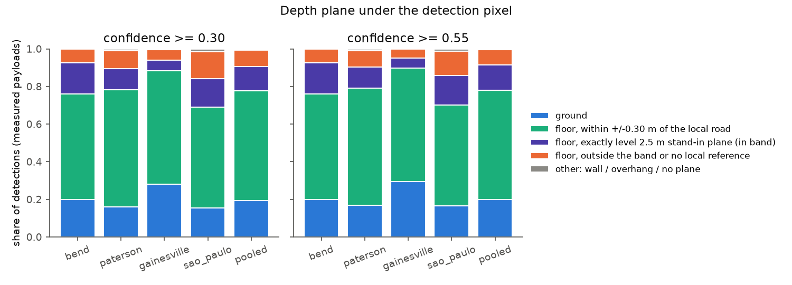
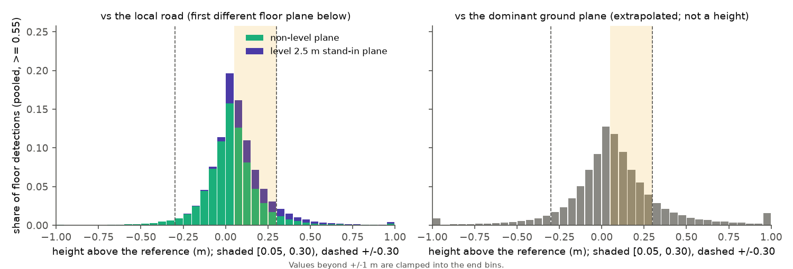
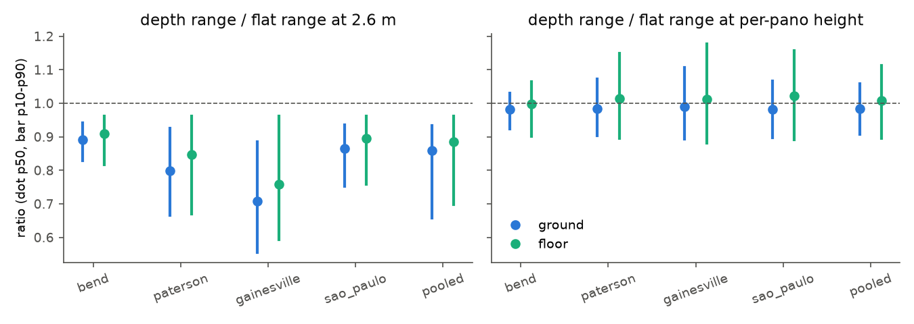
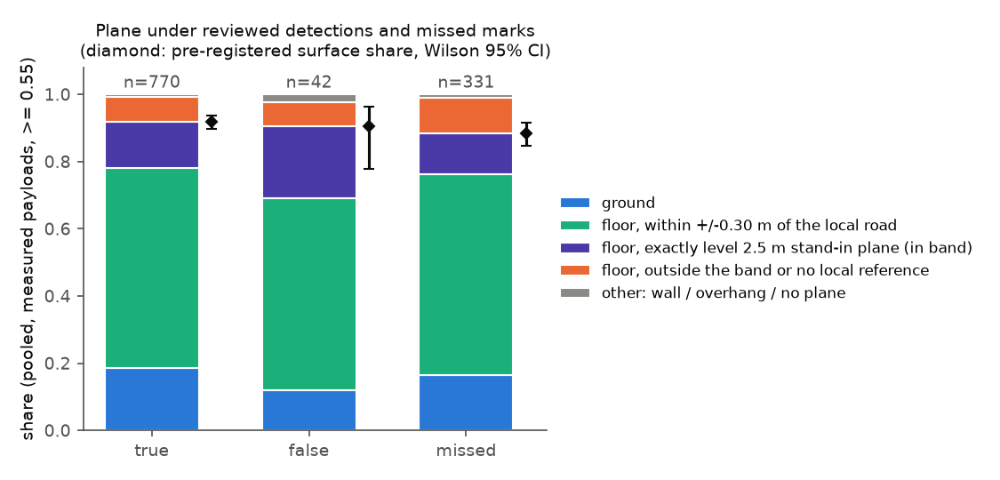

# Depth at the detection: does harvested GSV depth alone locate a curb ramp's surface?

**Issue:** [#47](https://github.com/ProjectSidewalk/sidewalk-auto-labeler/issues/47), step 1 — *take panos with a
RampNet detection and a harvested depth payload, read the modelled plane at the detection's pixel: is it a
near-horizontal plane at plausible range, how often is it "no plane", and does the ~0.15 m ramp-above-road offset
eat the signal?*
**Date:** 2026-09-26. **Branch:** `depth-at-detection-47`.
**Reproduce:** `scripts/depth_at_detection.py` (every number and figure below; see §9). **Tests:**
`tests/test_depth_at_detection.py` (the plane class in the image frame, the local height offset, the column walk,
the verdict rule), all on synthetic payloads.
**Pre-registration:** the plan comment on #47 fixed the classes, the offset definition, the bins and the reading
before any GT-conditioned number was computed. Commit `f895e20` put the reading into code (`verdict()`) together
with §1–4 below, before the full measurement ran; nothing in them changed afterwards. Everything marked
*exploratory* was added after the run and does not enter the verdict.

## 0. Summary

Over the four harvested GSV runs, 138,084 stored detections at ≥ 0.30 sit on 56,941 panoramas; 53,092 of those
panoramas have a payload, and 114,932 detections sit on a payload whose ground plane is `measured`. For each, the
depth plane under the detection's pixel was read in the image frame and classified.

1. **Depth never has "no plane" under a detection.** 0 of 114,932 at the pixel, 4 of 114,932 anywhere in the
   3x3 neighbourhood (all at ≥ 25 m). The issue's "how often is it −1" is answered: never, at any range. GSV
   models a surface under every below-horizon pixel a ramp detector fires on.
2. **The plane is almost always horizontal, and usually not the dominant one.** 19.5% of detections land on the
   dominant ground plane, 79.9% on another floor plane, 0.4% on a steep plane (median tilt 88.7°: walls) and
   0.2% on an overhang (0.30 tier, pooled; §5.1). A ramp is a separately segmented piece of ground.
3. **Rule (i), depth carries the surface: SUPPORTED.** 708 of 770 verdict-True detections on measured payloads
   (0.919, Wilson 0.898–0.937) are `ground` or a floor plane within ±0.30 m of the local road; every city clears
   0.80 (bend 0.934, paterson 0.898, gainesville 0.947, São Paulo 0.904). **Finding 6 qualifies it:** part of
   the surface is stand-in planes. Set aside the way the registration sets every other stand-in aside (out of
   the denominator), rule (i) still reads SUPPORTED (0.930); only if they are counted as failures does it fall
   to 0.782.
4. **Rule (ii), a free false-positive signal: NOT SUPPORTED.** The non-surface share is 0.095 (4 of 42, Wilson
   0.038–0.221) among verdict-False detections against 0.081 (62 of 770, 0.063–0.102) among True — a 1.5-point
   difference against a pre-registered 20. `underpowered` came out **false**: with the share near 10% the
   False interval is 18.3 points wide, under the 20-point margin, and even its upper end is only ~16 points
   above the True interval's lower end, so an effect of the registered size is not merely undetected but
   implausible. The reviewed false positives sit on the modelled surface as often as the real ramps do.
5. **The ~0.15 m ramp-above-road offset is not what depth shows for most ramps.** The median height of a True
   `floor` detection above the local road is **0.050 m** (95% CI 0.039–0.057), which falls 0.0002 m below the
   pre-registered [0.05, 0.30) band, so the descriptive claim reads *not consistent* — a knife-edge on the band
   edge, but decisively below 0.15 m. Over all 76,003 floor detections at ≥ 0.55 the median is 0.049 m
   (p10/p90 −0.11/+0.26 m); 31% sit within ±0.05 m of the road ("same surface, different segment") and 42% in
   the curb-height band.
6. **Exploratory, not part of the reading: a large share of the "floor" planes are Google's 2.500 m stand-in.**
   10–27% of floor detections (by city) sit on a secondary plane that is *exactly* level — the stand-in pattern
   `depth.SYNTHETIC_GROUND` tests on the dominant plane, here appearing as a secondary plane (15,757 of the
   15,771 at ≥ 0.55 are at exactly 2.5 m; `level_floor.csv`). On non-level floor planes the True median offset
   is **0.030 m** (0.018–0.040); on the stand-ins it is **0.148 m** (0.120–0.174). That offset is not a height
   of anything: it is the *local road's tilt* carried out to the hit point. Were the road level at its own
   height under the camera (median 2.354 m), the 2.5 m stand-in would sit ~0.14 m **below** it; the road's
   median 1.8° tilt, extrapolated from the camera's nadir out to a hit ~14 m away, adds ~+0.31 m (§5.2). That
   the net lands near 0.15 m is a geometric coincidence. How rule (i) reads without the stand-ins depends on
   how they are set aside, so both readings are given:
   - **excluded from numerator and denominator** — the registration's treatment of stand-ins, which are
     "reported apart, never pooled" (§4.1): True surface **0.930** (602 of 647; bend 0.942, paterson 0.918,
     gainesville 0.950, São Paulo 0.911), rule (i)'s arithmetic still **SUPPORTED**;
   - **counted as off-surface failures**: 0.782 (602 of 770; bend 0.742, paterson 0.779, gainesville 0.889,
     São Paulo 0.720), which would read NOT SUPPORTED.

   The registered verdict stands as registered. The first reading is the one consistent with it; the second is
   a lower bound for anyone who counts a stand-in hit as depth failing to locate the surface.
7. **Range.** The depth plane's horizontal range runs 0.86x (dominant ground) and 0.88x (other floors) of the
   flat 2.6 m raycast's, pooled; against the raycast at the pano's own depth-measured height the medians are
   0.98x and 1.01x (§5.3). By vintage, the new rig (paterson 2025, gainesville 2026) reads 0.73x and 0.69x
   (depth heights 1.88 and 1.80 m) and nearly every other vintage 0.88–0.92x (2.23–2.39 m; São Paulo 2021 is the exception, §5.3). This is the depth frame's own scale — the same frame that runs 6–16%
   short of the imagery (docs/camera-height-study.md) — so it corroborates the camera-height study's rig ranking
   without adding an independent scale.
8. **Missed ramps sit on the surface too.** 293 of 331 non-unsure missed marks on measured payloads (0.885,
   0.846–0.915) are surface (0.903 with the stand-ins excluded, 0.761 with them counted as failures): a
   depth-based miner for step 2 would find the modelled
   surface under the ramps the model misses about as often as under the ones it finds.

**Bottom line for #47.** Depth reliably says "there is modelled ground here" under a curb-ramp detection — never
sky, almost never a wall — and gives a usable range at its own height. It does **not** separate real ramps from
false positives, and its plane geometry does not resolve a ramp as a raised surface: most ramp pixels are a
separately segmented floor plane a few centimetres from the road, and the one population that reads ~0.15 m
up is Google's level stand-in plane, whose offset comes from the tilt of the road it is compared with. Step 2
needs the segmenter for the semantics; depth contributes the metric frame.

## 1. Background and goals

#47 proposes computing the *impedance region* (where an object's footprint meets the walkable surface) from
depth x sidewalk segmentation x detection, instead of inferring it from a click and a size formula. Its first step
is the cheapest: GSV's depth payload is Google's plane model of the scene (`depth.py`: a list of planes plus one
plane index per pixel of a 512x256 grid), and it models the **surface** while omitting objects. A curb ramp is
part of the surface, not an object on it, so for this class depth alone may already be enough. The
sidewalk-panorama-tools notes on the same payload say two things that bear on that: "no plane" (index 0) means sky
or anything unmodelled, and curb ramps sit ~0.15 m above the modelled road surface rather than appearing as their
own geometry.

**Goals.** (G1) Measure, for every stored detection on a pano with a payload, what the depth model puts under its
pixel. (G2) Measure how far a ramp's plane sits above the road beside it. (G3) Measure the horizontal range the
plane gives, against the flat-ground raycast. (G4) Against RampNet ground truth: does depth carry the surface for
real ramps, and does it separate false positives for free?

## 2. Research questions

| | Question | Answered by |
|---|---|---|
| RQ1 | What plane is under a detection — the dominant ground, another floor plane, a wall, an overhang, or nothing? How often nothing? | plane class per detection, by city, tier, vintage, and range (§5.1) |
| RQ2 | When the plane is a secondary floor plane, how high above the local road is it? Is it ~0.15 m? | `offset_local` of `floor` detections (§5.2) |
| RQ3 | Is the plane's range plausible, and how does it compare with the flat raycast at 2.6 m and at the depth-measured height? | `ratio_flat`, `ratio_pp` (§5.3) |
| RQ4 | Do verdict-True detections sit on the surface? Do verdict-False detections sit off it more often? | pre-registered rules (i) and (ii) (§5.4) |

## 3. Data

The four GSV runs whose depth was harvested (`scripts/harvest_depth.py`, #41) — bend, paterson, gainesville,
sao_paulo — read in place and not modified, and RampNet's benchmark bundles for the same cities
(`../RampNet/benchmark/<city>/{verdicts.json,records.jsonl}`, read as data). The per-city coverage table (panos
with a detection, with a payload, by payload status) is in §5.0 and `coverage.csv`. Not every pano has a payload:
gap-fill panos (#32) were added after the harvest, most of them in sao_paulo.

## 4. Methods

### 4.1 Unit and tiers

Every stored detection at or above `OPERATIONAL_CONFIDENCE` (0.30), reported at 0.30 and at
`BENCHMARK_CONFIDENCE` (0.55). bend predates the storage floor, so its stored detections are all ≥ 0.55 and its
two tiers coincide. The payload's status is `depth.classify_height`'s (`measured`, `synthetic_ground`,
`degenerate`, `no_ground`, `implausible`, `unparsed`, plus `no_file` when no payload was harvested). **Only
`measured` payloads enter the headline shares and both rules**; the others are reported apart, never pooled
with them.

### 4.2 Frames: image-frame lookup, exact ray

Detections are stored in the image frame (x from the left of the panorama JPEG), and a raw depth-index column is
an image column (#80). The plane lookup is `depth._plane_at(payload, x, y)` in that frame. `depth.depth_at` is
never used: it takes streetlevel's mirrored raster frame and snaps the ray to a pixel centre, worth up to 6.6% of
range near the horizon. Only the plane lookup is quantized, which is correct because the segmentation is per
pixel; the hit point is the exact ray `depth._direction_continuous(x, y)` intersected with that plane, and the
horizontal range is computed exactly as `depth.ground_range_at` computes it (the tests assert equality). Depth
frame: +z is down.

### 4.3 Plane class

| class | rule |
|---|---|
| `no_plane` | index 0 at the pixel |
| `ground` | the pixel's plane is the dominant ground plane (`gsv_ground_plane.dominant_ground`, cross-checked against `depth.ground_plane` on every payload) |
| `floor` | another plane meeting `ground_plane`'s candidate rule: tilt ≤ `GROUND_MAX_TILT_DEG` (18°), ≥ 90% of its pixels below the horizon |
| `horizontal_nonfloor` | tilt ≤ 18° but fails the below-horizon share (an overpass or awning underside) |
| `non_horizontal` | tilt > 18° (the tilt is reported; a wall reads ~90°) |

"No plane" is also reported in the 3x3 payload-pixel neighbourhood (rows clamped, columns wrapping the seam),
binned by flat range (0–5, 5–10, 10–15, 15–20, 20–25, ≥ 25 m, and above the raycast horizon), so a zero at the
pixel is measured rather than assumed and a detection on a plane boundary is visible.

### 4.4 Height above the local road (primary) and above the dominant plane (secondary)

For a `floor` detection, P is the exact ray's hit on its plane. The **local reference** is the first floor-candidate
plane *different* from the detection's own, met walking the detection's payload column down toward the nadir —
the road in front of the ramp. `offset_local = z_ref(P_x, P_y) − P_z`, positive = above the road (both planes are
floor planes, so each is the one below the camera: `n·X = d·sign(n_z)`). `offset_dominant` does the same against
the dominant ground plane and is reported for completeness only: extrapolating a plane with the typical 1.5° tilt
over 20 m moves it about 0.5 m, so it is not a height. Differences of perpendicular distance (`ground.d − plane.d`)
are not height offsets and are not used. Bins: < −0.30, [−0.30, −0.05), [−0.05, 0.05) ("same surface, different
segment"), **[0.05, 0.30) = the curb-height band**, ≥ 0.30 m.

A `floor` detection whose column walk finds no reference has no `offset_local`. It is outside the surface band and
counts as `non_surface` (a clarification made while implementing, before any GT-conditioned number was computed;
the plan's probe found 2 such of 2,478 floor hits).

### 4.5 Range instrument

For `ground` and `floor`, `ratio_flat = range_depth / range_flat(2.6 m)` (`geo.detection_ground_point`,
`apply_pose=False`, `geo.DEFAULT_CAMERA_HEIGHT_M`) and `ratio_pp` against the flat raycast at the pano's own
depth-measured height (the harvested `depth/index.csv` through `fuse_sites.load_depth_index`; these runs predate
the #40 block fields). `ground` has `ratio_pp` ≈ 1 by construction, so the two classes are quoted separately.
Ratios are taken over rays the production raycast places (≤ 25 m, below `MIN_DEPRESSION_RAD`); the rest keep
their depth range and are counted as `beyond_25m`. Class shares and ratio medians are also reported per
(city, capture year) where the cell has ≥ 300 detections.

### 4.6 The GT join

Benchmark tier only (every bundle was exported and reviewed at 0.55). Panos come from `eval_sites.judged_gt_panos`,
so the drift gate and skip rules — and so the denominators — are eval_sites' and mined_precision's. Groups:
verdict-True detections, verdict-False detections, and non-unsure missed marks (`missed[].x/.y` are normalized
image-frame coordinates, the frame `x_normalized` is in, and are classified with the same lookup). `unsure` and
`duplicate` verdicts and unsure marks are counted apart. Intervals are Wilson 95% (`eval_sites.wilson`); the median
offset's interval is the distribution-free binomial order-statistic one.

### 4.7 The pre-registered reading, operationalised

In `verdict()` (committed before the full run), on `measured` payloads at the benchmark tier:

- **(i) Depth carries the surface.** `surface` = `ground`, or `floor` with −0.30 ≤ `offset_local` < 0.30.
  **SUPPORTED** iff the pooled surface share of verdict-True detections is ≥ 0.85 and ≥ 0.80 in every city;
  **UNDERCUT** iff pooled < 0.70; otherwise **NOT SUPPORTED**. The 0.15 m claim is read descriptively: the median
  `offset_local` of True `floor` detections, with its CI, is "consistent" if it lies in [0.05, 0.30).
- **(ii) A free false-positive signal.** `non_surface` = everything else (`no_plane`, `non_horizontal`,
  `horizontal_nonfloor`, `floor` outside ±0.30 m or with no local reference). **SUPPORTED** iff the pooled
  non_surface share among verdict-False detections exceeds the True share by ≥ 20 points AND the False share's
  Wilson lower bound exceeds the True share's upper bound; otherwise **NOT SUPPORTED**. `underpowered: true` is
  printed when the False share's Wilson 95% interval is wider than the 20-point margin: a null is then weak
  evidence. With the pooled verdict-False count near 49, it will be.
- Reported without a gate: missed marks against True on the same classes (a depth-based miner for step 2 needs the
  surface to be there for the ramps the model misses, too).

## 5. Findings

All tables are in `docs/figures/depth-at-detection/data/` (file named per table). "Measured" = measured payloads
only; "pooled" = the four cities' detections together.

### 5.0 Coverage (`coverage.csv`)

| City | Panos with a detection ≥ 0.30 | … with a payload | Detections ≥ 0.30 | ≥ 0.55 | On a measured payload (≥ 0.30) | Stand-in dominant ground | No payload |
|---|---:|---:|---:|---:|---:|---:|---:|
| bend | 20,613 | 20,607 | 51,543 | 51,543 | 45,219 | 6,273 | 18 |
| paterson | 12,820 | 12,789 | 35,110 | 29,756 | 32,188 | 2,837 | 81 |
| gainesville | 11,457 | 10,467 | 24,082 | 15,574 | 19,664 | 2,192 | 2,199 |
| sao_paulo | 12,051 | 9,229 | 27,349 | 16,159 | 17,861 | 3,003 | 6,463 |
| **total** | 56,941 | 53,092 | 138,084 | 113,032 | 114,932 | 14,305 | 8,761 |

The rest are `degenerate` (42 detections) and `implausible` (44). No payload failed to parse. bend's two tiers
coincide (it predates the storage floor). The "no payload" detections are on gap-fill panoramas (#32) added after
the harvest.

### 5.1 RQ1 — what plane is under a detection (`class_shares.csv`, `no_plane_by_range.csv`, fig. 1)



| Measured, ≥ 0.30 | n | ground | floor | horizontal non-floor | non-horizontal | no plane | surface |
|---|---:|---:|---:|---:|---:|---:|---:|
| bend | 45,219 | 0.199 | 0.801 | 0.0003 | 0.0003 | 0 | 0.926 |
| paterson | 32,188 | 0.160 | 0.831 | 0.0034 | 0.0061 | 0 | 0.895 |
| gainesville | 19,664 | 0.281 | 0.716 | 0.0007 | 0.0022 | 0 | 0.940 |
| sao_paulo | 17,861 | 0.155 | 0.829 | 0.0029 | 0.0133 | 0 | 0.842 |
| pooled | 114,932 | 0.195 | 0.799 | 0.0016 | 0.0042 | 0 | 0.907 |
| pooled, ≥ 0.55 | 95,595 | 0.199 | 0.797 | 0.0011 | 0.0031 | 0 | 0.916 |

- **No plane: zero.** Not one of 114,932 detections has index 0 at its pixel, in any range bin (0–5 m through
  ≥ 25 m and above the raycast horizon). In the 3x3 neighbourhood, 4 do — 3 in paterson, 1 in São Paulo, all ≥ 25
  m. The other payload statuses show the same (stand-in-ground payloads: 0 of 14,305).
- **Non-horizontal** planes are walls (median tilt 88.7°) and are rare everywhere; São Paulo's 1.3% is the most.
- **Floor, not ground.** Four in five detections sit on a floor plane other than the dominant one; these are small
  (median pixel share 0.9–1.9% of the image). A curb ramp is a separately segmented piece of ground.
- `surface` (the rule (i) definition: ground, or floor within ±0.30 m of the local road) is 0.84–0.94 of all
  detections by city — the same order as on verdict-True detections (§5.4), which is the first sign that the
  class does not separate true from false.

Per capture year (`class_by_year.csv`, cells ≥ 300), the surface share is flat within a city (0.87–0.95 for
bend, paterson, gainesville; 0.83–0.86 for São Paulo 2022–25) except São Paulo 2021 (0.71, n = 573, with 4.2% overhang
hits).

### 5.2 RQ2 — height above the local road (`offset_bins.csv`, `offset_hist.csv`, fig. 2)



A local reference was found for 76,003 of 76,157 floor detections at ≥ 0.55 (99.8%), a median 7 payload rows
further down the column (6 for non-level planes, 12 for the stand-ins).

| Floor, ≥ 0.55, pooled | n | < −0.30 | [−0.30, −0.05) | [−0.05, 0.05) | **[0.05, 0.30)** | ≥ 0.30 | median (95% CI) | p10 / p90 |
|---|---:|---:|---:|---:|---:|---:|---|---|
| vs local road | 76,003 | 2.2% | 17.1% | 31.0% | 42.0% | 7.7% | 0.049 (0.048–0.050) | −0.114 / 0.261 |
| vs dominant plane (not a height) | 76,157 | 6.4% | 19.7% | 22.0% | 37.8% | 14.1% | 0.058 (0.056–0.059) | −0.208 / 0.376 |
| *exploratory:* non-level planes | 60,246 | 2.6% | 20.9% | 33.5% | 37.9% | 5.1% | 0.031 (0.030–0.033) | −0.135 / 0.211 |
| *exploratory:* exactly level (stand-in) | 15,757 | 0.5% | 2.5% | 21.4% | 58.1% | 17.6% | 0.129 (0.127–0.132) | 0.013 / 0.390 |

- The distribution against the local road is centred a few centimetres above it with a long positive tail. The
  dominant-plane column is wider in both directions, as the plan expected: a 1.5° plane extrapolated over 20 m
  moves 0.5 m.
- Per city the local median is 0.034 (gainesville) to 0.061 m (São Paulo).
- **What `offset_local` contains.** It is the reference plane evaluated *under the hit point*, so besides any
  real step it includes the reference's tilt extrapolated from where the column walk met it (a median 6 payload
  rows nearer the camera for non-level planes, 12 for stand-ins) out to the hit. `level_floor.csv` splits it,
  per city and split, into the offset the plane would have against a *level* reference at the reference's own
  height under the camera (`offset_level_ref`) and the rest (`offset_ref_tilt_term`, the reference's tilt
  carried from the nadir to the hit). For non-level planes the tilt term is small (median −0.03 m pooled at
  ≥ 0.55); for the stand-ins it is the whole story (below).
- **The stand-in planes (exploratory).** 10.1% (gainesville) to 26.8% (São Paulo) of floor detections sit on a
  secondary plane whose normal is *exactly* vertical, and 15,757 of those 15,771 (≥ 0.55, pooled) sit at a
  perpendicular distance of exactly 2.5 m (`level_floor.csv`, `n_plane_d_exactly_2p5`; the test is on the
  normal, as `SYNTHETIC_GROUND`'s is, and the distance confirms it). That is the stand-in `depth.SYNTHETIC_GROUND`
  detects on the dominant plane, appearing here as a secondary plane inside payloads whose dominant ground is
  measured. Its offset (median 0.13 m, most of it in the curb band) is **not** the stand-in's default height
  against a measured road. The local road under it sits a median 2.354 m under the camera with a median tilt of
  1.81°. Against that road held level, a 2.5 m plane is ~0.14 m *below* it (`offset_level_ref` median −0.144 m;
  −0.134 to −0.198 by city); the road's tilt, carried from the nadir out to the hit (median depth range 14.4 m),
  adds a median +0.306 m; the net is the observed +0.13 m. The sign comes from the road's tilt, and a net near the
  folklore's 0.15 m is a coincidence of that tilt and that range, not a measurement of anything on the street.
  On real (non-level) planes the median is 0.031 m.

### 5.3 RQ3 — range against the flat raycast (`range_ratio.csv`, `class_by_year.csv`, fig. 3)



| Measured, ≥ 0.30 | class | n placed (≤ 25 m) | beyond 25 m / horizon | ratio_flat p10 / **p50** / p90 | ratio_pp p10 / **p50** / p90 |
|---|---|---:|---:|---|---|
| bend | ground | 8,940 | 37 | 0.83 / **0.89** / 0.94 | 0.92 / **0.98** / 1.03 |
| bend | floor | 34,577 | 1,639 | 0.82 / **0.91** / 0.96 | 0.90 / **1.00** / 1.06 |
| paterson | ground | 4,948 | 190 | 0.67 / **0.80** / 0.93 | 0.90 / **0.98** / 1.07 |
| paterson | floor | 21,596 | 5,151 | 0.67 / **0.85** / 0.96 | 0.90 / **1.01** / 1.15 |
| gainesville | ground | 5,248 | 281 | 0.56 / **0.71** / 0.88 | 0.89 / **0.99** / 1.11 |
| gainesville | floor | 11,777 | 2,302 | 0.59 / **0.76** / 0.96 | 0.88 / **1.01** / 1.18 |
| sao_paulo | ground | 2,688 | 71 | 0.75 / **0.86** / 0.94 | 0.90 / **0.98** / 1.07 |
| sao_paulo | floor | 13,737 | 1,075 | 0.76 / **0.90** / 0.96 | 0.89 / **1.02** / 1.16 |
| pooled | ground | 21,824 | 579 | 0.66 / **0.86** / 0.93 | 0.91 / **0.98** / 1.06 |
| pooled | floor | 81,687 | 10,167 | 0.70 / **0.88** / 0.96 | 0.90 / **1.01** / 1.11 |

- Against the flat raycast at 2.6 m, depth ranges run 10–30% short, city by city, in the rig order the camera-height
  study found. Against the raycast at the pano's own depth-measured height the medians sit at 0.98–1.02: depth's
  range and depth's height agree, as they must, since both are in the depth frame. So this is a **third reading of
  the depth frame's scale**, not an independent referee of the imagery's (the depth frame is 6–16% short of the
  imagery's height; docs/camera-height-study.md).
- **The floor class's p90 of `ratio_flat` is exactly 0.9615 = 2.5 / 2.6 in every city.** That is the stand-in
  plane again (§5.2): a detection on a level 2.5 m plane has a range exactly 2.5/2.6 of the flat raycast's.
- By vintage (`class_by_year.csv`), `ratio_flat` is 0.73 (paterson 2025) and 0.69 (gainesville 2026) on the new
  rig, with depth heights 1.88 and 1.80 m, and 0.88–0.92 on every other vintage (heights 2.23–2.39 m), except
  São Paulo 2021 (0.88 at a 1.73 m median height, `ratio_pp` 1.09 — its detections' planes are not the plane the
  height was read from; n = 573).
- 11% of floor detections at ≥ 0.30 (10,167) are beyond 25 m or above the horizon under the flat raycast and are
  kept out of the ratios; paterson has the most (19%).

### 5.4 RQ4 — against RampNet ground truth (`gt_classes.csv`, `gt_counts.csv`, `verdict.json`, fig. 4)



All 485 GT panoramas passed the drift gate (0 skipped, 0 partial, 0 warnings). Of 897 verdict-True detections,
770 are on measured payloads; the other 127 are on stand-in-ground payloads (125 of them surface) and stay out, as
registered. Likewise 42 of 49 verdict-False and 331 of 378 non-unsure missed marks.

| Measured, ≥ 0.55 | True n | True surface (Wilson 95%) | False n | False non-surface | Missed n | Missed surface |
|---|---:|---|---:|---|---:|---|
| bend | 198 | 185 = 0.934 (0.891–0.961) | 7 | 0 | 56 | 0.875 |
| paterson | 244 | 219 = 0.898 (0.853–0.930) | 5 | 0 | 116 | 0.845 |
| gainesville | 171 | 162 = 0.947 (0.903–0.972) | 9 | 1 | 78 | 0.936 |
| sao_paulo | 157 | 142 = 0.904 (0.848–0.941) | 21 | 3 | 81 | 0.901 |
| **pooled** | **770** | **708 = 0.919 (0.898–0.937)** | **42** | **4 = 0.095 (0.038–0.221)** | **331** | **0.885 (0.846–0.915)** |

**Rule (i): SUPPORTED** — pooled 0.919 ≥ 0.85 and every city ≥ 0.80. The 62 non-surface True detections are
floor planes ≥ 0.30 m above the road (42), ≤ −0.30 m (13), walls (4), floor with no reference (2) and an overhang
(1). The ~0.15 m claim: the median `offset_local` of True floor detections is **0.050 m (0.039–0.057) — "not
consistent"**, by 0.0002 m at the band's lower edge; its interval straddles 0.05 and lies wholly below 0.15.

**Rule (ii): NOT SUPPORTED** — False non-surface 0.095 against True 0.081 (0.063–0.102): +1.5 points, not +20,
and the intervals overlap. **`underpowered: false`**: the False interval is 18.3 points wide, inside the 20-point
margin. The plan expected ~26 points at n = 49, assuming a share near one half; at a share near a tenth the Wilson
interval is narrower. Even taking both intervals' far ends (0.221 − 0.063) the gap is 15.8 points, short of the
registered 20: the null is informative, not just unpowered.

**Missed marks (no gate):** 0.885 surface against True's 0.919, the same classes in the same proportions.

**Exploratory, NOT part of the reading** (`verdict.json` → `exploratory_level_floor`). Detections on exactly
level secondary planes (§5.2) set aside, in two readings:

| True surface share | pooled | bend | paterson | gainesville | São Paulo | rule (i) arithmetic | False | missed |
|---|---:|---:|---:|---:|---:|---|---:|---:|
| as registered | 0.919 (708/770) | 0.934 | 0.898 | 0.947 | 0.904 | SUPPORTED | 0.905 | 0.885 |
| stand-ins **excluded** (numerator and denominator) | **0.930** (602/647) | 0.942 | 0.918 | 0.950 | 0.911 | **SUPPORTED** | 0.906 | 0.903 |
| stand-ins **counted as failures** | 0.782 (602/770) | 0.742 | 0.779 | 0.889 | 0.720 | NOT SUPPORTED | 0.690 | 0.761 |

The exclusion reading leads because it is the registration's own treatment of a stand-in: a payload whose
dominant ground is the stand-in is "reported apart, never pooled" (§4.1), and a stand-in under the pixel is the
same thing one plane down. The failure reading treats a stand-in hit as depth failing to locate the surface; it
is a lower bound, not the reading. The True floor median is 0.030 m (0.018–0.040) on non-level planes and 0.148 m (0.120–0.174) on the
stand-ins. Unsure verdicts (47 measured) and unsure marks (162) sit at 0.83 surface; the 4 duplicates are too few
to read.

## 6. Discussion

**What depth gives a curb-ramp detection.** A guarantee that the pixel is modelled ground (never sky, almost never
a wall), a floor plane of its own four times in five, and a range consistent with the depth frame's own height.
That is exactly the "surface" half of #47's decomposition. What it does not give is *discrimination*: a false
positive sits on the modelled surface as often as a ramp (rule ii), and the geometry of the plane under a ramp is
indistinguishable from the road's within a few centimetres for most ramps. The segmentation that separates a
ramp's plane from the road's exists — floor is its own plane 80% of the time — but its *height* carries no ramp
signal beyond ~3 cm on real planes.

**The 0.15 m folklore.** sidewalk-panorama-tools' `docs/depth.md` says curb ramps "sit ~0.15 m above the modelled
road surface, so rays overshoot them by roughly 0.5 m". On real planes the offset is ~0.03 m; the population that
reads ~0.13–0.15 m up is the exactly level 2.5 m stand-in, and there the number is the tilt of the road it is
compared with, carried out to the hit (level, the stand-in would sit ~0.14 m *below* the road; §5.2). Whether
that tool's figure was read off the same stand-ins is a guess this study cannot check; what it shows is that
no measured population of ramp planes sits ~0.15 m up. A ray overshoot of ~0.5 m should not be attributed to
ramp height.

**Rule (i) and the stand-ins.** The registered surface definition counts any floor plane within ±0.30 m of the
local road, and a stand-in plane usually lands there (a fixed 2.5 m plane against a measured road 2.3–2.4 m
under the camera, compared at street range, is within a few tenths of a metre of it). Setting the stand-ins
aside as the registration sets stand-ins aside — out of the denominator — rule (i) stays SUPPORTED (0.930, every
city ≥ 0.91). Counting each stand-in hit as a failure instead gives 0.782, so quote (i) with the qualifier that
16% of True detections (123 of 770) sit on a stand-in rather than a measured plane. The rule's thresholds were
not revisited.

**For the cropper's size rule** (ProjectSidewalk/sidewalk-panorama-tools#32 / #54): `range_depth_m` is available
under every detection and never missing; it is in the depth frame (`ratio_pp` ≈ 1), so as a distance input it
needs the same per-rig scale question the camera-height study left open, and a stand-in plane gives a range scaled
by 2.5 m rather than a measurement.

**For step 2.** The miner's premise holds (missed ramps sit on modelled surface 88% of the time), but depth adds no
ramp-vs-not evidence; the semantics have to come from the segmenter.

## 7. Answers to the issue's step-1 questions

- *Is it a near-horizontal plane at plausible range?* Yes: 99.4% horizontal; range consistent with the depth
  frame's height (median ratio 0.98–1.02).
- *How often is it −1?* Never at the pixel (0 of 114,932); 4 in the 3x3 neighbourhood, all ≥ 25 m.
- *Does depth carry the surface for our binding class?* Pre-registered rule (i): SUPPORTED (0.919), with the
  stand-in qualifier: 0.930 with the stand-in hits excluded (still SUPPORTED), 0.782 if they are counted as
  failures.
- *Does the ~0.15 m offset eat it?* No — the offset on real planes is ~0.03 m; the population reading ~0.15 m is
  Google's level stand-in, and its offset is the reference road's tilt, not a raised surface.
- *A free false-positive signal?* No (rule ii NOT SUPPORTED, not underpowered).

## 8. Recommendations

1. **Do not build a depth-based FP filter** for curb ramps from the plane class or height; rule (ii) rules it out
   at this effect size.
2. **Treat exactly level secondary planes as unmeasured**, as `depth.py` already does for the dominant plane,
   in any consumer that reads a plane under a pixel (a range for the cropper, a surface test for step 2).
   The same gap reaches a production field: `depth.classify_height` tests only the *dominant* plane for the
   stand-in (`exactly_level`), but `height_spread_m` — the per-pano spread used as a height sigma since #44 — is
   a weighted percentile over *all* ground candidates, so a secondary 2.5 m stand-in enters it on the 10–27% of
   payloads that carry one. The follow-up helper should exclude exactly level secondary planes from that
   spread too, and say how much it moves.
   *TODO (not done here, out of scope): a `depth.py` helper for both belongs in its own PR.*
3. **Step 2 proceeds on the segmenter** for semantics; depth supplies metric range and a surface prior.
4. **Follow-up measurement** (not this step): re-run the lookup at the box bottom-centre of the paterson and São
   Paulo `boxes.json` (ProjectSidewalk/RampNet#83) instead of the heatmap peak — the ground-contact line is where a
   surface test is meant to be read.

## 9. Reproducibility

Everything reads `runs/<city>/{results.jsonl,depth/}` (from `--run-root`, read-only) and
`../RampNet/benchmark/<city>/`, writes per-detection CSVs to `runs/<city>/depth_at_detection/` and the aggregates
to `runs/_summary/depth_at_detection/` (both gitignored), and figures to `docs/figures/depth-at-detection/`.
Stdlib on top of `depth.py`, `geo.py`, `fuse_sites.py`, `eval_sites.py`, `gsv_ground_plane.py`,
`mapillary_tilt.py`; `figures` needs matplotlib. No network, no GPU. `measure` read 53,092 payloads in 9.4
minutes on 14 processes (the plan estimated ~5 minutes on 8); `gt` takes ~30 s; the rest run in seconds.

```bash
python scripts/depth_at_detection.py measure --limit 500   # smoke: first 500 panos per city -> detections.limit.csv, no summaries
python scripts/depth_at_detection.py measure               # all four cities (run first)
python scripts/depth_at_detection.py gt                    # the GT join; needs ../RampNet/benchmark
python scripts/depth_at_detection.py verdict               # the pre-registered reading -> verdict.json
python scripts/depth_at_detection.py figures               # copies the aggregates to docs/figures/.../data/, redraws
pytest tests/test_depth_at_detection.py tests/test_depth.py
```

`figures` copies the aggregates in `runs/_summary/depth_at_detection/` to `docs/figures/depth-at-detection/data/`
(committed) and redraws from them; `verdict` and `figures` fall back to the committed copies, so every table above
can be checked from a fresh clone. `measure --summaries-only` rebuilds the aggregates from the per-city
`detections.csv` without re-reading any payload, and refuses when a city's row count disagrees with
`coverage.csv`; a `--limit` smoke run writes `detections.limit.csv`, so it can never stand in for the full
file. The per-detection CSVs (`runs/<city>/depth_at_detection/`) are
not committed (tens of MB).

**Deviations from the plan, all minor:** (1) a floor detection with no local reference counts as non-surface
(clarified in code before the full run, §4.4); (2) the payload status list includes `implausible`, which
`classify_height` returns and the plan's list omitted; (3) the ratio medians are taken over rays the production
raycast places (≤ 25 m), with the rest counted as `beyond_25m`; (4) `underpowered` is defined as the False share's
Wilson interval being wider than the 20-point margin (the plan's "CI width exceeds the margin"); (5) exploratory
columns added after the full run — the exactly-level-plane split (`n_surface_level_floor`,
`share_surface_excl_level_floor`, `local_level` / `local_nonlevel` offsets, `exploratory_level_floor` in
`verdict.json`), plus `coverage.csv`, `offset_hist.csv` and `gt_counts.csv` — none of which enter `verdict()`;
added on review (#91), also outside `verdict()`: both stand-in readings (`n_level_floor`,
`share_surface_level_floor_excluded`), the per-detection `plane_d_m` / `ref_d_m` / `ref_tilt_deg` /
`offset_local_level_ref_m` columns and their aggregate `level_floor.csv`, and `coverage.csv`'s `n_panos_no_file`.
The re-run for them reproduced every registered number in `verdict.json` exactly; ratio and offset quantiles
moved in the sixth significant digit (the earlier aggregates were rebuilt from the 6-digit CSV, these from the
full-precision rows), so 12 bin counts in `offset_hist.csv` change by one (a value on a 5 cm bin edge; rebuilding from the CSV reproduces the earlier file exactly);
(6) figure 1 and 4 fold the three rare classes into one segment (the CSVs keep them apart).
