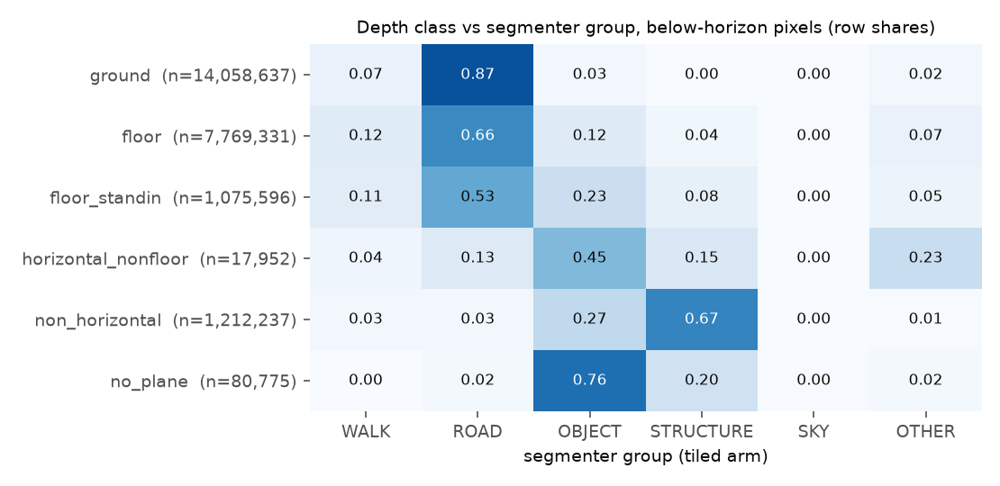
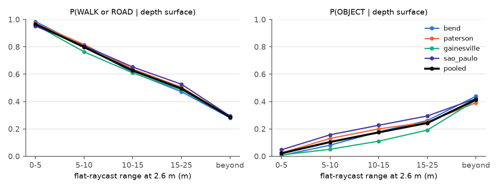
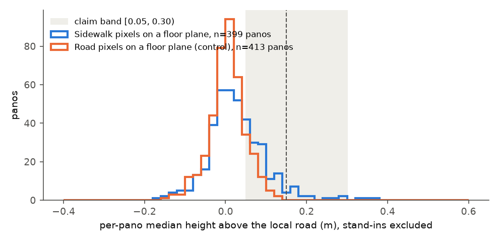
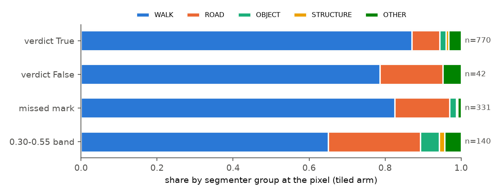
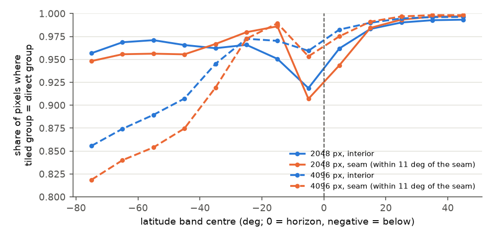
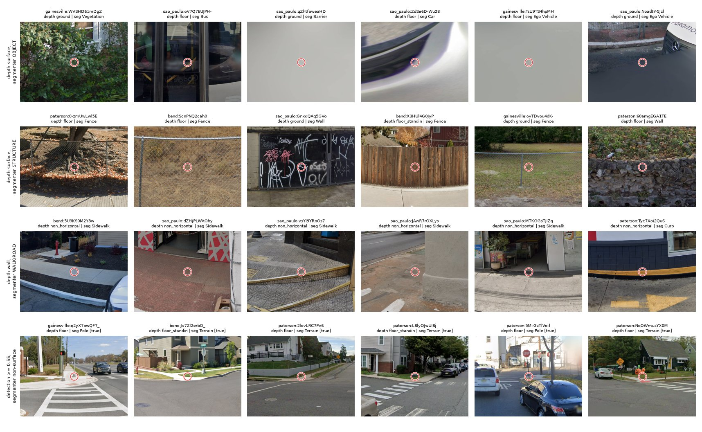

# Footway: do an off-the-shelf segmenter and GSV depth agree on the walkable surface?

**Issue:** [#47](https://github.com/ProjectSidewalk/sidewalk-auto-labeler/issues/47), step 2: *run a pretrained
Mask2Former/SegFormer over a few hundred panos and measure agreement against "depth says a near-horizontal
plane ~camera-height below". Disagreement is the interesting output either way.*

**Date:** 2026-09-30, revised the same day after review of
[#124](https://github.com/ProjectSidewalk/sidewalk-auto-labeler/pull/124) (§9). **Branch:** `footway-depth-47`.

**Reproduce:** `scripts/footway_segmentation.py` produces every number and figure below (§8).

**Tests:** `tests/test_footway_segmentation.py`, pure functions only; the model is never loaded. It covers:
- the equirect/perspective tile mapping round trip, seam wrap, and the render-then-stitch recovery of a
  labelled equirect;
- the vote tie-break and the class collapse;
- a synthetic 512x256 payload that pins `compare_pano`'s grid↔payload indexing, the mirrored null and the
  reference-pixel lookup;
- kappa and the lift arithmetic, and the verdict rule.

**Pre-registration:** the [dated #47 comment](https://github.com/ProjectSidewalk/sidewalk-auto-labeler/issues/47#issuecomment-5921395361)
fixed the sample, model, tiling (including the unseen zenith above ~+43° and nadir below ~−79°), class mapping and
readings before any GT-conditioned number was computed.
- Commit `d1ffbb6` put the rule into code (`verdict()`), together with the headline denominators that leave
  out pixels no tile sees.
- `75f2d05` only fixed a payload-parse crash and range-restricted the per-pano `n_*_px` counts.
- Anything marked *exploratory* or *post hoc* was added after scoring and enters no verdict.
- The null arm, the solid-angle and per-pano columns, kappa, and the 4096 px direct arm were added on review;
  they change interpretation, not a rule (§9).

**Builds on:** step 1, [docs/depth-at-detection-study.md](depth-at-detection-study.md). Its depth classes, plane
lookup and `offset_local` are imported, not reimplemented.

## 0. Summary

The sample is 416 judged benchmark panoramas from bend, paterson, gainesville and São Paulo, each with a
`measured` depth payload. Each was segmented with `facebook/mask2former-swin-large-mapillary-vistas-semantic` on 16
perspective tiles, and the label maps were stitched back onto a 1024x512 equirect grid.

1. **Below the horizon, depth puts a floor plane almost everywhere, so "agreement on the surface" is mostly a base
   rate.**
   - Within 25 m, depth's floor (ground ∪ floor ∪ stand-in floor) covers 98.3% of the pixels a tile sees.
   - The segmenter calls 88.4% of those pixels WALK or ROAD.
   - P(WALK or ROAD | depth surface) = 0.897 is therefore a lift of only 1.01 over that marginal. A null with the
     depth index rotated 180° in azimuth gives 0.894, and a mirrored one 0.895.
   - The pixel pool is also nadir-heavy: 71% of within-25 m pixels lie in the 0–5 m bin, mostly road under the
     car.
   - Solid-angle weighting gives 0.863 (marginal 0.845), and the per-pano median gives 0.917 (marginal 0.904).
     Neither changes the reading.
   - The first version of this study called 0.871/0.897 "agreement". It is not.
2. **Where depth is informative, the instruments do agree: the walls.**
   - P(STRUCTURE | depth's steep planes) is 0.661 within 25 m, against 0.415 under the yaw-180 null and 0.470
     mirrored. That is a lift of 29 over STRUCTURE's 2.3% marginal.
   - Cohen's kappa on a common surface/vertical/unmodelled partition is 0.250 within 25 m, against 0.169 / 0.188
     under the nulls (0.430 vs 0.341 / 0.364 over all ranges).
   - The per-pano median kappa is only 0.097. The agreement is real but weak, and it is concentrated in the few
     pixels where depth models something other than floor.
3. **"Depth draws the ground through objects": supported, and the null is what shows it.**
   - 94.7% of segmenter-OBJECT pixels within 25 m sit on a depth floor plane. The nulls give 93.5% / 93.6%.
   - An object pixel is as likely to be on a modelled floor as an arbitrary pixel (lift 0.96). Depth has no
     object-shaped holes; it draws its plane under cars, people, vegetation and poles.
   - Without Ego Vehicle / Car Mount the figure is 94.4%. Those two classes are 6.2% of the depth-surface ∩
     OBJECT pixels within 25 m.
   - OBJECT is 5.5% of depth-surface pixels within 25 m (5.1% without the camera car; 7.1% solid-angle weighted).
     This is the term a segmenter supplies and depth cannot.
4. **(C) The segmenter class at the detection as a false-positive filter: NOT SUPPORTED.**
   - 2 of 42 verdict-False detections (0.048, Wilson 0.013–0.158) sit on a non-surface class, against 43 of 770
     verdict-True (0.056, 0.042–0.074). The registered margin is +20 pts; the False share is lower.
   - `underpowered` is **false**. The False interval is 14.5 pts wide, and its top end is 10 pts above the True
     share.
   - The reviewed false positives are footway things: 33 of 42 are Sidewalk/Curb/Curb Cut, and 7 are ROAD-group
     (Road 5, Catch Basin 1, Manhole 1).
5. **(C') 0.944 of verdict-True detections (727/770) are on WALK or ROAD.** Most exceptions are the peak pixel landing
   on a ramp's grass edge (Terrain) or an adjacent pole: one-pixel label noise.
6. **(B) The sidewalk plane is not ~0.15 m above the road in GSV depth.**
   - Over 399 panos, the median of per-pano medians of `offset_local` for Vistas-`Sidewalk` pixels on a measured
     floor plane is **0.022 m (CI 0.014–0.030)**. That is **not consistent** with ~0.15 m.
   - The road-on-floor control reads 0.008 m. 34% of sidewalk offsets fall in [0.05, 0.30), against 23% for the
     road control.
   - Exploratory: requiring the local reference to be segmenter-ROAD gives 0.042 m (0.025–0.055).
   - The plane model does not carry a curb step; step 1 found ~0.03 m for real ramp planes.
7. **The trap: separating projection from resolution changed the answer** (registered: latitude band and seam).
   - The registered control arm fed the equirect at 2048 px wide, 5.7 px/deg, half the tiles' 11.4 px/deg.
   - A 4096 px direct arm, added on review at the tiles' angular resolution, shows the projection failure the
     issue predicted. Below −40° it labels **6–15% of the road under the car as SKY**. Agreement with the tiled
     arm falls to 0.82–0.91 there, where the 2048 px arm read 0.95–0.97.
   - Near the horizon the 4096 arm agrees better than the 2048 arm: 0.95–0.96 against 0.91–0.92 at −10..0°.
   - The fine-class drop reported first (`Curb Cut` under True detections 0.271 tiled → 0.179 direct) was
     **resolution, not projection**. At 4096 px the direct arm reads 0.301. That comparison at detection pixels is
     post hoc and descriptive, not a registered trap reading.
   - Seam vs interior is content-confounded. The seam band is straight behind the car: 95% ROAD at −20..−10°
     against 44% in the interior. It says nothing about how the model handles the wrap.
8. **Exploratory lead, outside every reading.** `Curb Cut` at the peak pixel covers 0.271 of True detections (Wilson
   0.241–0.304) against 0.071 of False (3/42, 0.025–0.190) in the tiled arm. In the 4096 direct arm the figures
   are 0.301 and 0.119. That is a candidate for a pre-registered follow-up (§7), not a result.

**Net for #47.**
- **The two instruments describe different things.** Depth says "a floor is modelled here" nearly everywhere, and
  says nothing about objects. The segmenter says what is there.
- **Their coarse agreement is mostly the base rate**, and where depth is informative (walls) it agrees with the
  segmenter well above chance.
- **For stage 3, the useful combination is the complement:** an object region from the segmenter, standing on a
  floor plane whose range depth supplies.
- **Neither instrument discriminates a ramp from the reviewed false positives** at a detection pixel.
- **GSV depth does not resolve the curb step.**

## 1. Background and goals

Step 1 showed that GSV depth puts a near-horizontal plane under 99.4% of detections, and under verdict-False
detections as often as verdict-True ones. Depth locates the surface but does not discriminate a ramp from a
non-ramp.

The issue's premise is that depth models the **surface** and omits the **objects**, so that stage 3, the
"impedance region", needs a segmenter for the object and surface-class term. Step 2 measures three things:
- whether the two instruments agree, and where they disagree;
- whether the segmenter adds a discriminating term at a detection that depth lacked;
- how much the equirect-direct shortcut distorts the segmenter.

## 2. Research questions

- **RQ-A.** Over below-horizon pixels, how do depth plane classes and segmenter classes co-occur, beyond what their
  marginals imply? What share of depth's surface is actually an object?
- **RQ-B.** Where the segmenter sees sidewalk on a secondary depth plane, how high does depth put it above the road?
  Is it the ~0.15 m the issue quotes?
- **RQ-C.** At a detection, does the segmenter class separate verdict-False from verdict-True? This is step 1's
  rule (ii), with the segmenter in place of depth.
- **RQ-D.** How badly does feeding the equirect directly (the issue's "known trap") distort the answer?

## 3. Data

| city | judged GT panos | measured payload | stand-in / degenerate / implausible (excluded) |
|---|---:|---:|---|
| bend | 110 | 90 | 20 / 0 / 0 |
| paterson | 125 | 113 | 10 / 2 / 0 |
| gainesville | 125 | 112 | 12 / 0 / 1 |
| São Paulo | 125 | 101 | 24 / 0 / 0 |
| **total** | **485** | **416** | 69 |

- **Inputs.** `runs/_pooled/footway/sample.csv` lists the sample with a JPEG and payload sha256 per pano;
  `sample_counts.csv` holds the counts above.
- **GT join.** `eval_sites.judged_gt_panos`, with the same drift gate as every sibling study. No pano was skipped.
- **Pixels.** `../RampNet/benchmark/<city>/panos/`: 16384x8192 JPEGs, read-only.
- **Depth.** The runs' `depth/` payloads.
- **Detections.** The stored ones at ≥ 0.30. Verdicts are at the benchmark tier, 0.55.
- **Counts on these 416 panos:**
  - 770 verdict-True and **42 verdict-False**;
  - 47 unsure and 4 duplicate;
  - 331 non-unsure and 162 unsure missed marks;
  - 140 detections in the 0.30–0.55 band.

## 4. Methods

### 4.1 Segmenter

The segmenter is `facebook/mask2former-swin-large-mapillary-vistas-semantic` at revision
`4772b6bf101d91f2534c106dc524d906aeb3c68a` (Mapillary Vistas v1.2, 65 classes, including Curb Cut). It runs in
fp16 on the local RTX 3070 (torch 2.8.0+cu126, transformers 5.12.1).

- **No resize.** The processor's default resize to 384x384 is switched off (`do_resize=False`).
- **Semantic maps.** Computed the standard Mask2Former way: softmax(class) without the no-object column, times
  sigmoid(mask), at mask resolution; then bilinear upsampling to the target and argmax.
- **Load report.** It flags `swin.layernorm` as newly initialised. That layer feeds only the backbone's pooled
  output, which Mask2Former's feature maps do not use.
- **Provenance.** Every one of the 6,656 tile maps comes from a batch-2 forward. On review, the 404 maps an aborted
  batch-4 invocation had written were re-segmented at batch 2; the batch-4 versions had differed in 0.022% of
  pixels, an fp16 batching effect. The 32 smoke-run maps re-segment byte-identically. The notes are in
  `masks_manifest.json`.

### 4.2 Tiling, the stitch, and the control arms

- **Tiles.** Each pano is resized to 4096x2048 (LANCZOS) and rendered bilinearly to **16 perspective tiles**. Each
  tile is 90° FOV, 1024x1024, at 11.4 px/deg. Headings are every 45°, at pitch 0° and −35°.
- **Frame.** The geometry is pure image-frame: x runs from the left of the JPEG, longitude increases to the right,
  and heading 0 is the centre column.
- **Stitch.** Every tile whose frustum contains a grid pixel votes with its nearest tile pixel. A tie goes to the tile
  nearest in angle.
- **Coverage.** No tile sees the zenith above ~+43°, nor the nadir below ~−79°. The nadir gap is 11.4% of
  below-horizon pixels, all within ~0.5 m of the car. As the pre-registration stated, these pixels are labelled
  `NONE` and left out of every denominator.
- **Control arms** (never in a headline):
  - **direct 2048** (registered): the 2048x1024 equirect, 5.7 px/deg.
  - **direct 4096** (added on review): the 4096x2048 equirect at the tiles' angular resolution, as a single
    whole-image forward with no sliding window. It peaked at 5.7 GiB and ran at 0.72 img/s.

  Both are read out on the same grid and compared over the pixels the tiled arm sees.

### 4.3 Class collapse

`COLLAPSE` in the script maps every Vistas name explicitly; an unmapped name refuses.

| group | Vistas classes |
|---|---|
| WALK | Sidewalk, Curb, Curb Cut, Crosswalk - Plain, Pedestrian Area |
| ROAD | Road, Lane Marking - Crosswalk, Lane Marking - General, Parking, Bike Lane, Service Lane; flush fixtures Manhole, Catch Basin, Pothole; Rail Track |
| OBJECT | every vehicle, person and rider, Bird, Ground Animal, Vegetation, Guard Rail, Barrier, all poles, signs, lights and street furniture, Car Mount, Ego Vehicle |
| STRUCTURE | Building, Wall, Fence, Bridge, Tunnel |
| SKY | Sky |
| OTHER | Terrain, Mountain, Sand, Snow, Water |

**Kappa partition** (added on review). Kappa needs one partition on both sides:
- depth {ground, floor, stand-in} ↔ segmenter {WALK, ROAD, OTHER} as `surface`;
- depth `non_horizontal` ↔ STRUCTURE as `vertical`;
- depth {no_plane, horizontal_nonfloor} ↔ {OBJECT, SKY} as `unmodelled`.

Under this partition an object standing on a depth floor plane counts *against* kappa, by design.

### 4.4 Depth side

- **Classes.** Step 1's classes come from `depth_at_detection.plane_class`, with `floor` split by `depth.is_standin`.
  The depth surface is ground ∪ floor ∪ stand-in floor.
- **Lookup.** `depth._plane_at`, in the image frame, with an exact ray. `offset_local` comes from
  `depth_at_detection.classify`, and the local reference plane is read where its column walk stopped
  (`reference_plane`; its stand-in test is `depth.is_standin`).
- **Grid.** There is one grid pixel per payload pixel below the horizon: 512x128 per pano.
- **Range.** Bins use the flat raycast at 2.6 m.
- **Null arms (A), added on review.** The same pixels and denominators, with the payload index array rotated 180° in
  azimuth (`yaw180`) or mirrored left-right (`mirror`).
- **Weightings (A), added on review.** Three columns: pooled pixels (the registered reading), solid angle
  (cos(latitude) per pixel row), and the per-pano median (each pano one vote).

### 4.5 The readings, as registered

- **(A)** A descriptive agreement matrix. Its headlines are P(WALK or ROAD | depth surface) and
  P(OBJECT | depth surface).
- **(B)** The median, across panos, of each pano's median `offset_local` over `Sidewalk` pixels.
  - Pixels: on a measured floor plane within 25 m, whose plane and local reference are not stand-ins.
  - Panos: a pano needs ≥ 20 such pixels.
  - Reading: "consistent with ~0.15 m" iff the median lies in [0.05, 0.30).
  - The cap of 1,500 pixels per pano and group (a seeded subsample) is set in the pre-scoring code (`d1ffbb6`),
    not in the comment.
- **(C)** `non_surface` = the tiled group at the detection pixel is not WALK or ROAD.
  - **SUPPORTED** iff the pooled False share exceeds the True share by ≥ 20 pts **and** the False Wilson lower bound
    exceeds the True upper bound.
  - `underpowered` iff the False interval is wider than 20 pts.
  - Tier 0.55.
- **(C')** Descriptive: the share of True detections on WALK or ROAD.
- **Trap.** Tiled vs direct agreement by latitude band and seam band.

## 5. Findings

### 5.1 RQ-A: agreement, against its base rate (`headline.csv`, `agreement.csv`; figs. 1–2)

Pooled, within 25 m unless noted. NULL columns use pixel weighting.

| statistic | pixels | solid angle | per-pano median | NULL yaw 180 | NULL mirror | all ranges, pixels |
|---|---:|---:|---:|---:|---:|---:|
| P(WALK or ROAD \| depth surface) | 0.897 | 0.863 | 0.917 | 0.894 | 0.895 | 0.871 |
| marginal P(WALK or ROAD) | 0.884 | 0.845 | 0.904 | 0.884 | 0.884 | 0.826 |
| lift | 1.01 | 1.02 | 1.00 | 1.01 | 1.01 | 1.05 |
| P(depth surface \| WALK or ROAD) | 0.997 | 0.997 | 1.000 | 0.994 | 0.995 | 0.997 |
| marginal P(depth surface) | 0.983 | 0.976 | 0.996 | 0.983 | 0.983 | 0.946 |
| P(OBJECT \| depth surface) | 0.055 | 0.071 | 0.033 | 0.054 | 0.054 | 0.070 |
| ... without Ego Vehicle / Car Mount | 0.051 | | 0.032 | | | 0.067 |
| P(depth surface \| OBJECT) | 0.947 | 0.942 | 0.979 | 0.935 | 0.936 | 0.804 |
| ... without Ego Vehicle / Car Mount | 0.944 | | 0.979 | | | 0.797 |
| P(STRUCTURE \| depth wall) | **0.661** | 0.687 | 0.692 | **0.415** | **0.470** | 0.674 |
| marginal P(STRUCTURE) | 0.023 | 0.033 | 0.013 | 0.023 | 0.023 | 0.053 |
| P(WALK or ROAD \| depth wall) | 0.153 | 0.120 | 0.007 | 0.336 | 0.280 | 0.052 |
| Cohen's kappa | **0.250** | 0.263 | 0.097 | **0.169** | **0.188** | 0.430 (nulls 0.341 / 0.364) |

Per city, within 25 m (correct / yaw180 / mirror):

| city | P(WALK∪ROAD \| surf) [marginal] | P(surf \| OBJECT) | P(STRUCTURE \| wall) | kappa |
|---|---|---|---|---|
| bend | 0.906 / 0.905 / 0.905 [0.902] | 0.957 / 0.966 / 0.963 | 0.488 / 0.209 / 0.222 | 0.104 / 0.053 / 0.057 |
| paterson | 0.905 / 0.902 / 0.903 [0.892] | 0.955 / 0.941 / 0.946 | 0.674 / 0.403 / 0.486 | 0.225 / 0.146 / 0.170 |
| gainesville | 0.882 / 0.881 / 0.881 [0.878] | 0.966 / 0.960 / 0.955 | 0.553 / 0.174 / 0.216 | 0.117 / 0.055 / 0.065 |
| São Paulo | 0.896 / 0.889 / 0.891 [0.866] | 0.929 / 0.907 / 0.907 | 0.684 / 0.466 / 0.512 | 0.341 / 0.242 / 0.266 |

**Reading.**
- **The surface headline is a base rate.** Depth calls nearly every seen below-horizon pixel within 25 m a
  floor, and most of those pixels are road. Scrambling depth's geometry moves P(WALK or ROAD | depth surface) by
  0.003. Every weighting agrees.
- **The pooled pixels are nadir-heavy.** 71% of within-25 m pixels lie in the 0–5 m bin, mostly road under the car.
  That is why the solid-angle and per-pano columns are shown beside the pooled one.
- **The walls carry the signal.** Depth's steep planes are segmenter STRUCTURE 66% of the time, against 42–47% when
  the depth geometry is scrambled. Kappa sits 0.05–0.10 above the nulls in the pool and in every city. The
  agreement is real but weak, and it lives in the few non-floor pixels.
- **Depth does not exclude objects.** P(depth surface | OBJECT) is at or above its null in the pool (0.947 vs 0.935;
  per city it sits within ~0.02 of the null either way, and bend's 0.957 is just below its 0.966 / 0.963), with a
  lift of 0.96 over the floor's marginal. Depth's floor runs under objects as if they were not there: it "draws the
  ground through objects", the issue's premise. OBJECT is 5.5% of the modelled surface within 25 m (7.1%
  solid-angle weighted), rising with range from 2% at 0–5 m to 24% at 15–25 m (fig. 2). That share is what a
  segmenter adds.





The matrix rows (fig. 1, all ranges):
- **The dominant ground plane** is 87% ROAD and 7% WALK.
- **Secondary floor planes** are 66% ROAD, 12% WALK and 12% OBJECT. WALK makes up a larger share of secondary
  floors than of the dominant plane (11.8% vs 6.9% of seen pixels). In absolute terms, though, the sidewalk is
  split about evenly: 0.97 M WALK pixels sit on the dominant plane and 1.03 M on secondary floors (0.91 M
  measured, 0.12 M stand-in).
- **Stand-in floors** are the most object-laden surface class (23% OBJECT).
- **Steep planes** are 67% STRUCTURE.

Where depth reports a wall and the segmenter a sidewalk (15% of wall pixels within 25 m, about half the nulls'
28–34%), the fixed-rule gallery (§5.5, row 3) shows mostly **steeply sloped pavement**: São Paulo's sloped
sidewalks, driveway aprons, a curb face.

### 5.2 RQ-B: curb height (`curb_height.csv`; per-pano medians in `runs/_pooled/footway/curb_pano_medians.csv`, fig. 3)

| reading | panos | median of pano medians [95% CI] | pixel p10 / median / p90 | share in [0.05, 0.30) |
|---|---:|---|---|---:|
| **Sidewalk, measured planes (registered)** | 399 | **0.022 [0.014, 0.030]** | −0.10 / 0.02 / 0.19 | 0.339 |
| Sidewalk, with stand-ins | 401 | 0.033 [0.025, 0.039] | −0.09 / 0.03 / 0.22 | 0.366 |
| Sidewalk, reference = segmenter ROAD (*exploratory*) | 366 | 0.042 [0.025, 0.055] | −0.13 / 0.05 / 0.26 | 0.428 |
| all WALK, measured | 407 | 0.021 [0.013, 0.028] | −0.10 / 0.02 / 0.18 | 0.330 |
| ROAD on a floor plane (control) | 413 | 0.008 [0.002, 0.012] | −0.09 / 0.01 / 0.11 | 0.234 |

Positive means above the road. Per city, the registered Sidewalk reading is bend 0.031, paterson 0.024, gainesville
0.020 and São Paulo 0.009. **Reading: not consistent with ~0.15 m.**



What the median does and does not cover:
- **It covers only sidewalk on a secondary plane.** Sidewalk pixels on the dominant plane, shared with the road,
  have no offset to measure and are excluded. Including them as zeros would lower the figure, not raise it. That
  share is 50.5% pixel-pooled, but the per-pano median is 0.27 over 410 panos, so it is concentrated in some panos.
- **It can understate a real step.** The column walk's reference is "the first different floor plane below", which
  can be another piece of sidewalk. The exploratory road-referenced reading addresses this and moves the median only
  to 0.042 m.
- **Tilt can push it either way.** `offset_local` carries the reference plane's tilt, extrapolated to the hit (step
  1 §5.4).

Sidewalk offsets do sit in the curb band more often than the road control's (34% vs 23%), so there is a faint
step. But no reading puts the typical sidewalk plane near 0.15 m.

### 5.3 RQ-C: at the detection (`runs/_pooled/footway/detections.csv`, `detection_classes.csv`, `verdict.json`, fig. 4)

| group | n | non-surface share [Wilson 95%] | WALK | ROAD |
|---|---:|---|---:|---:|
| verdict True | 770 | 0.056 [0.042, 0.074] | 0.870 | 0.074 |
| verdict False | 42 | 0.048 [0.013, 0.158] | 0.786 | 0.167 |
| missed (non-unsure) | 331 | 0.030 [0.016, 0.055] | 0.825 | 0.145 |
| unsure missed | 162 | 0.056 [0.029, 0.102] | 0.765 | 0.179 |

**(C) NOT SUPPORTED.**
- The gap is −0.8 pts against a registered +20.
- `underpowered` is false.
- Per city, the False non-surface counts are 1/7, 0/5, 0/9 and 1/21.

**(C') 0.944 of True detections are on WALK or ROAD** (bend 0.955, paterson 0.930, gainesville 0.924, São Paulo
0.975).



**What the false positives are.** They sit on the footway: Sidewalk 25, Curb 5, Curb Cut 3. Seven more are
ROAD-group (Road 5, Catch Basin 1, Manhole 1). They are driveway cuts, ramp-like curb transitions and paving
changes. A surface-class filter cannot remove them.

**Depth at the same pixels agrees with step 1.**
- True: floor 500, ground 143, stand-in floor 122, steep 4, overhang 1.
- False: floor 26, stand-in 10, ground 5, steep 1.

### 5.4 RQ-D: the trap (`trap.csv`, fig. 5)

Agreement with the tiled arm is on the collapsed group, over the pixels the tiled arm sees. Shares also exclude
`NONE`, which was corrected on review.

| latitude band | interior, 2048 | interior, 4096 | seam, 2048 | seam, 4096 |
|---|---:|---:|---:|---:|
| −80..−70° | 0.957 | **0.856** | 0.948 | **0.819** |
| −60..−50° | 0.971 | 0.890 | 0.956 | 0.854 |
| −40..−30° | 0.962 | 0.945 | 0.967 | 0.919 |
| −20..−10° | 0.951 | 0.970 | 0.986 | 0.989 |
| −10..0° | 0.919 | 0.959 | 0.907 | 0.953 |
| 0..10° | 0.962 | 0.983 | 0.944 | 0.975 |
| +20..+40° | 0.99 | 1.00 | 0.99 | 1.00 |



**Projection vs resolution.**
- **At matched angular resolution the projection failure shows at the nadir, as the issue predicted.** The 4096 px
  direct arm labels 12% of the road at −80..−70° as **SKY** (15% in the seam band), still 6–8% at −50..−40° (`trap.csv`, `direct4096_share_SKY`).
  That the largest single disagreement pair is tiled `Road` → direct `Sky` comes from an uncommitted check over
  every 4th pano's −70..−51° rows; it is not in a committed CSV.
- **The 2048 arm hides this.** It reads the nadir as road (0.95). Why is speculation: perhaps at half the
  resolution the stretched nadir is a featureless grey band either way.
- **Near the horizon, resolution matters more than projection.** The 4096 arm agrees better than the 2048 arm there.
- **The registered seam-vs-interior split cannot isolate the wrap.** The seam band is straight behind the car: 95%
  ROAD at −20..−10°, against 44% in the interior. The first version's "the model handles the wrap" claim is
  withdrawn.

**At the detection pixels** (post hoc, descriptive; not a registered trap reading):

| arm | agrees with tiled on group / fine class (True + False + missed) | `Curb Cut` under True | under False | under missed |
|---|---|---:|---:|---:|
| tiled | — | 0.271 | 0.071 | 0.254 |
| direct 2048 | 0.896 / 0.684 | 0.179 | 0.024 | 0.130 |
| direct 4096 | 0.958 / 0.843 | 0.301 | 0.119 | 0.269 |

The fine-class loss reported first was resolution, not projection. Fed at full resolution, the equirect keeps Curb
Cut at the detections, 98% of which lie between −2° and −36° (full range −49° to +4°), where the projection distortion is small. The projection
cost shows up at the nadir instead.

### 5.5 The disagreement gallery (`gallery.csv`, fig. 6)

**Selection rule** (fixed, seed 47):
- For each of three pixel categories, panos are ranked by the size of the category's largest 8-connected component
  within 25 m. Six are drawn from the top 20, each marked at the component pixel nearest its centroid.
- The fourth row is six draws from all 45 detections at ≥ 0.55 that the segmenter calls non-surface.



1. **Depth surface, segmenter OBJECT.** A bus, a hedge, a parked car's body, a barrier, and the camera car's own
   nadir patch in two cells. Depth draws its plane through each. Ego Vehicle is 6.2% of this category within 25 m,
   but 2 of the 6 picks, because the largest-component rule favours the nadir.
2. **Depth surface, segmenter STRUCTURE.** See-through fences, behind which depth models the ground, and walls at
   the ground-contact line.
3. **Depth wall, segmenter WALK.** Steeply sloped sidewalks and driveway aprons, a curb face, a store threshold.
   Here depth carries slope information that the segmenter's class lacks.
4. **True detections the segmenter calls non-surface.** The peak lands on the grass edge or a pole beside the ramp.

## 6. Discussion

**Stages 2 and 3 of #47.**
- **The two instruments are complementary, not redundant.** Depth's floor is close to unconditional below the
  horizon and ignores objects. The segmenter's surface classes add no information about *whether* there is a floor,
  but they add the object term: where something stands on the floor.
- **Stage 3 is well-posed as that complement.** Take a segmenter-OBJECT region and read the depth floor plane
  under it for a metric contact-line range.
- **Where depth models something other than floor** (walls, steep pavement), it agrees with the segmenter well above
  chance. It also carries a slope signal (gallery row 3) that may matter for stage 3's severity question.
- **The curb step is the gap.** A height under ~0.3 m needs another instrument: monocular depth, multi-view
  triangulation, or the box annotations.
- **Tile, or at least run at full resolution and handle the nadir.** At 2048 px a direct equirect loses fine classes;
  at 4096 px it hallucinates sky under the car.

**What it does not do.**
- A class at a detection's single peak pixel is no false-positive filter, from depth (step 1) or from the
  segmenter (here).
- Discrimination has to come from the detector's appearance model, from multi-view consistency (#27), or from a
  region-level rule.

**For the heuristic cropper** (ProjectSidewalk/sidewalk-panorama-tools#32): the segmenter's WALK region around a
detection is a plausible context-extent input, and the depth plane under it gives the range. This is a direction;
nothing here measures crop quality.

**Limits.**
- 42 verdict-False detections.
- One model.
- The pixel test is at the heatmap peak, which RampNet's upsampled heatmap quantises to an 8-cell grid
  ([RampNet#221](https://github.com/ProjectSidewalk/RampNet/issues/221)).
- The kappa partition is a choice, stated in §4.3.
- The benchmark panos are corner-heavy by construction.

## 7. Recommendations

1. **Never quote a conditional over below-horizon pixels without its marginal and a scrambled-geometry null.**
2. **Tile.** If a direct equirect is used, run it at full angular resolution and mask or tile the nadir. At 2048 px
   the fine classes go; at 4096 px the road under the car turns to sky.
3. **Do not build a surface-class false-positive filter** from depth or the segmenter at the peak pixel.
4. **Next pre-registered step (not done here): a region-level `Curb Cut` score** around the detection.
   - Choose the window on a held-out city.
   - Use it as a ranking and mining signal (ties to RampNet#158). 25% of non-unsure missed marks already sit on
     tiled Curb Cut pixels.
5. **For stage 3's metric term,** take ground-contact range from depth. Do not rely on depth for heights under
   ~0.3 m.

## 8. Reproducibility

```
python scripts/footway_segmentation.py sample   --run-root <runs> --benchmark-root ../RampNet/benchmark
python scripts/footway_segmentation.py tiles    --benchmark-root ../RampNet/benchmark --workers 8          # ~14 min
python scripts/footway_segmentation.py tiles    --benchmark-root ../RampNet/benchmark --workers 8 --direct-width 4096
W=runs/_pooled/footway/work
python scripts/footway_segmentation.py segment --in $W/tiles --out $W/tile_labels --fp16 --batch-size 2      # ~19 min on a 3070
python scripts/footway_segmentation.py segment --in $W/direct --out $W/direct_labels --target 1024x512 --fp16 --batch-size 1
python scripts/footway_segmentation.py segment --in $W/direct4096 --out $W/direct4096_labels --target 1024x512 --fp16 --batch-size 1   # ~10 min, 5.7 GiB
python scripts/footway_segmentation.py stitch   --run-root <runs> --benchmark-root ../RampNet/benchmark
python scripts/footway_segmentation.py compare  --run-root <runs> --benchmark-root ../RampNet/benchmark
python scripts/footway_segmentation.py figures  --run-root <runs> --benchmark-root ../RampNet/benchmark [--fig-dir DIR]
```

- **Dependencies.** `segment` needs torch and transformers, deliberately not in requirements.txt.
- **Work files.** Tiles and label maps live in `runs/_pooled/footway/work/` and are untracked.
  `runs/_pooled/footway/masks_manifest.json` records the model revision, the runtime, the provenance notes and every
  label map's sha256.
- **Tracked once.** The three large tables live only in `runs/_pooled/footway/`: `detections.csv`,
  `curb_pano_medians.csv` and `masks_manifest.json`. `docs/figures/footway-depth/data/` holds the small aggregates.
- **`verdict` and `figures`** read `runs/_pooled/footway/` and print which directory they read.
- **`compare`** refuses if any sampled pano no longer passes the GT join.

## 9. Corrections on review (2026-09-30)

A deep review of #124 verified the pipeline, frames, decoding, GT join, pre-registration order and the (B)/(C)
readings, which reproduce byte for byte. It found the following, and all of it is corrected above.

1. **The (A) headlines were base rates presented as agreement.** The null arm, lifts, kappa, and the solid-angle and
   per-pano columns were added. The honest reading is §0.1–0.3. (A) was registered as descriptive, so this corrects
   an interpretation, not a rule.
2. **The trap conclusion was confounded.**
   - The registered direct arm ran at half the tiles' angular resolution. The 4096 px arm moves the effect from the
     Curb Cut class to the nadir.
   - The detection-pixel fine-class comparison is post hoc.
   - Seam vs interior is content-confounded.
   - The nadir shares divided by a total that included `NONE`.
   - "0.92–0.99 in every band" was false: the seam reads 0.907 at −10..0°.
3. **(B) wording.**
   - The dominant-plane exclusion does not make the median understate; including those pixels as zeros would lower
     it.
   - The 50.5% share was pixel-pooled; the per-pano median is 0.27.
   - "Secondary floors are where the sidewalk lives" overstated a share difference.
4. **Provenance.**
   - The pre-registration did state the unseen zenith.
   - The denominator rule was already in `d1ffbb6`.
   - The pixel cap is in the pre-scoring code only.
   - The module docstring said −75°.
5. **Nits.**
   - The ROAD group of the False detections is 7, not 5.
   - Ego Vehicle / Car Mount are now reported both ways.
   - `standin_ref` now uses `depth.is_standin` on the reference plane.
   - `figures` takes `--fig-dir`.
   - The large tables are tracked once.
   - Outputs are written with LF line endings.
   - The batch-4 tile maps were redone at batch 2.
