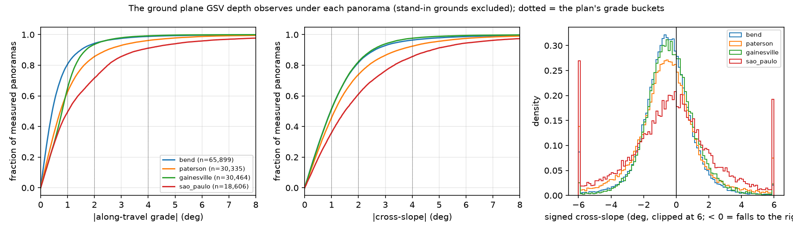
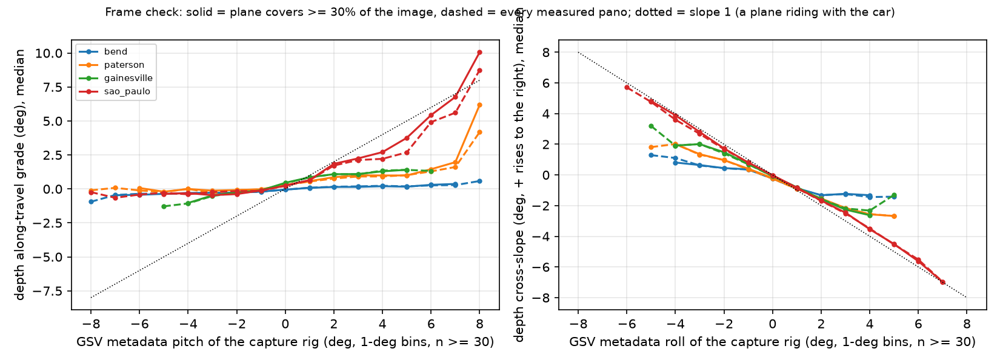
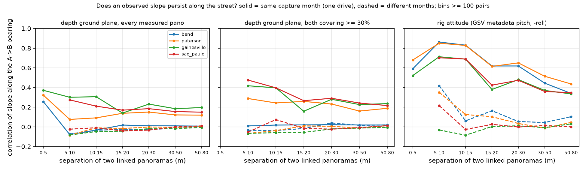
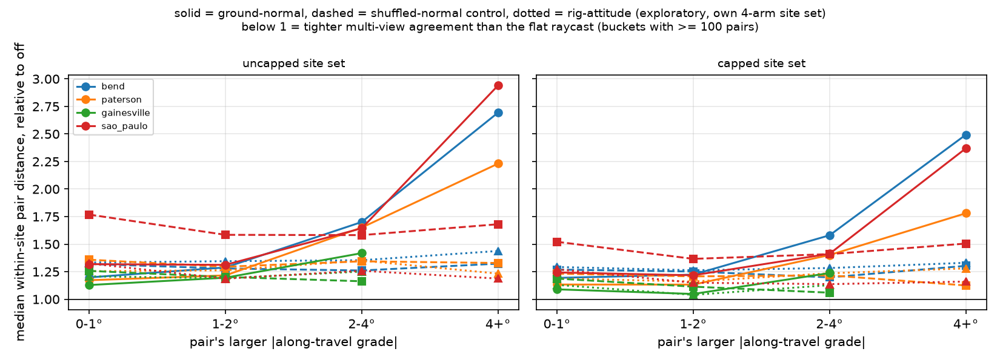
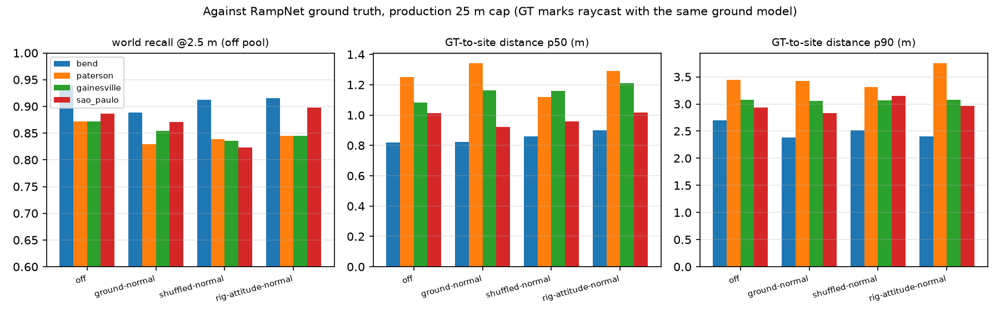
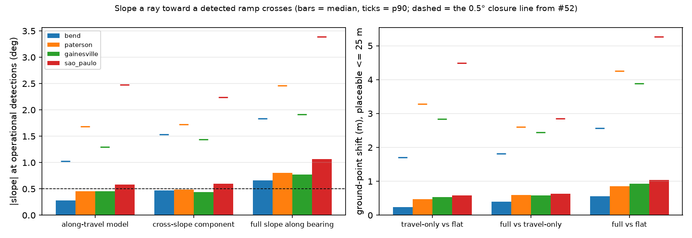

# GSV ground plane: what the depth reconstruction observes, and whether the raycast wants it

**Issue:** [#52](https://github.com/ProjectSidewalk/sidewalk-auto-labeler/issues/52) — *measure the ground
plane directly from GSV's depth planes, and use it to test the road-relative raycast claim.* Split out of
[#42](https://github.com/ProjectSidewalk/sidewalk-auto-labeler/issues/42); tests the mechanism behind §5.3–5.4
of the Mapillary tilt study (`docs/mapillary-tilt-study.md`, PR #50).
**Date:** 2026-09-23. **Branch:** `gsv-ground-plane-52`, stacked on `camera-height-40` (PR #68, whose
`depth.py` carries the `SYNTHETIC_GROUND` status this study relies on).
**Reproduce:** `scripts/gsv_ground_plane.py` (every number and figure below; see §9). **Tests:**
`tests/test_gsv_ground_plane.py` (the frame mapping, the ray injection, the verdict rule).
**Pre-registration:** the plan comment on #52 fixed the arms, buckets and reading before any number was
computed, and commit `f7226e8` put the reading into code (`verdict()`) before the full run. Nothing in it
changed afterwards.

## 0. Summary

Every GSV panorama in the four harvested runs (bend, paterson, gainesville, sao_paulo; 180,716 panoramas,
170,919 depth payloads) carries Google's own planar depth reconstruction. This study keeps the dominant ground
plane's **normal** (the harvest kept only its tilt magnitude), decomposes it into along-travel grade and
cross-slope, checks it against the world, and uses it for the test #52 asked for: if the flat-ground raycast
really wants the camera's orientation relative to the local road (#50 §5.3), then rotating GSV's
gravity-rectified rays into the observed ground plane should tighten multi-view agreement, most on the steepest
panoramas.

1. **The pre-registered verdict is UNDERCUT.** Rotating the rays into the observed ground plane
   (`ground-normal`) *loosens* within-site multi-view agreement in all four cities, and loosens it most where
   the plane is steepest: on the primary (uncapped, three-arm) site set the **median** pair distance in the
   2–4° grade bucket is 1.42–1.70× the flat raycast's, and 2.23–2.94× in the 4°+ bucket. It wins the top
   buckets in **0 of 4** cities; the shuffled-normal control wins 0 of 4 as well. The p90 GT-to-site clause
   holds (not worse in any city), but it is not needed for the verdict and §5.5 shows why it is not a
   discriminating statistic here.
2. **The flat raycast is not paying for the observed slope.** Under production's flat raycast the median pair
   distance is essentially flat across the grade buckets (bend 1.69 / 1.69 / 1.71 / 1.70 m; São Paulo
   1.77 / 1.94 / 2.02 / 1.89 m). If the observed grade were real ground the flat raycast ignores, the error
   would grow with it. It does not; the correction's error does.
3. **The observed ground normal is a noisy per-pano quantity, not a road-grade measurement.** The slope it
   implies along a street does not persist from one panorama to the next: between linked panoramas 10–15 m
   apart on the same drive, r = −0.03 to 0.31 by city, and ≈ 0 (−0.05 to −0.01) between different capture
   months. Its per-pano noise is bounded at 1.0–2.4° RMS — larger than the typical grade it would correct. It
   does carry some real signal: its cross-slope falls to the right on 56–67% of panoramas (road crown, right-hand
   traffic) and tracks the rig's metadata roll with slope −0.45 to −0.87 (−0.89 where the plane is well
   determined); and the 2025–26 GSV rig reads about
   twice the median |grade| of earlier rigs on the same streets, so part of the tilt is the reconstruction's,
   not the road's.
4. **An independent road-plane estimate fails the same way.** The plane implied by the rig's own metadata
   attitude (a car rides on the road; exploratory arm, added after step 1 and outside the pre-registered
   reading) persists far better along a drive (r 0.69–0.86 at 5–15 m) and still loosens the median by
   1.15–1.29× (uncapped) / 1.08–1.24× (capped) in every city. On GSV, no available estimate of the road frame
   beats the gravity frame the imagery is already in.
5. **Cross-slope at ramp bearings (step 4):** the part of the observed slope along a ray toward a detected
   ramp that an along-travel-only model cannot see has a median of 0.47° (bend), 0.49° (paterson), 0.44°
   (gainesville) and 0.59° (São Paulo) — under the 0.5° closure line in three cities, just over it in São
   Paulo — and these are upper bounds, since finding 3 says the normal's noise inflates them.
6. **Step 2 (validate the SfM grade estimator) cannot be run from the archive** — GSV records carry no altitude.
   It needs #23 (store `elevation`) plus a metadata re-fetch, or a DEM (#51). The offline part, grade
   persistence along the link graph, is finding 3.

**What this means for #42.** The road-relative mechanism was the explanation for #50's median result, and the
one direct test of it comes out against it. The Mapillary §5.4 numbers are measurements on un-rectified imagery
and stand as such; what falls is the claim that they are explained by the ground plane. §6 gives an alternative
that fits both results, and §8 says what the #42 wiring PR should now have to show.

## 1. Background and goals

GSV's depth payload is a list of planes plus a per-pixel plane index (`depth.py`). #40/#41/#68 used the dominant
ground plane's *distance* as a camera height; its *normal* is the ground's orientation in the panorama's frame,
per panorama, observed by Google's reconstruction rather than inferred. The #27 pose ablation established that
streetlevel's GSV equirectangulars are gravity-rectified, so GSV separates the two frames the Mapillary study
could not: the camera frame is the gravity frame, and the depth plane gives the road.

**Goals.** (G1) Extract the ground normal per panorama and express it as along-travel grade and cross-slope,
with checks that tie the frame to the world. (G2) Say what the offline archive can and cannot contribute to
validating the SfM grade estimator. (G3) Test the mechanism with a control. (G4) Size the cross-slope at the
bearings where ramps actually are.

## 2. Research questions

| | Question | Answered by |
|---|---|---|
| RQ1 | What grade and cross-slope does the depth ground plane report, and is it in the world frame we think? | decomposition + three frame checks (§5.1) |
| RQ2 | Is the reported grade a property of the street — does it persist pano to pano? | link-graph persistence, depth vs rig attitude (§5.2) |
| RQ3 | Does rotating rays into the observed plane tighten multi-view agreement, most on steep panoramas, beyond a shuffled control? | frozen-association ablation, three arms, common site set (§5.3) |
| RQ4 | Does it change world P/R and GT-to-site distance under the production cap? | re-fused GT eval per arm (§5.5) |
| RQ5 | How large is the cross-slope along ramp bearings? | per-detection slope decomposition (§5.6) |

## 3. Data

The four GSV runs whose depth was harvested (`scripts/harvest_depth.py`, #41), read in place and not modified,
plus RampNet's benchmark bundles for the same cities.

| City | Panoramas | Depth payloads | No payload (gap-fill #32, after the harvest) | Measured ground | Stand-in ground excluded | GT panos |
|---|---:|---:|---:|---:|---:|---:|
| bend | 78,560 | 78,548 | 12 | 65,899 (83.9%) | 12,459 (15.9%) | 110 |
| paterson | 34,687 | 34,427 | 260 | 30,335 (87.5%) | 3,899 (11.4%) | 125 |
| gainesville | 37,435 | 35,203 | 2,232 | 30,464 (81.4%) | 4,091 (11.6%) | 125 |
| sao_paulo | 30,034 | 22,741 | 7,293 | 18,606 (61.9%) | 4,025 (17.8%) | 125 |

"Measured" is `depth.classify_height(...) == MEASURED`: the ground plane is not a degenerate fallback (≤2
planes; 457 panos in total), not Google's stand-in ground (exactly vertical normal, `SYNTHETIC_GROUND`), and
at a plausible height (684 `implausible`, 575 of them in gainesville). The stand-in share is of the
non-degenerate payloads with a ground plane and matches the #68 audit (14% overall, 16% in bend). Panos without
a measured plane are raycast flat in every arm. The gap-fill panos (added 2026-09-22, after the harvest) have no
payload, which is why São Paulo's measured share is 62%.

## 4. Methods

### 4.1 Frames and the decomposition (RQ1)

`depth.py`'s ray convention (transcribed from streetlevel and checked against its raster in
`tests/test_depth.py`) puts stored coordinate `(x, y)` at `phi = 2πx + π/2`, `v = (sin t cos phi,
sin t sin phi, cos t)`. So in the depth frame **+x is camera-right, −y is camera-forward (x = 0.5, the heading)
and +z is down.** `camera_frame_normal` maps a plane normal to the camera frame (forward, right, up) with the
normal pointing up; `slopes` gives

- **grade** = `atan2(−n_f, n_u)`: the angle the plane rises moving forward (along the heading — the direction
  of travel on a GSV car);
- **cross-slope** = `atan2(−n_r, n_u)`: the angle it rises moving to the camera's right.

The tests pin the mapping against `depth.ground_range_at` on a synthetic payload: a plane rising ahead is
closer ahead than behind by exactly the intersection geometry, a plane rising to the right is closer on the
right. Three checks tie it to the world:

- **Travel direction.** The heading is compared with the axis of the pano's nearest GSV link (`links[].yaw_deg`,
  folded to [0°, 90°]).
- **Crown.** Both US cities and São Paulo drive on the right, and a crowned road falls toward the right-hand
  curb, so a correct left/right mapping should show a negative median cross-slope. A mirrored frame flips it.
- **Rig attitude.** Every GSV record carries the capture rig's metadata pitch/roll. A car rides on the road, so
  a gravity-frame ground normal should track them with slope ±1 wherever the plane is well determined.

### 4.2 Persistence along the street (RQ2; the offline part of step 2)

For every pair of measured panoramas joined through the GSV link graph (≤ 8 hops), the slope of **each** pano's
own plane is evaluated along the one world bearing A→B, so both numbers describe the same stretch of street.
A real, persistent road grade gives r → 1 at short separation; the RMS difference / √2 bounds the per-pano noise
from above. Pairs are split by whether the two panoramas share a capture month (one drive, one rig) or not.
Three signals on the same pairs: the depth plane; the depth plane where both planes cover ≥ 30% of the image
(`WELL_DETERMINED_SHARE`; about half the measured panos); and the rig-attitude plane (metadata pitch, −roll —
the signs the depth planes themselves select in §5.1).

### 4.3 Step 2 is blocked

The Mapillary estimator differences `computed_altitude` between consecutive frames. GSV records store no
altitude: streetlevel exposes `elevation`, but `sources/gsv.py` never wrote it (#23). So the regression of an
altitude-profile grade on the observed normal cannot be run from the archive. It needs either #23 plus a
metadata re-fetch, or a DEM (#51). No proxy is substituted; §4.2's persistence is what the archive can say.

### 4.4 The three-arm ablation (RQ3)

#50 §4.4's instrument, on GSV. Association is frozen from the production fuse (flat raycast, benchmark tier
0.55, `mask_rig=False`, 2.6 m camera height); every operational member of every multi-member site is re-projected
under each arm and the within-site pairwise member distance compared.

- **`off`** — production: the flat raycast in the gravity-rectified frame.
- **`ground-normal`** — the ray expressed in the observed plane's frame. Implemented by injecting the camera's
  (pitch, roll) *relative to the plane* (`road_pose`) into the pano block and calling
  `geo.detection_ground_point(apply_pose=True)` unchanged — the same path `fuse_sites`/`eval_sites` take —
  and moving the ray origin to the foot of the perpendicular from the camera to the plane, which on a slope
  sits `h·sin(slope)` uphill (0.045 m per degree). The test suite caught the need for that shift: without it
  every point of a sloped pano moves downhill by a constant, 1.6% of the range at 3°. With it the injection
  agrees with an exact ray–plane intersection to < 0.5% of the range out to 25 m.
- **`shuffled-normal`** — every measured pano gets another measured pano's normal (a fixed-seed permutation over
  the city): the same distribution of corrections and the same extra degrees of freedom, with the pano-specific
  information removed. If this tightens too, a gain is not the mechanism.
- **`rig-attitude-normal`** (exploratory; §0 item 4) — the plane implied by the metadata attitude, on measured
  panos only. Scored on its own four-arm site set (`*_4arm`) so the pre-registered rows are untouched by it.

Camera height is 2.6 m in every arm, so nothing here depends on the #40/#68 height question.

Site sets, both reported: **`uncapped`** (primary; #50's design, `max_range_m = inf`, a site kept only if every
arm places every member) and **`capped`** (production's 25 m cap, a site kept only if every arm places every
member within it — #50's open question was the tail under the cap, at the price of survivorship: 16–32% of
sites drop). Pairs are bucketed by the pair's larger |along-travel grade| (0–1°, 1–2°, 2–4°, 4°+, the plan's
buckets) using the **true** grade in every arm, so the shuffled control is scored on the same pairs, bucketed by
how steep they really are. A pair enters the buckets only if both panos have a measured plane; the overall
statistics include every pair. Median, mean, p90 and range-normalised mean are reported.

### 4.5 GT evaluation (RQ4)

`eval_sites.evaluate_city` re-run per arm with the arm's frame injected into every `SlimPano` — re-association,
GT raycasting and matching all under the arm, production 25 m cap, benchmark tier. #50 §4.5's caveats apply
unchanged: GT marks are raycast under the arm, so (a) for a self-detected ramp a shared error cancels, and
(b) the recall pool moves; `recall vs off pool` puts each arm's numerator over the off arm's pool.

### 4.6 Cross-slope at ramp bearings (RQ5)

For every operational detection (production tier 0.30 with the rig mask — this describes what ships) on a pano
with a measured plane: the plane's slope along the detection's azimuth `a`, the along-travel-only model's
prediction there (`grade·cos a`, the Mapillary SfM grade has no cross term), and their difference. Then the same
in meters: ground points under the full plane, under the travel-only plane and flat, for detections production
would place (flat range ≤ 25 m).

### 4.7 The pre-registered reading, operationalised

From the plan: *supported if `ground-normal` beats `off` on the top grade buckets in at least three of four
cities on median spread and does not lose p90 GT distance anywhere, while `shuffled-normal` does not; undercut
if `off` wins or the control matches the treatment.* In `verdict()` (committed before the full run):
top buckets = 2–4° and 4°+ with ≥ 100 off-arm pairs; "beats" = strictly lower median in every qualifying top
bucket on the `uncapped` set; p90 = GT-to-site distance at 5 m, to 0.01 m, ≤ off's in every city; SUPPORTED iff
ground-normal wins ≥ 3 cities and the p90 rule holds and shuffled wins < 3; UNDERCUT iff ground-normal wins ≤ 1
city or shuffled wins ≥ ground-normal's wins; otherwise NOT SUPPORTED.

## 5. Findings

### 5.1 RQ1 — the observed ground plane



*Figure 1. Along-travel grade, cross-slope and signed cross-slope of the dominant depth ground plane, every
measured panorama.*

| City | \|grade\| p50 / p90 / p99 | \|grade\| > 2° | > 4° | \|cross\| p50 / p90 | cross p50 (signed) | falls right | heading vs link axis p50 / p90 (within 5°) |
|---|---:|---:|---:|---:|---:|---:|---:|
| bend | 0.43° / 1.50° / 4.29° | 5.7% | 1.2% | 0.96° / 2.61° | −0.55° | 66.8% | 1.27° / 7.5° (85%) |
| paterson | 0.73° / 2.48° / 6.39° | 14.3% | 3.8% | 1.11° / 3.50° | −0.56° | 64.9% | 0.79° / 5.2° (90%) |
| gainesville | 0.80° / 1.69° / 3.75° | 6.4% | 0.8% | 0.97° / 2.52° | −0.43° | 62.5% | 0.95° / 7.7° (86%) |
| sao_paulo | 1.02° / 3.71° / 10.38° | 28.4% | 8.8% | 1.49° / 4.73° | −0.29° | 55.9% | 0.88° / 5.6° (89%) |

(`planes_summary.csv`; every measured panorama.) The magnitudes rank the cities the way their terrain does —
São Paulo's centre is hilly, Bend and Gainesville mostly flat — and the heading is the travel axis to a median
of about 1°. **The crown check passes:** the cross-slope falls to the right on 56–67% of panoramas, median
−0.29° to −0.56°, as right-hand traffic on crowned roads predicts; a mirrored frame would put it on the left.



*Figure 2. Median depth grade and cross-slope in 1° bins of the rig's metadata pitch and roll. Solid: plane
covers ≥ 30% of the image; dashed: every measured pano; dotted: slope ±1.*

| City | grade on metadata pitch: slope, r (well determined) | cross on metadata roll: slope, r (well determined) |
|---|---:|---:|
| bend | +0.09, 0.16 (+0.09, 0.21) | −0.45, −0.31 (−0.48, −0.43) |
| paterson | +0.24, 0.30 (+0.26, 0.37) | −0.63, −0.39 (−0.64, −0.48) |
| gainesville | +0.34, 0.41 (+0.34, 0.45) | −0.69, −0.55 (−0.71, −0.62) |
| sao_paulo | +0.54, 0.50 (+0.71, 0.67) | −0.87, −0.55 (−0.89, −0.67) |

(OLS over every measured pano, and over the well-determined half.) **Cross-slope tracks the rig's roll**, with
slope close to −1 in São Paulo and gainesville and binned medians on the −1 line out to ±6° (Figure 2, right) —
evidence that the frame is the gravity frame and the cross axis is right. **Grade tracks pitch only on climbs**:
for positive metadata pitch the São Paulo medians follow the +1 line, for negative pitch the depth grade stays
near 0 in every city (Figure 2, left). A road plane observed in a gravity frame would not know which way the car
was driving; this asymmetry says the dominant-plane pick is not a clean road measurement along travel. The
signs (grade ~ +pitch, cross ~ −roll) are the ones the rig-attitude arm uses.

**The tilt is partly the rig's.** On the same streets, the 2025–26 GSV rig (the low one #68 found) reads about
twice the median |grade| of every earlier vintage: paterson 2025 0.91° against 0.52–0.65° for 2018–2024;
gainesville 2026 0.90° against 0.35–0.46° for 2021–2025 (`planes_by_year.csv`). The streets did not steepen.
São Paulo's 2021 imagery (876 panos, ground at 1.65 m) reads a median 4.49°: a different capture system.

### 5.2 RQ2 — the observed grade does not persist along the street



*Figure 3. Correlation between two linked panoramas' slopes along the bearing that joins them, by separation.
Solid: same capture month; dashed: different months.*

Correlation r between linked panoramas' slopes along the A→B bearing (pairs in parentheses), and the RMS of the
difference / √2 at 5–10 m in one drive (an upper bound on per-pano noise):

| City | signal | 5–10 m, one drive | 5–10 m, different months | 10–15 m, one drive | 10–15 m, different | 30–50 m, one drive | noise bound |
|---|---|---:|---:|---:|---:|---:|---:|
| bend | depth plane | −0.08 (17,311) | −0.07 (1,579) | −0.03 (45,543) | −0.03 | 0.01 | 1.17° |
| | depth, well determined | 0.01 (5,228) | −0.03 | 0.02 | −0.04 | 0.02 | 0.71° |
| | rig attitude | 0.86 | 0.42 | 0.83 | 0.06 | 0.44 | 0.73° |
| paterson | depth plane | 0.08 (8,312) | −0.08 (1,492) | 0.09 (19,389) | −0.01 | 0.12 | 1.67° |
| | depth, well determined | 0.29 (2,756) | −0.07 | 0.24 | −0.04 | 0.16 | 1.17° |
| | rig attitude | 0.85 | 0.35 | 0.83 | 0.13 | 0.51 | 0.82° |
| gainesville | depth plane | 0.30 (9,118) | −0.08 (1,040) | 0.31 (21,827) | −0.05 | 0.18 | 0.99° |
| | depth, well determined | 0.42 (5,199) | −0.07 | 0.40 | −0.06 | 0.23 | 0.81° |
| | rig attitude | 0.71 | −0.03 | 0.69 | −0.08 | 0.37 | 0.71° |
| sao_paulo | depth plane | 0.27 (3,865) | −0.02 (1,439) | 0.21 (12,993) | −0.01 | 0.16 | 2.41° |
| | depth, well determined | 0.48 (1,049) | −0.05 | 0.40 | 0.07 | 0.24 | 2.18° |
| | rig attitude | 0.70 | 0.22 | 0.69 | −0.03 | 0.36 | 1.50° |

(`chain.csv`.) A road's grade 10 m further on is nearly the same grade, and two drives down the same street see
the same road. **The depth plane's slope does neither**: beyond 5 m, at most r = 0.31 within one drive (0.48 where both
planes are well determined), and ≈ 0 across capture months in every city at every separation. Its per-pano noise bound,
1.0–2.4°, is at least the size of the median grade it would correct (0.43–1.02°). The rig-attitude slope persists
within a drive (r 0.69–0.86 at 5–15 m, decaying to 0.36–0.51 by 30–50 m) but not across months either, so it
carries drive-level offsets as well as grade. Neither is a per-pano road-grade measurement one can trust at the
degree level.

For #50 §6's smoothing-window question this gives an indicative length only: within a drive the rig-attitude
slope keeps most of its correlation to 15 m and about half by 30–50 m, so a window of ~20–30 m (two to three
GSV frames) keeps most of whatever grade signal a vehicle's attitude carries. The depth plane does not persist
enough to set a window at all.

### 5.3 RQ3 — the mechanism test



*Figure 4. Median within-site pair distance relative to the flat raycast, by the pair's larger |grade|. Left:
uncapped (primary); right: capped at 25 m.*

Within-site pairwise member distance, **uncapped** (primary) site set — every row of a city is the same sites and
pairs; ×n is relative to `off`:

| City | sites | pairs | arm | median (m) | mean (m) | p90 (m) | mean / range | 0–1° | 1–2° | 2–4° | 4°+ |
|---|---:|---:|---|---:|---:|---:|---:|---:|---:|---:|---:|
| bend | 11,595 | 83,164 | **off** | **1.70** | **2.06** | **4.22** | **0.154** | 1.69 (44,009) | 1.69 (18,490) | 1.71 (4,685) | 1.70 (760) |
| | | | ground-normal | 2.08 (1.22×) | 2.81 (1.37×) | 5.68 (1.35×) | 0.201 (1.31×) | 2.03 | 2.17 | 2.91 | 4.59 |
| | | | shuffled-normal | 2.14 (1.26×) | 3.06 (1.48×) | 6.04 (1.43×) | 0.211 (1.37×) | 2.23 | 2.16 | 2.16 | 2.25 |
| paterson | 5,910 | 38,060 | **off** | **2.30** | **2.60** | **4.92** | **0.189** | 2.24 (14,562) | 2.50 (11,009) | 2.40 (4,947) | 2.45 (1,222) |
| | | | ground-normal | 2.85 (1.24×) | 4.16 (1.60×) | 7.94 (1.61×) | 0.265 (1.40×) | 2.62 | 3.04 | 3.96 | 5.47 |
| | | | shuffled-normal | 2.99 (1.30×) | 4.51 (1.73×) | 8.62 (1.75×) | 0.281 (1.49×) | 3.04 | 3.24 | 3.23 | 3.26 |
| gainesville | 3,366 | 17,583 | **off** | **2.63** | **2.87** | **5.24** | **0.205** | 2.65 (5,508) | 2.98 (4,351) | 2.72 (914) | 2.76 (59) |
| | | | ground-normal | 2.98 (1.13×) | 3.69 (1.29×) | 7.19 (1.37×) | 0.248 (1.21×) | 2.99 | 3.56 | 3.86 | 4.90 |
| | | | shuffled-normal | 3.06 (1.16×) | 3.98 (1.39×) | 7.80 (1.49×) | 0.259 (1.26×) | 3.33 | 3.58 | 3.17 | 3.24 |
| sao_paulo | 3,114 | 31,204 | **off** | **1.80** | **2.12** | **4.16** | **0.164** | 1.77 (3,975) | 1.94 (3,978) | 2.02 (3,259) | 1.89 (921) |
| | | | ground-normal | 2.25 (1.25×) | 3.36 (1.58×) | 6.36 (1.53×) | 0.230 (1.41×) | 2.34 | 2.55 | 3.31 | 5.55 |
| | | | shuffled-normal | 2.40 (1.33×) | 3.95 (1.86×) | 7.40 (1.78×) | 0.255 (1.56×) | 3.14 | 3.07 | 3.19 | 3.17 |

Bucket columns are medians in meters (pairs in parentheses, the same for every arm). The 4°+ bucket in
gainesville has 59 pairs, under the 100 the reading requires, so there only 2–4° is read. Sites dropped by the
intersection: 60 of 11,655 (bend), 89 of 5,999, 6 of 3,372, 83 of 3,197.

**Capped** at 25 m (9,734 / 4,065 / 2,549 / 2,282 sites) the same ordering holds on every statistic, with
smaller ratios: ground-normal median 1.19× / 1.17× / 1.07× / 1.18×, p90 1.21× / 1.26× / 1.14× / 1.28×;
2–4° bucket 1.58× / 1.40× / 1.24× / 1.42×; 4°+ 2.49× / 1.78× / (25 pairs) / 2.37× (`ablation.csv`,
`site_set = capped`).

Four things the table says, each on the statistic named:

- **Off is best on every statistic in every city**, on both site sets. The pre-registered rule: ground-normal
  beats off in the top buckets in **0 of 4** cities; so does shuffled-normal. **Verdict: UNDERCUT** — "off wins"
  (`verdict.json`).
- **The ground-normal penalty grows with the observed grade** (median, uncapped: bend 1.20× → 1.28× → 1.70× →
  2.70× across the buckets; São Paulo 1.32× → 1.31× → 1.64× → 2.94×), while **off's median is flat across the
  same buckets**. That is the signature of a correction whose size is error: where the normal claims the most
  slope, applying it moves points furthest from where the other views put them.
- **The shuffled control is flat across the buckets** (bend 2.23 / 2.16 / 2.16 / 2.25 m), as it must be, and on
  the overall median slightly *worse* than ground-normal (1.16–1.33× vs 1.13–1.25×). So the real normal is not
  pure noise — it beats a random one overall — but in the steep buckets, the only place the mechanism predicts a
  gain, it is worse than random.
- **A well-determined plane does not rescue it.** Restricted to pairs whose planes both cover ≥ 30% of the image
  and at least one reads ≥ 2°, ground-normal's median is 2.65 vs 1.92 m (bend), 4.11 vs 2.67 (paterson),
  3.53 vs 2.84 (gainesville), 3.14 vs 2.16 (São Paulo), uncapped.

**The exploratory rig-attitude arm** (four-arm site sets, `*_4arm`): median 1.29× / 1.25× / 1.15× / 1.15×
uncapped and 1.24× / 1.17× / 1.08× / 1.11× capped, p90 1.18–1.61×. A road-plane estimate that does persist
along a drive loosens agreement too. This is the GSV analogue of #27's pose ablation, where every sign of the
metadata pitch/roll loosened paterson and bend on the mean; here the same holds on the median, with the angles
read as the road's rather than the rig's.

### 5.4 Why the verdict does not hang on the noisy normal alone

A fair objection to a negative result is that the instrument was too noisy to see the effect. Three things argue
against that here. (1) The rig-attitude plane, a different and more persistent estimate, fails the same way.
(2) The failure is not a uniform blur but grows with the claimed slope, which a noisy-but-unbiased correction on a
real slope would not do: if the slope were real, off would pay for it in the steep buckets, and off's median is
flat across them. (3) The well-determined half fails as clearly as the rest. What the study cannot exclude is a
true slope effect below the ~1–2° noise of every available per-pano estimate; §8 says what would reach below it.

### 5.5 RQ4 — against RampNet ground truth



*Figure 5. World recall at 2.5 m on the off arm's pool, and GT-to-site distance p50 / p90, per arm.*

| City | arm | pool | GT marks unplaceable | recall @5 m | recall @2.5 m | **vs off pool @2.5 m** | precision | GT→site p50 / p90 (m) | sites |
|---|---|---:|---:|---:|---:|---:|---:|---:|---:|
| bend | off | 296 | 30 | 0.956 | 0.939 | **0.939** | 0.957 | 0.82 / 2.70 | 14,190 |
| | ground-normal | 286 | 39 | 0.948 | 0.920 | 0.889 | 0.955 | 0.82 / 2.38 | 14,937 |
| | shuffled-normal | 288 | 37 | 0.962 | 0.938 | 0.912 | 0.955 | 0.86 / 2.51 | 15,237 |
| | rig-attitude | 297 | 28 | 0.953 | 0.912 | 0.916 | 0.956 | 0.90 / 2.41 | 15,196 |
| paterson | off | 304 | 91 | 0.957 | 0.872 | **0.872** | 0.975 | 1.25 / 3.45 | 14,363 |
| | ground-normal | 296 | 99 | 0.953 | 0.851 | 0.829 | 0.974 | 1.34 / 3.42 | 14,726 |
| | shuffled-normal | 304 | 91 | 0.911 | 0.839 | 0.839 | 0.974 | 1.12 / 3.31 | 15,065 |
| | rig-attitude | 301 | 94 | 0.937 | 0.854 | 0.845 | 0.983 | 1.29 / 3.75 | 14,808 |
| gainesville | off | 219 | 53 | 0.927 | 0.872 | **0.872** | 0.956 | 1.08 / 3.08 | 16,411 |
| | ground-normal | 209 | 63 | 0.957 | 0.895 | 0.854 | 0.961 | 1.16 / 3.06 | 16,206 |
| | shuffled-normal | 206 | 66 | 0.956 | 0.888 | 0.836 | 0.954 | 1.16 / 3.06 | 16,285 |
| | rig-attitude | 210 | 62 | 0.938 | 0.881 | 0.845 | 0.953 | 1.21 / 3.07 | 16,255 |
| sao_paulo | off | 255 | 26 | 0.953 | 0.886 | **0.886** | 0.893 | 1.01 / 2.93 | 17,318 |
| | ground-normal | 253 | 27 | 0.925 | 0.877 | 0.871 | 0.896 | 0.92 / 2.83 | 17,806 |
| | shuffled-normal | 248 | 32 | 0.940 | 0.847 | 0.824 | 0.888 | 0.96 / 3.15 | 18,250 |
| | rig-attitude | 257 | 23 | 0.934 | 0.891 | 0.898 | 0.892 | 1.02 / 2.96 | 17,688 |

On the fixed denominator at 2.5 m, **ground-normal loses recall in all four cities** (−5.0, −4.3, −1.8, −1.5
points) and precision moves by at most 0.5 points. Its p90 GT-to-site distance is *not worse* than off's in any
city (2.38 vs 2.70, 3.42 vs 3.45, 3.06 vs 3.08, 2.83 vs 2.93 m), which is the pre-registered clause — but read it
with the pool: ground-normal makes 8–10 more GT marks unplaceable in bend, paterson and gainesville, and a
placement statistic over the ramps that survive gets easier as the hard ones leave. The shuffled control, which
cannot carry information, also improves p90 in three cities. So on this data the p90 GT distance is not a
discriminating statistic; the cross-view spread of §5.3, which does not share the GT's raycast, is. `off`
reproduces the committed `fusion_eval/report.md` for bend, paterson and gainesville; São Paulo's world recall reads
0.953 against the report's 0.933 because the September gap-fill added 7,293 panoramas the report predates.

### 5.6 RQ5 — cross-slope at curb-ramp bearings



*Figure 6. Left: slope magnitudes at operational detections. Right: ground-point shift between plane models,
detections placeable at 25 m.*

| City | detections | median \|sin azimuth\| | along-travel model p50 / p90 | **cross component p50 / p90** | > 0.5° | full slope along bearing p50 / p90 | shift full vs travel-only p50 / p90 (m) |
|---|---:|---:|---:|---:|---:|---:|---:|
| bend | 45,209 | 0.62 | 0.28° / 1.03° | **0.47° / 1.53°** | 48% | 0.66° / 1.84° | 0.40 / 1.82 |
| paterson | 32,187 | 0.57 | 0.46° / 1.69° | **0.49° / 1.72°** | 49% | 0.81° / 2.46° | 0.60 / 2.61 |
| gainesville | 19,658 | 0.62 | 0.45° / 1.30° | **0.44° / 1.44°** | 45% | 0.77° / 1.92° | 0.59 / 2.44 |
| sao_paulo | 17,856 | 0.57 | 0.58° / 2.48° | **0.59° / 2.24°** | 56% | 1.07° / 3.39° | 0.64 / 2.85 |

(`crossslope_summary.csv`; operational detections at 0.30 with the rig mask, on panos with a measured plane.)
Ramps sit to the side more often than ahead (median |sin a| 0.57–0.62), so the cross-slope term is as large as
the along-travel one at ramp bearings. Against the plan's line: **median under 0.5° in bend, paterson and
gainesville (0.44–0.49°), 0.59° in São Paulo.** Two qualifications travel with these numbers. They are upper
bounds on the true cross-slope contribution, because the normal's per-pano noise (§5.2) adds to every magnitude.
And the meter figures on the right are the size of a correction this study shows not to make: the full plane
(which includes the cross term) loses to flat in §5.3.

## 6. Discussion

**What was undercut.** The plan's claim for GSV: rotating rays into the observed ground plane tightens multi-view
agreement, most on the steepest panoramas. The opposite happened, in every city, on every statistic, on both
site sets, and a second, independent road-plane estimate did the same. On GSV the gravity-rectified frame the
imagery is served in is the best frame available for the flat raycast, and no per-pano ground estimate we have
improves on it.

**What that does and does not say about Mapillary (#42 / #50).** #50 §5.4 measured that, on Mapillary, subtracting
the SfM road grade from the gravity-relative correction tightens the median within-site spread in all five
cities. That is a measurement and it stands. What it rested on for an explanation was §5.3: the camera rides on
the road, so the raycast wants the road frame. The direct test of that explanation is this study, and it fails.
One alternative fits both results and deserves a test before #42 is wired: **`computed_rotation`'s pitch and
`computed_altitude`'s grade come out of the same SfM reconstruction**, so an SfM error that tips a camera also
tips the altitude profile it sits on. Subtracting the grade then cancels shared SfM error, not road slope.
Morgantown's slope-0.97 regression of pitch on grade is what a shared error would produce as well as what a
level-riding camera would. The test is cheap and uses #50's own instrument: shuffle the grade across frames
*within* a sequence (keeping its distribution and the rig) and see whether road-relative still beats gravity. If
the true grade is doing the work, the shuffle loses it; if a shared error is, so does the shuffle, but the
road-relative gain should also be concentrated in frames whose SfM is weakest (Richmond's hand-carried
sequences over Morgantown's car).

**The control is not optional.** Shuffled-normal loosened spread by 16–33% on the median here, i.e. adding
degrees of freedom is not free on GSV. On Mapillary the analogous question — does a shuffled grade also help? —
was never asked, so #50's road-relative gain has no control yet.

**What the depth normal is good for.** Its cross-slope carries the crown and tracks the rig's roll; its grade
does not persist and is asymmetric in the rig's pitch; its tilt roughly doubles on the 2025–26 rig. Read together
with #68 (the same plane's distance runs 6–16% short of the imagery's own geometry), the depth ground plane is a
reconstruction artefact with real signal in it, not a survey of the road — a point for #44.

**Limits.** (1) Every per-pano plane estimate here is noisy at the 1–2° level; a true slope effect smaller than
that is not excluded, only unobservable with this data. (2) The frozen-association ablation favours the arm the
association was built with (off); the GT eval shares its raycast with the GT. Neither is neutral, which is why
both are reported — but the frozen design is #50's, so the comparison with #50 is like for like. (3) The rig-
attitude arm and the well-determined subset were added after step 1 was seen; they are labelled exploratory and
do not enter the verdict. (4) 7,293 São Paulo and 2,232 gainesville panoramas post-date the harvest and are flat
in every arm, which dilutes rather than biases the comparison. (5) Camera height is fixed at 2.6 m in every arm;
a plane's distance was not used.

## 7. Answers to the issue's checklist

| #52 step | Status |
|---|---|
| 1. Extract the ground normal, decompose into along-travel grade + cross-slope | Done for 145,304 measured panoramas; frame pinned by tests and three world checks (§5.1). |
| 2. Validate the SfM grade estimator against it | **Blocked** — GSV records store no altitude; needs #23 + re-fetch or #51. Offline part (persistence) done: the depth grade does not persist (§5.2), so even with altitude it would be a weak reference. |
| 3. Test the mechanism, bucketed by grade, with a control | Done: **UNDERCUT** by the pre-registered rule (§5.3, §5.5). |
| 4. Cross-slope at ramp bearings | Done: median 0.44–0.49° in three cities, 0.59° in São Paulo, all upper bounds (§5.6). |

## 8. Recommendations

1. **GSV: no change.** Keep `apply_pose=False` and the flat raycast in the served frame; do not add a ground-plane
   term, from the depth plane or from the rig metadata.
2. **#42 wiring: add a control and drop the mechanism claim.** Before `apply_pose=True` goes in for Mapillary,
   the existing precondition (#50 §8 rec 3: `eval_sites` under the 25 m cap, p90 GT-to-site distance under off /
   documented / road-relative) stays, and two things join it: a **within-sequence shuffled-grade** arm that
   road-relative has to beat, and the #50 write-up's §5.3 reworded from "the raycast wants the road frame" to "on
   Mapillary, subtracting the SfM grade tightens the median; the mechanism is untested and a direct GSV test did
   not support the road-frame reading" (#52).
3. **#51 cross-slope item: close it.** Median cross-slope contribution at ramp bearings is under 0.5° in three
   cities and 0.59° in São Paulo, as upper bounds, and the full plane (cross term included) makes placement worse,
   not better. Nothing here justifies modelling it.
4. **Step 2 needs an independent grade.** A DEM (#51) is the better route than #23: it is independent of both
   GSV's reconstruction and Mapillary's SfM, so it can referee the shared-error question above, which GSV
   `elevation` (same capture system as the depth) could not.
5. **For #44 (which depth quantities to believe):** add the normal to the list of quantities that are not
   per-pano measurements at face value; its tilt is rig-dependent (2025–26 rig ≈ 2× earlier), like its distance.

## 9. Reproducibility

Everything below reads `runs/<city>/{results.jsonl,depth/}` (from `--run-root`, read-only) and
`../RampNet/benchmark/<city>/`, writes per-pano CSVs to `runs/<city>/ground_plane/` and the aggregated ones to
`runs/_summary/ground_plane/` (both gitignored), and figures to `docs/figures/gsv-ground-plane/`. Stdlib on top of
`depth.py`, `geo.py`, `fuse_sites.py`, `eval_sites.py`, `mapillary_tilt.py`; `figures` needs numpy + matplotlib.
No network, no GPU; `planes` reads 170,919 payloads in about ten minutes on 14 processes, everything else runs in
minutes.

```bash
R=--run-root=../sidewalk-auto-labeler/runs     # wherever the harvested runs live
python scripts/gsv_ground_plane.py planes $R   # step 1: planes.csv per city + summaries (run first)
python scripts/gsv_ground_plane.py chain $R    # persistence along the link graph (step 2, offline part)
python scripts/gsv_ground_plane.py ablation $R # step 3: frozen-association spread, all site sets
python scripts/gsv_ground_plane.py eval $R     # step 3: world P/R vs RampNet GT, 25 m cap
python scripts/gsv_ground_plane.py crossslope $R  # step 4
python scripts/gsv_ground_plane.py verdict     # the pre-registered reading -> verdict.json
python scripts/gsv_ground_plane.py figures     # redraw docs/figures/gsv-ground-plane/
pytest tests/test_gsv_ground_plane.py
```

The aggregated CSVs and `verdict.json` are committed in `docs/figures/gsv-ground-plane/data/`, so every table
above can be checked without re-running anything, and `figures` redraws figures 2–6 from them (it looks in
`runs/_summary/ground_plane/` first). Figure 1 needs the per-panorama `planes.csv` (up to 79k rows per city, not
committed) and is skipped with a message without it. After a full re-run, refresh the committed copies with
`cp runs/_summary/ground_plane/* docs/figures/gsv-ground-plane/data/`.
