# Mapillary rig tilt: what `computed_rotation` says, whether it is right, and what applying it buys

**Issue:** [#42](https://github.com/ProjectSidewalk/sidewalk-auto-labeler/issues/42) — *Mapillary rig tilt is
already stored in every run (`computed_rotation`) and never parsed.*
**Date:** 2026-09-04. **Branch:** `mapillary-tilt-study`.
**Reproduce:** `scripts/mapillary_tilt.py` (every number and figure below; see §9). **Tests:**
`tests/test_mapillary_tilt.py` (the convention lock).
**Revised 2026-09-21** after review. Every number in this document was re-derived on that
date against all five runs; §5.4 and §5.5 changed method (see the revision note at the end
of each) and their numbers moved. What did not change: §5.1 (the convention lock), §5.2
and §5.3 reproduce cell for cell.
**Wired 2026-09-23** (§10): the pose is written into every Mapillary record, `geo._world_ray` now uses
PS's roll sign (so **every roll value in §5 and the committed per-pano CSVs has the opposite sign to what
the code produces today**), and fusion applies the tilt road-relative by default for Mapillary — after
the p90 precondition §6 asked for passed in all five cities.

## 0. Summary

Every one of the 191,286 Mapillary panoramas across the five finished runs carries OpenSfM's
`computed_rotation` in its `source_metadata`. This study parses it, pins the convention against four
independent pieces of evidence, measures how much tilt there is, and measures what applying it does to the
flat-ground raycast that multi-view fusion (#27) and Project Sidewalk's label placement depend on.

1. **The convention is locked, four ways.** `computed_rotation` is the world→camera rotation (world = east,
   north, up; camera = right, down, forward). (a) Mapillary's own `computed_compass_angle` equals the yaw of
   that matrix to 10⁻¹¹ degrees on all 191,286 records — the transposed reading is off by a median 107°.
   (b) Project Sidewalk's Mapillary viewer derives pitch and roll from the same vector with the same axes;
   the value PS stored for a smoke-test pano matches ours to 10⁻¹⁵ on pitch, with the roll sign named the
   other way. (c) Re-rendering panoramas with the parsed rotation levels them — building verticals straighten
   and the horizon lands on the centre row — while the sign-flipped alternatives double the tilt (§5.1, figures
   with real imagery; a vertical-edge statistic over 593 benchmark panoramas agrees). (d) Under the parsed
   convention **zero** of 1,315 reviewer-marked curb ramps raycast above the horizon; every sign flip puts
   some there.
2. **The tilt is large and nearly universal.** Median 2.8–3.4° per city, p90 4.7–12.4°; 81–85% of panoramas
   exceed the 1.5° that `MAPILLARY_ERRORS.sigma_pitch_rad` assumes today. A flat raycast lands a median
   1.2–1.5 m and a p90 4.4–5.6 m away from the tilt-corrected point for the same detection.
3. **"Tilt" is two different things, and the raycast only wants one of them.** Whether the gravity-relative
   correction helps depends on what the tilt is. On a vehicle in hilly terrain (Morgantown: camera pitch
   along the direction of travel tracks the road grade with slope 0.97, r = 0.91) the camera rides level on the
   road, so the flat raycast in the camera frame was already right and a gravity correction over-corrects —
   the median within-site multi-view spread grows 23%. Where the rig itself is tilted (Clovis, Laurens,
   Richmond's GoPro sequences) the correction tightens the median by 14–40%. Subtracting the road grade
   (available from the sequence's own SfM altitude profile) reconciles the two — **on the centre of the
   distribution.** Road-relative beats the flat raycast on the median (−1.9% to −38%) and on the
   range-normalized mean (−0.3% to −31%) in all five cities. **It does not beat it in the tail:** on the raw
   mean and p90 it loses to flat in Richmond (+4%/+6%), Morgantown (+6%/+6%) and Annapolis (+11%/+18%).
   §5.4 says why that split is expected and what it does and does not license.
4. **Against RampNet ground truth**, applying the tilt raises world recall at a 2.5 m match radius in four of
   five cities (+1.6 to +11.5 points with the gravity-relative angles on a fixed denominator; the
   road-relative variant reaches +12.4 in Laurens), leaves precision within ±1 point, and tightens the
   median GT-to-site distance in every city — as **both corrections** do, while every sign flip loosens it. The one recall loss under the gravity-relative variant
   (Richmond, −1.6 points at 2.5 m) comes with the largest placement gain (p90 3.85 → 3.51 m; 3.11 m
   road-relative); road-relative also loses Morgantown (−2.8 points).
5. **The viewer gate needs a value, not a correct value.** Project Sidewalk's Pannellum wrapper deliberately
   ignores `cameraPitch` when rendering (its own comment cites the marker displacement it caused, #5174);
   `/backupImage/:id/metadata` only checks that the column is non-null. The route is consulted only when the
   provider's live imagery fails (expired panoramas, or a provider check that comes back negative), so with
   Mapillary still serving the images nothing launch-critical degrades today — but the same rows become
   unviewable the day Mapillary drops them. Two of the seven smoke-test panoramas on `sidewalk-richmond-test`
   already return 200 because PS had written its own pitch for them; five return 404.

**Recommendation (§8):** write `camera_pitch`/`camera_roll` from `computed_rotation` in PS's sign convention
(pitch = elevation of the forward axis, roll positive = camera rolled clockwise as the photographer sees
it), backfill the four submitted cities with the idempotent pano-only path, and have fusion apply the tilt
relative to the local road rather than to gravity. The camera-height half of #42 (mesh, calibrated depth,
slope-zeroing) is untouched here and remains open.

## 1. Background and goals

`sources/mapillary.py` requests `computed_rotation` and stores it verbatim, but `geo.pano_pose` treats every
Mapillary panorama as level and widens the error model instead (`sigma_pitch_rad = 1.5°`). The issue asks
for the rotation to be parsed *and measured*, because the GSV pose ablation (#27) showed that applying
metadata angles blindly can hurt: streetlevel's GSV equirectangulars are already gravity-rectified. It later
picked up a second consumer — Project Sidewalk refuses to serve a self-hosted panorama whose `camera_pitch`
is null, which affects every AI-submitted Mapillary panorama.

**Goals.** (G1) Establish the exact mapping from `computed_rotation` to the `(heading, pitch, roll)` that
`geo._world_ray` composes and that Project Sidewalk stores, with evidence that does not rest on our reading
of the documentation. (G2) Characterise the tilt across every Mapillary city and rig. (G3) Decide, by
measurement, whether applying it to the ground raycast helps, hurts or does nothing — and why. (G4) State
precisely what the viewer gate needs.

## 2. Research questions

| | Question | Answered by |
|---|---|---|
| RQ1 | What rotation does `computed_rotation` encode, and in which frames? Can that be verified from data already on disk? | compass identity; PS viewer cross-check; rectification of real imagery; horizon test (§5.1) |
| RQ2 | How large is the tilt, how does it vary by rig and within a sequence, and how far does it move a ground point? | tilt distributions, sequence structure, displacement (§5.2) |
| RQ3 | Is the tilt the rig's own, or the road's? | camera pitch along travel vs. road grade from the sequence altitude profile (§5.3) |
| RQ4 | Does applying it tighten multi-view agreement? Under which sign convention? | frozen-association within-site spread on a common site set, eight conventions, four statistics, by tilt / grade bucket (§5.4) |
| RQ5 | Does it improve world-space recall, precision and placement against RampNet ground truth? | re-fused world eval per convention (§5.5) |
| RQ6 | Which Project Sidewalk surfaces depend on `camera_pitch`, and does the value have to be right? | SidewalkWebpage code path + live probe of `sidewalk-richmond-test` (§5.6) |

## 3. Data

All five Mapillary runs, exactly as produced by `main.py` (thinned to one panorama per 5 m cell) plus the
RampNet benchmark bundles for the same cities (verdicts and native-resolution pixels; no network anywhere).

| City | Panoramas | Sequences | Rigs (make / model, panoramas) | GT panos / marks |
|---|---:|---:|---|---:|
| richmond | 9,091 | 358 | NCTech iSTAR Pulsar 4,809 · GoPro Max 3,318 · unknown 960 · Insta360 X4 4 | 124 / 310 |
| clovis | 72,776 | 514 | GoPro Fusion (two firmware strings) 40,096 + 32,680 | 125 / 195 |
| morgantown | 51,692 | 338 | GoPro Max 51,692 | 125 / 267 |
| annapolis | 53,232 | 669 | Trimble MX7 37,408 + 15,824 | 125 / 294 |
| laurens | 4,495 | 19 | GoPro Max 4,495 | 94 / 249 |

`computed_rotation`, `computed_compass_angle` and `computed_geometry` are present on 100% of records in
every run. "GT marks" are verdict-true operational detections plus the reviewers' non-unsure missed-ramp
marks — 1,315 pixel positions that a human said are curb ramps.

## 4. Methods

### 4.1 Parsing the rotation (RQ1)

OpenSfM documents its pose as the rotation and translation that convert world coordinates to camera
coordinates, with a topocentric world frame (x east, y north, z up) and an OpenCV camera frame (x right, y
down, z forward); Mapillary's API documents `computed_rotation` as "corrected orientation of the image as an
axis-angle rotation vector". Rodrigues' formula turns the vector into a matrix **R** whose *rows* are the
camera axes expressed in world coordinates: `R[0]` = right, `R[1]` = down, `R[2]` = forward.

OpenSfM's spherical model maps normalised image coordinates to a bearing exactly as `geo.py` does: the
centre column is camera-forward, the centre row is the camera-frame horizon, `phi = (x − 0.5)·2π`,
`theta = (0.5 − y)·π`, bearing `(cos θ sin φ, −sin θ, cos θ cos φ)` in the camera frame. The world direction
of a pixel is therefore **Rᵀ·bearing**, and its elevation and compass bearing follow.

`opensfm_pose` decomposes **R** into `(heading, pitch, roll)` in the convention `geo._world_ray`
composes — yaw about up, then pitch about the right axis (positive raises the forward axis), then roll about
the forward axis (positive lifts the image's right side): `heading = atan2(fwd_E, fwd_N)`,
`pitch = asin(fwd_U)`, roll = the angle of the camera's right axis measured from the level right axis toward
the pitched up axis. `tests/test_mapillary_tilt.py` checks, for 200 random rotations, that the decomposition
rebuilds the same matrix and that `geo._world_ray` reproduces the direct `Rᵀ·bearing` raycast to 10⁻⁹ rad.
`tilt` is the angle between the camera's up axis and world up.

Four checks that do not depend on our reading of the docs:

- **Compass identity.** If the frames are right, the yaw of **R** must equal Mapillary's separately served
  `computed_compass_angle`; if the vector were camera→world instead, the yaw of **Rᵀ** would.
- **Project Sidewalk's viewer.** `MapillaryViewer.extractPitchRoll` in SidewalkWebpage (`develop`) derives
  pitch and roll from the same vector for the live Mapillary viewer and stores them in `pano_data`. Its
  author verified the result by re-rendering an image with `ffmpeg v360` (comment in the source). A pano
  whose PS row predates our submission gives an independent numeric reference.
- **Rectification of real pixels.** For each benchmark panorama, re-render the equirectangular so that
  world-up is image-up (sample the source at `R·d_world`), under the documented convention and under
  each sign-flipped alternative. In a gravity-aligned equirectangular every world-vertical edge is a
  straight pixel column, so the fraction of strong-gradient pixels in the building band (elevation −20° to
  +35°) whose edge is vertical (gradient within 4° of horizontal, top decile by magnitude) rises when the
  image is level. The correct convention must raise it; a flipped one doubles the tilt and must lower it.
  593 panoramas (every benchmark panorama with a run record), decoded at 2048×1024 through JPEG DCT scaling.
- **Horizon test.** A curb ramp is on the ground, so a reviewer's mark that raycasts at or above the
  horizon is a pose error by definition. Count such marks per convention.

### 4.2 Magnitude, structure, displacement (RQ2)

Per-panorama `tilt`, `pitch`, `roll`; distributions by city and rig; within-sequence standard deviation
versus between-sequence spread; and a smoothness test — the RMS of frame-to-frame pitch differences divided
by √2 × the within-sequence SD (white noise gives 1, a slowly varying signal much less). Displacement: for
every operational detection, the distance between the flat ground point and the tilt-corrected one, and
the ratio of ranges, bucketed by tilt.

### 4.3 Rig or road? (RQ3)

For consecutive frames of a sequence (≤ 60 s apart, 2–40 m of horizontal travel) the SfM altitude profile
gives a road grade γ along the direction of travel. The camera's gravity-relative pitch along that same
direction is `p_t = pitch·cos φ_t + roll·sin φ_t` (φ_t = travel bearing relative to camera forward). A camera
mounted level on a vehicle has `p_t ≈ γ` (slope 1 in a regression of `p_t` on γ); a rig tilted independently
of the road has slope ≈ 0. Their difference, `p_t − γ`, is the camera's pitch relative to the road — the
quantity a flat-ground raycast actually wants.

### 4.4 Multi-view sign lock (RQ4)

The design of `fuse_sites.py --pose-ablation`, generalised: freeze the association from a pose-off fuse,
then re-project every operational member under each convention and measure the pairwise distance between
members of the same site, overall and by the pair's larger tilt, road grade, or pitch-relative-to-road.
Conventions: off; documented; pitch flipped; roll flipped; both flipped; pitch only; roll only; and
**road-relative** (`pitch − γ cos φ_t`, `roll − γ sin φ_t`, falling back to documented where no grade is
available — which is 0.3% of frames in Morgantown and Laurens, 0.8% in Annapolis, 6.1% in Clovis and 7.3%
in Richmond; `grade` reports it as `frac_with_grade`). The freeze favours the convention the association
was built with (off), so a tie with "off" here is already a positive result for a correction.

Three choices in this measurement do real work, and each one has a cost:

- **Every convention is scored on the same sites.** A site enters only if *every* convention places
  *every* one of its operational members; one unplaceable member drops the whole site from all rows. Without
  that, a convention that pushes members above the horizon is measured on the easier remainder — it cost
  Morgantown's flipped rows 4.3% of their pairs in the first version of this study, while the table printed
  a single pair count that read as shared. The price is 1.1% (Annapolis) to 11.6% (Morgantown) of sites
  dropped from every row (Richmond 1,183 → 1,079; Morgantown 1,359 → 1,201; Clovis, Annapolis and Laurens
  under 2%), and those are the hardest sites. The intersection is deliberately taken over **all eight**
  conventions, including the ones being rejected, so that a single set of sites backs every cell of the
  table; the sign flips cause about three quarters of the drop, and a three-convention intersection over
  off / documented / road-relative alone (Richmond 1,156 sites, Morgantown 1,317) changes no conclusion —
  Richmond median 2.76 off vs 2.27 road-relative, mean 3.27 vs 3.51, p90 6.58 vs 7.11; Morgantown median
  2.16 vs 2.15, mean 2.75 vs 3.00, p90 5.91 vs 6.43, i.e. the same centre-versus-tail split.
- **The raycast runs with no range cap** (`max_range_m=inf`), where production drops rays beyond 25 m. The
  cap would reintroduce exactly the survivorship problem one step further in — applying it costs 40–50% of
  the pairs, asymmetrically by convention, and flips every mean. The price is that the tail of this
  distribution contains pairs at ranges production would never emit, so **the raw mean and p90 here are
  pessimistic about any correction that lengthens rays**, which every gravity correction does on a
  nose-down rig.
- **Four statistics are reported, and they do not agree.** Median and the range-normalised mean (so a
  convention cannot win by shrinking every range) describe the centre; the raw mean and p90 describe the
  tail. The GSV pose ablation this generalises — quoted in `geo._world_ray`'s docstring — reported the raw
  **mean**, and on that statistic its verdict was unambiguous (every sign convention loosened every city, by
  50–80%). Here it is not: the sign flips lose on all four statistics, but the two *correct* conventions
  win on the centre and lose in the tail in three of five cities. §5.4 states which statistic each claim
  rests on, and §6 says what follows for the recommendation.

### 4.5 World-space GT evaluation (RQ5)

`eval_sites.evaluate_city` re-run per convention with `apply_pose=True` and the parsed angles injected into
each `SlimPano` — the same code path that scored #27, so re-association, GT raycasting and matching all use
the pose under test. Reported: world recall at 5 m and 2.5 m, GT-incompleteness-safe precision, the median
and p90 GT-to-site distance for matched ramps, and the site count.

Two caveats travel with every row. (1) GT positions are themselves raycasts of the reviewer's pixel marks
under the same pose model, so for self-detected ramps the metric is partly self-consistency; the cross-view
metrics (§4.4) are the sharper multi-view test. (2) For the same reason the recall *denominator* is not
constant: a mark that the pose under test pushes above the horizon or past the 25 m cap leaves the pool
entirely. The pool size is reported per row, and `recall vs off pool` puts the same numerator over the flat
raycast's pool so the rows can be compared; it can exceed 1 when a correction makes more marks placeable.

### 4.6 Viewer gate (RQ6)

Traced `camera_pitch` through SidewalkWebpage `develop` (`PanoDataService.getLocalBackupImage`,
`LabelTable.imageryViewable`, `LabelService.checkImageryBatch`, `utilitiesSidewalk.backupImageDataIsComplete`,
`PanoData.js`, `PannellumViewer.js`, `PanoManager.js`, `PopupPanoManager.js`) and probed
`/backupImage/<id>/metadata` on `sidewalk-richmond-test` for the seven smoke-test panoramas.

## 5. Findings

### 5.1 RQ1 — the convention (locked)

**Compass identity.** Across all 191,286 records the yaw of **R** matches `computed_compass_angle` to at most
8.5 × 10⁻¹² degrees; the yaw of **Rᵀ** is off by a median 107° (Richmond). Mapillary evidently derives its
compass from this very matrix under this very convention, so the frame assignment — world→camera,
ENU world, right/down/forward camera — is not ours to get wrong.

**Project Sidewalk's viewer.** For Richmond pano `2163793620710887` (iSTAR Pulsar), the `pano_data` row on
`sidewalk-richmond-test`, written by PS's own Mapillary viewer before our submission, holds
`cameraPitch = 2.231776541825151`, `cameraRoll = −6.354952531976068`. Our decomposition of the same record's
`computed_rotation` gives pitch `2.231776541825151` and roll `+6.354952531976069`. Identical pitch; roll
sign opposite — and only the *name* of the sign differs. PS defines roll positive as "camera tilted
clockwise from the photographer's perspective" (up-vector leaning right); `geo._world_ray` defines it
positive when the image's right side lifts, which is the same physical rotation with the opposite sign.
Mikey's commented-out roll correction in `PanoDataService.calculatePovFromPanoXY`
(`rawPitch − cameraRoll·sin(offset)`) uses the same sign as the viewer, so PS is internally consistent:
**PS roll = −geo roll.** The test file pins both numbers.

**Rectification of real pixels.** Figure 1 shows the two example strips committed under
`docs/figures/mapillary-tilt/example_*.jpg` (`examples` regenerates them, and any other panorama, on
demand), each the original as served, the re-render under the documented
convention, and the re-render under the both-flipped convention, cropped to elevation −30°…+45° with the
world horizon drawn in red. Under the documented convention the house fronts, poles and bridge trusses become
straight vertical columns and the visible horizon sits on the red line; under the flipped convention the
tilt doubles. This is a 25° case and a 7° case; the effect is the same at every tilt that is visible at all.

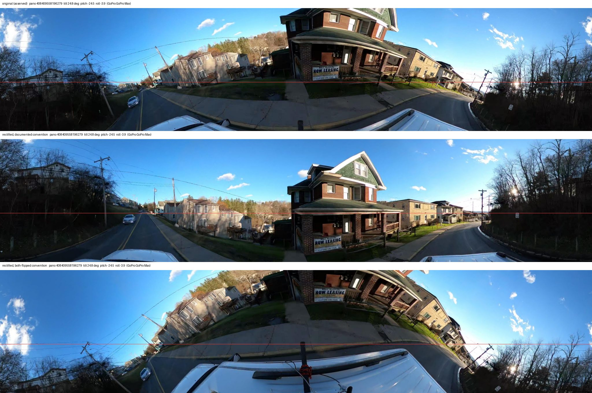

*Figure 1a. Morgantown `408409558196279` (GoPro Max, tilt 24.8°, pitch −24.5°, roll −3.9°). Top: as served.
Middle: rectified with the documented convention. Bottom: rectified with pitch and roll both flipped.*

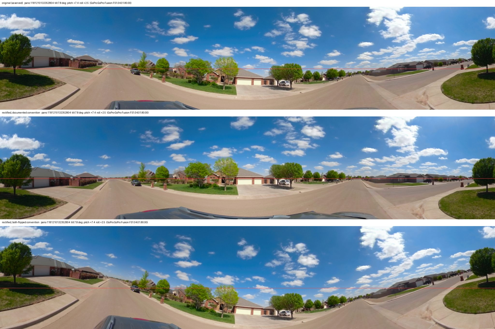

*Figure 1b. Clovis `1181210132352804` (GoPro Fusion, tilt 7.8°, pitch +7.4°, roll +2.5°). A typical
car-roof tilt rather than an extreme one; the horizon moves onto the red line in the middle panel.*

The vertical-edge statistic over all 593 benchmark panoramas (Figure 1c, `verticality.csv`) makes the same
call without a human in the loop: on the 308 panoramas with tilt ≥ 3°, re-rendering with the documented convention raises the
vertical-edge fraction on 273 (89%), while the both-flipped convention raises it on 6 (2%) and lowers it on
the rest; in a paired comparison the documented rendering beats the both-flipped one on 298 of 308 and beats
all three flips at once on 240 of 308. The effect grows with tilt (93 of 98 improve above 5°) and vanishes in
the control group below 1.5° (56 of 104, a coin flip — there is nothing to correct). Pitch carries most of
the signal; roll is small on most rigs, so its flip is closer to a coin flip (150 of 308). Per city the
documented convention improves 52/55 (Richmond), 59/68 (Clovis), 67/69 (Morgantown), 57/63 (Annapolis) and
38/53 (Laurens) of the tilted panoramas.

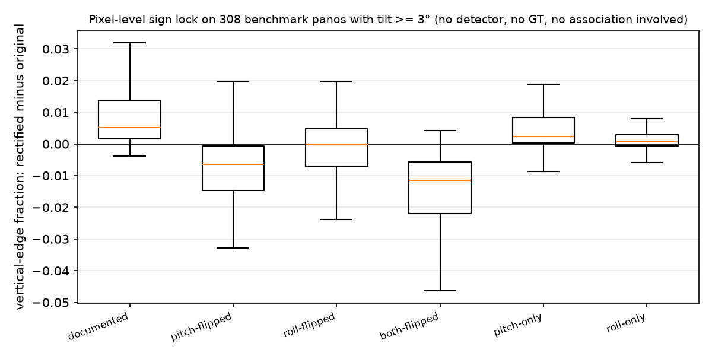

*Figure 1c. Change in the vertical-edge fraction after re-rendering under each convention, for the 308
benchmark panoramas with tilt ≥ 3°. Above zero = the re-rendered image is more gravity-aligned than the
original. No detector, ground truth or association is involved.*

**Horizon test.** Under the documented convention no reviewer-marked ramp in any city raycasts above the
horizon; every alternative puts some there.

| Marks above the horizon (of 1,315) | off | documented | road-relative | pitch-flipped | roll-flipped | both-flipped |
|---|---:|---:|---:|---:|---:|---:|
| richmond (310) | 5 | **0** | 2 | 13 | 10 | 17 |
| clovis (195) | 0 | **0** | 1 | 0 | 1 | 3 |
| morgantown (267) | 0 | **0** | 0 | 7 | 2 | 9 |
| annapolis (294) | 3 | **0** | 0 | 33 | 0 | 33 |
| laurens (249) | 0 | **0** | 0 | 4 | 0 | 2 |
| total | 8 | **0** | 3 | 57 | 13 | 64 |

Four independent lines — Mapillary's compass, PS's viewer, the pixels, and the reviewers' marks — agree.
The convention is settled.

### 5.2 RQ2 — how much tilt, and where it comes from

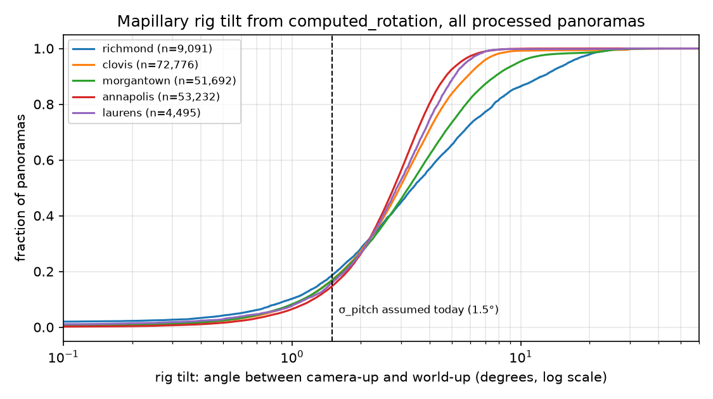

*Figure 2. Rig tilt (angle between camera-up and world-up) for every processed panorama. The dashed line is
the 1.5° pitch sigma the Mapillary error model assumes today.*

| City | tilt p50 | p90 | p99 | max | > 1.5° | > 5° | > 10° | label-weighted p50 / p90 |
|---|---:|---:|---:|---:|---:|---:|---:|---:|
| richmond | 3.38° | 12.40° | 22.96° | 51.1° | 81% | 34.5% | 13.6% | 2.73° / 8.11° |
| clovis | 2.96° | 5.84° | 9.08° | 169.8° | 83% | 16.1% | 0.8% | 2.86° / 5.45° |
| morgantown | 3.23° | 7.72° | 22.89° | 42.0° | 83% | 26.6% | 4.6% | 3.15° / 7.30° |
| annapolis | 2.79° | 4.70° | 7.05° | 83.4° | 85% | 7.5% | 0.1% | 2.81° / 4.63° |
| laurens | 2.87° | 5.12° | 6.99° | 80.4° | 84% | 11.2% | 0.2% | 3.10° / 5.04° |

"Label-weighted" weights each panorama by its number of operational detections: the panoramas that produce
labels are not less tilted than the rest. The 1.5° sigma covers roughly the bottom sixth of the distribution.

**By rig** (Figure 3, `tilt_by_rig.csv`). Richmond's GoPro Max sequences (15 sequences, 3,318 panoramas)
have a median tilt of 7.55° and a p90 of 17.5° — bicycle and hand-carried captures — against 2.35° / 4.90°
for the iSTAR Pulsar car rig in the same city. Richmond's 960 "unknown" panoramas sit at a median pitch of
−4.56° with roll ≈ 0: a fixed nose-down mount. Annapolis's Trimble MX7 survey vehicle has a median pitch of
−2.4° and roll +0.4°…+0.8°: a small, constant mount offset.

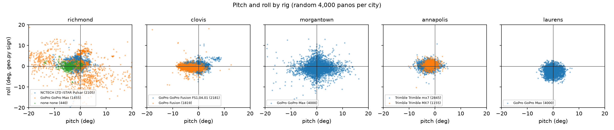

*Figure 3. Pitch against roll (geo.py sign) for a random 4,000 panoramas per city, coloured by rig.*

**Within sequences** (Figure 4). The tilt is not a per-rig constant. Median within-sequence SD of pitch is
0.9–2.4°, comparable to the spread *between* sequences (0.9–3.8°). The smoothness ratio separates two
regimes: Morgantown 0.38 and Annapolis 0.51 (a slowly varying signal — the road), Clovis 1.19, Laurens 1.26
and Richmond 1.72 (frame-to-frame jitter — bumps, handling, and some SfM noise). That split reappears in §5.3.

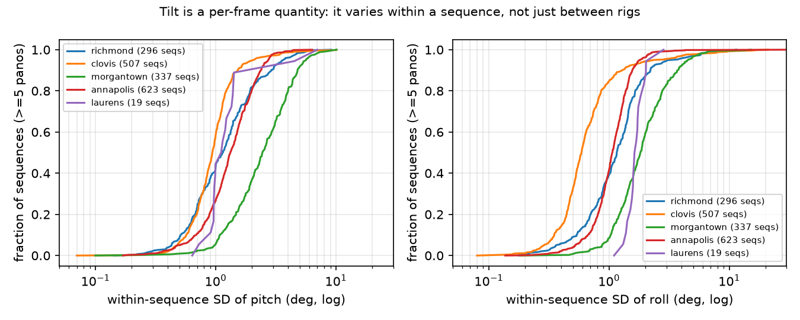

*Figure 4. Within-sequence standard deviation of pitch and roll (sequences with ≥ 5 panoramas).*

**What it does to a ground point** (Figure 5, `displacement_by_bucket.csv`). For operational detections the
flat and tilt-corrected ground points differ by a median 1.2–1.5 m and a p90 of 4.4–5.6 m per city — larger
than the p90 placement error fusion was measured to remove in #27. Within a tilt bucket the numbers are the
same in every city (median 0.4–0.6 m below 1.5°, 1.0–1.4 m at 1.5–3°, 1.7–2.2 m at 3–5°, 2.6–3.4 m at 5–10°,
4.3–6.7 m above 10°), because the geometry is the same. Between 3.4% (Laurens) and 13.1% (Richmond) of
operational detections change placeability — cross the 25 m range cap or the horizon guard — in one
direction or the other; both directions occur in every city, within a factor of 1.7 of each other.

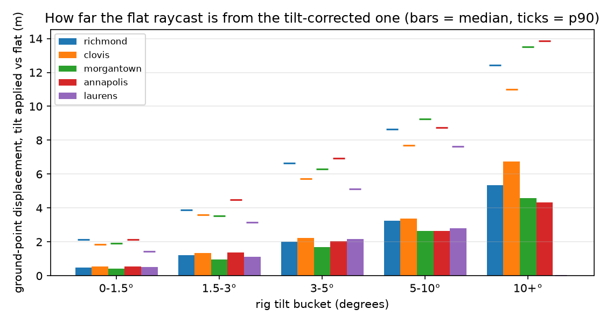

*Figure 5. Distance between the flat and tilt-corrected ground point of the same detection, by tilt bucket
(bars = median, ticks = p90).*

Side finding: the EXIF `compass_angle` disagrees with `computed_compass_angle` by more than 10° on 25%
(Richmond), 29% (Morgantown), 52% (Clovis) and 91% (Annapolis) of panoramas. `sources/mapillary.py` already
prefers the computed value; anything that reads the raw EXIF compass would be badly wrong.

### 5.3 RQ3 — rig or road?

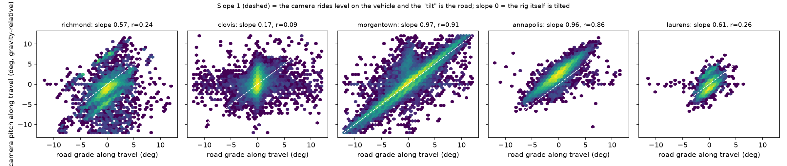

*Figure 6. Camera pitch along the direction of travel (gravity-relative) against the road grade from the
sequence's SfM altitude profile. Dashed: slope 1.*

| City | frames | slope of travel-pitch on grade | r | \|grade\| p50 / p90 | \|pitch along travel\| p50 | \|pitch relative to road\| p50 / p90 |
|---|---:|---:|---:|---:|---:|---:|
| richmond | 8,431 | 0.57 | 0.24 | 1.05° / 3.83° | 2.19° | 1.92° / 9.91° |
| clovis | 68,322 | 0.17 | 0.09 | 0.24° / 0.76° | 0.91° | 0.90° / 2.44° |
| morgantown | 51,537 | **0.97** | **0.91** | 2.06° / 6.33° | 2.30° | **0.49°** / 1.51° |
| annapolis | 52,815 | **0.96** | **0.86** | 0.85° / 2.50° | 2.39° | 2.55° / 3.12° |
| laurens | 4,483 | 0.61 | 0.26 | 0.62° / 1.60° | 1.21° | 1.12° / 2.64° |

Morgantown is a hill town, and its GoPro Max rides level on a car: the camera's gravity-relative pitch *is*
the road grade (slope 0.97, r 0.91), and relative to the road the camera is level to a median 0.49°. Annapolis
has the same slope on a flat city: the Trimble follows the road too, but with a constant −2.4° mount offset
that survives the subtraction (median 2.55° relative to the road). Clovis is flat and its tilt is the rig's
own (slope 0.17). Richmond and Laurens are mixtures.

This is the mechanism behind everything in §5.4. A flat-ground raycast assumes the ground is the plane
perpendicular to the camera's "up". On a vehicle on a grade the road *is* tilted with the camera, so the
camera frame was the right frame all along, and rotating the ray to gravity moves it off the road. The
quantity the raycast wants is the camera's orientation relative to the local ground, and `computed_rotation`
gives its orientation relative to gravity; on level ground they coincide, on a slope they differ by the
grade.

### 5.4 RQ4 — multi-view sign lock

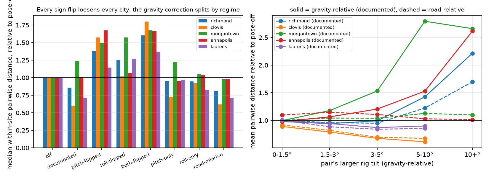

*Figure 7. Left: **median** within-site pairwise member distance under each convention, relative to the flat
raycast. Right: the **mean**, by the pair's larger tilt; solid = gravity-relative (documented), dashed =
road-relative. The two panels use different statistics deliberately — see the table below, where they
disagree on the two correct conventions.*

Within-site pairwise distance between operational members (association frozen from the flat fuse; every row
of a city is the same sites and therefore the same pair count; ×n is relative to `off`):

| City | sites | pairs | stat | off | documented | road-rel | pitch-flip | roll-flip | both-flip | pitch-only | roll-only |
|---|---:|---:|---|---:|---:|---:|---:|---:|---:|---:|---:|
| richmond | 1,079 | 29,249 | median (m) | 2.73 | 2.34 (0.86×) | **2.20 (0.81×)** | 3.77 (1.38×) | 3.42 (1.25×) | 4.37 (1.60×) | 2.59 (0.95×) | 2.58 (0.95×) |
| | | | mean / range | 0.257 | 0.239 (0.93×) | **0.228 (0.89×)** | 0.374 (1.45×) | 0.336 (1.31×) | 0.430 (1.67×) | 0.256 (1.00×) | 0.248 (0.96×) |
| | | | mean (m) | **3.23** | 3.58 (1.11×) | 3.36 (1.04×) | 5.44 (1.68×) | 5.05 (1.56×) | 6.08 (1.88×) | 3.64 (1.13×) | 3.26 (1.01×) |
| | | | p90 (m) | **6.49** | 7.30 (1.12×) | 6.89 (1.06×) | 11.08 (1.71×) | 9.88 (1.52×) | 11.79 (1.82×) | 7.28 (1.12×) | 6.71 (1.03×) |
| clovis | 1,532 | 22,468 | median (m) | 2.55 | **1.54 (0.60×)** | 1.58 (0.62×) | 4.01 (1.57×) | 2.60 (1.02×) | 4.59 (1.80×) | 1.85 (0.73×) | 2.36 (0.93×) |
| | | | mean / range | 0.243 | **0.162 (0.66×)** | 0.167 (0.69×) | 0.389 (1.60×) | 0.259 (1.07×) | 0.434 (1.78×) | 0.187 (0.77×) | 0.232 (0.95×) |
| | | | mean (m) | 3.03 | **2.14 (0.71×)** | 2.24 (0.74×) | 5.16 (1.70×) | 3.74 (1.23×) | 6.11 (2.01×) | 2.50 (0.83×) | 2.89 (0.95×) |
| | | | p90 (m) | 6.14 | **4.70 (0.77×)** | 4.87 (0.79×) | 10.48 (1.71×) | 7.90 (1.29×) | 12.60 (2.05×) | 5.40 (0.88×) | 5.90 (0.96×) |
| morgantown | 1,201 | 32,389 | median (m) | 2.11 | 2.61 (1.23×) | **2.07 (0.98×)** | 3.17 (1.50×) | 3.33 (1.57×) | 3.54 (1.67×) | 2.59 (1.23×) | 2.22 (1.05×) |
| | | | mean / range | **0.232** | 0.305 (1.32×) | 0.231 (1.00×) | 0.371 (1.60×) | 0.375 (1.62×) | 0.405 (1.75×) | 0.299 (1.29×) | 0.248 (1.07×) |
| | | | mean (m) | **2.68** | 4.45 (1.66×) | 2.83 (1.06×) | 5.52 (2.06×) | 5.60 (2.09×) | 5.97 (2.23×) | 4.16 (1.55×) | 3.07 (1.15×) |
| | | | p90 (m) | **5.74** | 9.49 (1.65×) | 6.11 (1.06×) | 11.63 (2.03×) | 11.75 (2.05×) | 12.35 (2.15×) | 8.59 (1.50×) | 6.48 (1.13×) |
| annapolis | 3,101 | 119,907 | median (m) | 2.75 | 2.78 (1.01×) | 2.70 (0.98×) | 4.61 (1.67×) | 2.93 (1.06×) | 4.58 (1.66×) | **2.62 (0.95×)** | 2.87 (1.04×) |
| | | | mean / range | 0.253 | 0.262 (1.04×) | 0.252 (1.00×) | 0.438 (1.73×) | 0.285 (1.13×) | 0.442 (1.75×) | **0.254 (1.00×)** | 0.264 (1.04×) |
| | | | mean (m) | **3.29** | 3.89 (1.18×) | 3.66 (1.11×) | 6.78 (2.06×) | 4.20 (1.28×) | 6.51 (1.98×) | 3.69 (1.12×) | 3.58 (1.09×) |
| | | | p90 (m) | **6.68** | 8.35 (1.25×) | 7.85 (1.18×) | 14.85 (2.22×) | 8.92 (1.34×) | 13.68 (2.05×) | 7.86 (1.18×) | 7.39 (1.11×) |
| laurens | 141 | 1,516 | median (m) | 3.70 | 2.65 (0.72×) | **2.65 (0.72×)** | 4.23 (1.14×) | 4.70 (1.27×) | 5.08 (1.37×) | 3.60 (0.97×) | 3.07 (0.83×) |
| | | | mean / range | 0.366 | 0.295 (0.80×) | **0.287 (0.78×)** | 0.401 (1.09×) | 0.485 (1.33×) | 0.531 (1.45×) | 0.365 (1.00×) | 0.310 (0.85×) |
| | | | mean (m) | 4.00 | 3.57 (0.89×) | **3.42 (0.86×)** | 5.46 (1.37×) | 5.18 (1.30×) | 6.01 (1.50×) | 4.07 (1.02×) | 3.69 (0.92×) |
| | | | p90 (m) | **7.17** | 7.52 (1.05×) | 7.18 (1.00×) | 9.95 (1.39×) | 9.24 (1.29×) | 10.59 (1.48×) | 7.54 (1.05×) | 7.28 (1.01×) |

**Every sign flip loosens agreement in every city, on all four statistics** — the sign is locked by this
test as well, and that conclusion does not depend on which statistic you read.

**The choice between the two correct conventions does.** On the median and the range-normalised mean, the
documented gravity-relative correction tightens Clovis (−40%), Laurens (−28%) and Richmond (−14%), loosens
Morgantown (+23%) and leaves Annapolis flat (+1%); road-relative is the best of the three physically meaningful
conventions (off / documented / road-relative) in four cities, within 3% of the best in the fifth, and
**loosens none of them** (−1.8% Annapolis, −2.3% Morgantown, −19.2% Richmond, −28.4% Laurens,
−38% Clovis). On the raw mean and p90 the same road-relative rows read +4%/+6% (Richmond), +6%/+6%
(Morgantown) and +11%/+18% (Annapolis) — i.e. *worse than doing nothing.*

Both readings are of the same pairs; they differ because the correction moves a minority of rays a long way.
§4.4 explains why the tail here is inflated by the missing 25 m cap, and §6 says what we are and are not
entitled to conclude from that. The short version: **this test supports "correct the tilt, road-relative"
for typical placements and does not support it for the tail**, and the tail is what #27's p90 placement
claim was made of.

Broken out by road grade (Figure 8, `ablation.csv`), the pattern is exactly the one §5.3 predicts:

| Morgantown, median pair distance by \|grade\| | 0–1.5° | 1.5–3° | 3–5° | 5–10° | > 10° |
|---|---:|---:|---:|---:|---:|
| off | 2.19 | 2.13 | 1.99 | 2.09 | 1.79 |
| documented (gravity) | 2.05 | 2.45 | 3.21 | 4.60 | 5.85 |
| road-relative | 2.01 | 2.05 | 2.12 | 2.15 | 1.84 |
| pairs | 10,280 | 10,841 | 6,745 | 4,255 | 217 |

The flat raycast does not get worse with grade because the camera follows the road; the gravity correction
gets worse in proportion to the grade; subtracting the grade restores the flat result. Richmond shows the
same shape at 3–10° of grade (3.3 → 4.2 → 3.5 m and 3.2 → 4.9 → 3.7 m). Bucketed by pitch relative to the
road instead (Figure 8, right), the gravity correction helps in every bucket in Clovis (0.63× → 0.36× as the
relative pitch grows) and Laurens, helps Richmond below 5° and stops helping above it, helps Annapolis once
the relative pitch exceeds 3° (the mount offset), and hurts Morgantown in every bucket with enough pairs to
read — because what it adds there is the grade, which the relative-pitch bucket has already taken out.

*Revision note.* This section was re-measured on 2026-09-21. The first version scored each convention on
whatever sites it could place, so the rows had different pair counts (Richmond 32,306 for `off` against
30,607 for `pitch-flipped`) under a single printed count; and it reported only the median and the
range-normalised mean. The common-site intersection and the mean/p90 rows are new, and every cell above
moved. The direction of every sign-flip conclusion is unchanged.

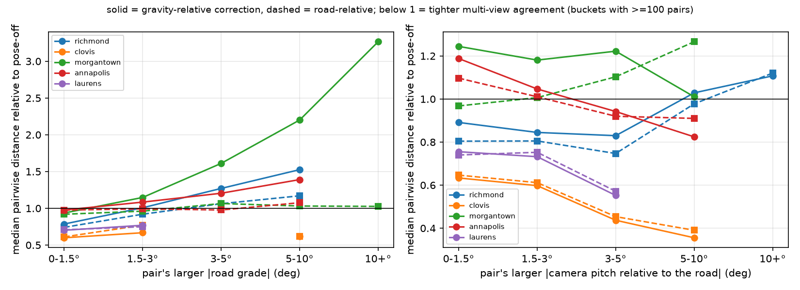

*Figure 8. Median within-site pairwise distance relative to the flat raycast, by the pair's larger road grade
(left) and by its larger camera pitch relative to the road (right). Solid = gravity-relative, dashed =
road-relative; buckets with ≥ 100 pairs.*

### 5.5 RQ5 — against RampNet ground truth

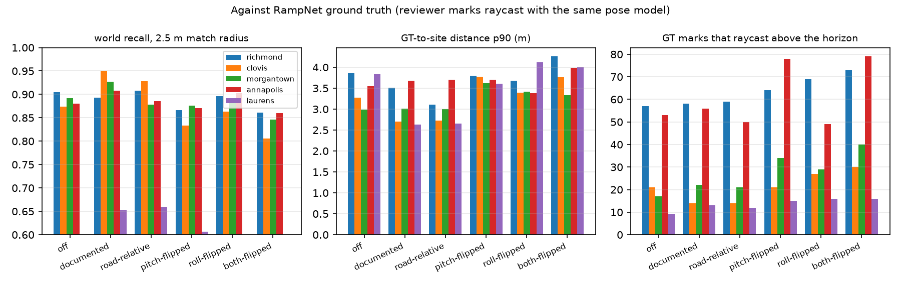

*Figure 9. World recall at 2.5 m, p90 GT-to-site distance, and unplaceable GT marks per convention.*

**The recall denominator moves between rows.** GT marks are raycast under the pose being tested, so a
convention that pushes a mark above the horizon or past the 25 m cap drops the ramp out of the pool — out of
the denominator as well as the numerator. `pool_ramps` is therefore printed for every row, and
`recall vs off pool` re-expresses the same numerator over one fixed denominator (the flat raycast's pool),
which is comparable across rows at the cost of being able to exceed 1 (Clovis, where the correction makes
*more* GT marks placeable). Read the fixed-denominator column when comparing conventions.

| City | convention | pool | GT marks unplaceable | recall @5 m | recall @2.5 m | **vs off pool @2.5 m** | precision | GT→site p50 / p90 (m) | sites |
|---|---|---:|---:|---:|---:|---:|---:|---:|---:|
| richmond | off | 253 | 57 | 0.941 | 0.905 | **0.905** | 0.959 | 1.55 / 3.85 | 1,570 |
| | documented | 252 | 58 | 0.933 | 0.893 | 0.889 | 0.959 | 1.30 / 3.51 | 1,442 |
| | road-relative | 251 | 59 | 0.932 | 0.908 | 0.901 | 0.959 | **1.16 / 3.11** | 1,456 |
| clovis | off | 174 | 21 | 0.943 | 0.874 | 0.874 | 0.923 | 1.32 / 3.28 | 2,495 |
| | documented | 181 | 14 | **0.978** | **0.950** | **0.989** | 0.913 | **0.98 / 2.70** | 2,367 |
| | road-relative | 181 | 14 | 0.967 | 0.928 | 0.966 | 0.913 | 1.12 / 2.73 | 2,357 |
| morgantown | off | 250 | 17 | 0.948 | 0.892 | 0.892 | 0.974 | 1.10 / 2.99 | 1,733 |
| | documented | 245 | 22 | **0.963** | **0.927** | **0.908** | **0.984** | 1.08 / 3.01 | 1,757 |
| | road-relative | 246 | 21 | 0.951 | 0.878 | 0.864 | 0.974 | **1.01** / 3.00 | 1,708 |
| annapolis | off | 241 | 53 | 0.934 | 0.880 | 0.880 | 0.980 | 1.38 / 3.55 | 4,018 |
| | documented | 238 | 56 | **0.971** | **0.908** | **0.896** | 0.975 | **1.36** / 3.67 | 3,533 |
| | road-relative | 244 | 50 | 0.959 | 0.885 | **0.896** | 0.980 | 1.37 / 3.70 | 3,476 |
| laurens | off | 235 | 9 | 0.698 | 0.536 | 0.536 | 0.892 | 1.88 / 3.83 | 2,298 |
| | documented | 233 | 13 | 0.712 | 0.652 | 0.647 | 0.893 | 1.39 / 2.63 | 2,241 |
| | road-relative | 235 | 12 | **0.715** | **0.660** | **0.660** | **0.895** | **1.36** / 2.66 | 2,236 |

On the fixed denominator at 2.5 m, the pitch-flipped and both-flipped conventions score below "off" in every
city, and roll-flipped in four of five — the exception is Annapolis (0.917 vs 0.880), where the median roll
is under 1° so the flip is close to a no-op and the nine-ramp gap on a pool of 241 is not a distinguishable
difference. Full table in `gt_eval.csv`.

The gravity-relative correction beats the flat raycast at 2.5 m in four cities (+1.6 Morgantown, +1.6
Annapolis, +11.1 Laurens, +11.5 Clovis); the exception is Richmond (−1.6), which is also where placement
improves most. Road-relative wins Clovis (+9.2), Annapolis (+1.6) and Laurens (+12.4), is level in Richmond
(−0.4) and loses Morgantown (−2.8). **Both corrections** tighten the median GT-to-site distance in every
city; every sign flip loosens it in four of five (roll-flipped, `match_dist_p50` vs off: 1.61/1.55
Richmond, 1.56/1.32 Clovis, 1.30/1.10 Morgantown, 1.94/1.88 Laurens).

Morgantown's recall gain under the gravity variant sits beside its multi-view *loss* in §5.4 because GT marks
are raycast with the same pose: for a ramp the reviewer marked in the very panorama that detected it, a
shared error cancels in the match. The cross-view test is the one that sees the grade, which is why §5.4
carries more weight for the choice of variant and §5.5 more weight for "does correcting at all help" — and on
that question the two agree.

*Revision note.* Re-measured on 2026-09-21. The `pool`, `GT marks unplaceable` and fixed-denominator columns
are new; the first version compared `recall @2.5 m` across rows whose denominators differ by up to 11% (the
Clovis and Annapolis pools move by 7 and 25 ramps), which overstated the gravity-relative gain in Morgantown
and Annapolis (+3.5 and +2.8 points became +1.6 and +1.6) and understated it in Clovis (+7.6 became +11.5).
The `recall @5 m`, `recall @2.5 m`, precision, distance and site columns are unchanged from the first version.

### 5.6 RQ6 — the viewer gate

Live probe of `sidewalk-richmond-test` for the seven smoke-test panoramas (2026-09-04): `2163793620710887`
and `1725939704722738` return 200, the other five 404. The first has PS's own pitch/roll (§5.1) — the
`pano_data` upsert keeps an existing value via `COALESCE`, so our null did not erase it; the second has
`cameraPitch: 0, cameraRoll: null` from an older PS write path. Both satisfy the gate; the five rows we
created alone do not.

What the value is used for, in `develop`:

- `PanoDataService.getLocalBackupImage` and `LabelTable.imageryViewable` require `camera_pitch` to be
  defined; `PannellumViewer.js` then **does not use it** — its `getPov` comment records that subtracting
  `cameraPitch` displaced the marker on ~98% of panoramas (#5174) and that "row panoHeight/2 is the horizon
  by construction". `calculatePovFromPanoXY` likewise ignores pitch and roll. So the gate is a presence
  check inherited from `PanoData`'s `requiredParams`, not a geometric dependency: **any number satisfies it,
  and a wrong number changes nothing on screen.**
- The route is a fallback. Validate admits a label when the provider reports the image exists and consults
  the backup metadata only when that check fails (`LabelService.checkImageryBatch`); `PanoManager.setPanorama`
  tries the live viewer first; the label popup used by Gallery, LabelMap and the dashboard runs live →
  Pannellum backup → static crop → "imagery not available", skipping the live attempt only when the pano is
  flagged `expired`. Crops (`CropService`) reach the file directly and never touch the gate.

So while Mapillary keeps serving Richmond's images, no launch-critical surface degrades because of the
null; the cost arrives the day a panorama expires, when the label becomes unviewable everywhere but its
crop. I did not open the pages in a browser to confirm the rendered state — this is the code path plus the
HTTP probe, which was the gap the previous session flagged. The server-side alternative the issue raises —
defaulting an unknown pitch to 0 at the gate, since the viewer ignores it — would fix every non-GSV
submitter at once and is a one-line change in `getLocalBackupImage`/`imageryViewable`; it is independent
of, and complementary to, writing the real value.

## 6. Discussion

**What "apply the tilt" should mean.** The issue framed the question as "does applying `computed_rotation`
help, hurt, or do nothing", by analogy with the GSV ablation. The answer is not a single sign: the rotation
is right (§5.1), applying it relative to gravity helps where the rig is tilted and hurts where the road is,
and the road-relative form is the one that is never wrong by more than noise **at the centre of the
distribution**. GSV was different in kind —
its imagery is pre-rectified, so its metadata angles describe a frame the pixels are no longer in. Mapillary
images are served as captured, so the angles describe the pixels; the subtlety is only which plane the
ray should meet.

**Error model.** With the correction applied, the residual pitch uncertainty is the pitch relative to the
road after the grade subtraction: median 0.5–1.9° (Annapolis 2.5°, a mount offset the correction handles),
p90 1.5–3.1° everywhere except Richmond, whose hand-carried GoPro sequences reach 9.9° — there the
per-frame value, not a sigma, is what matters. The current `sigma_pitch_rad = 1.5°` is roughly right *for the corrected raycast* and far too
small for the flat one it currently describes, where the real tilt has a median of 3°.

**What the reviewer-mark test cannot see.** The horizon test only exposes marks pushed above the horizon;
a wrong sign that pushes a mark *down* passes it. That is why it is one of four checks and not the check.

**Which statistic the recommendation rests on, and what that costs.** §5.4's road-relative verdict is a
claim about the median and the range-normalised mean. On the raw mean and p90 of the same pairs the same
correction is *worse than doing nothing* in Richmond, Morgantown and Annapolis, by 4–18%. Two things are
true about that. It is partly an artefact: the ablation deliberately runs uncapped (§4.4), so its tail holds
pairs at ranges `detection_ground_point` would drop, and a correction that lengthens rays is charged for
them. But it is not only an artefact — the corrected raycast really does move a minority of detections a
long way (§5.2: p90 displacement 4.4–5.6 m), and #27's case for fusion was made on a p90 placement
improvement, not a median one. So the honest scope of the recommendation is: **road-relative is the right
default for the typical label, and its effect on the worst 10% of placements is unmeasured under production's
range cap.** The wiring PR should measure that directly — re-run `eval_sites` end to end with the cap in
place and compare p90 GT-to-site distance, which §5.5 already shows moving in the right direction (every
convention tightens the median in every city, and the p90 in three of five).

**Limits.** (1) The road grade comes from SfM altitude differences over 2–40 m of travel between thinned
frames; its noise (≈ 1°) is visible in Clovis, where subtracting it costs 2.3 points of recall against the
gravity variant, and it is unavailable on 0.3% (Morgantown, Laurens) to 7.3% (Richmond) of frames, which
silently fall back to the gravity-relative angles — the convention §5.3 shows is the wrong one for a vehicle
rig. A smoothed profile over several frames would do better, and a cross-slope term is
unmodelled. (2) 30 of the 191,286 panoramas report tilts above 45°, up to 170° (25 of them in Clovis: upside-down or
failed reconstructions); they need a sanity cap before the values are trusted anywhere. (3) The frozen-association
ablation favours "off"; the re-fused GT evaluation favours whatever the GT was raycast with. Neither is
neutral, which is why both are reported. (4) Camera height is untouched: `DEFAULT_CAMERA_HEIGHT_M = 2.6` is
still applied to bicycle and hand-held rigs, and #42's items 3–5 remain open.

## 7. Answers to the issue's checklist

| #42 scope item | Status |
|---|---|
| Parse `computed_rotation` into `pano_pose` | Convention established and tested; **wired 2026-09-23** (§10): `geo.mapillary_pitch_roll` writes it into every new record and fusion derives it for old ones. |
| Re-run the pose ablation on a Mapillary city | Done on all five; result in §5.4–5.5: sign locked on every statistic; gravity-relative helps or hurts by regime; road-relative recommended on the median and the range-normalised mean, with its tail behaviour still to be measured under production's range cap (§6). |
| Validate slope-zeroing height estimation against GSV depth | Not started (needs the depth harvest, a GSV question). |
| Apply per-sequence height on richmond / clovis / morgantown / annapolis | Not started. |
| Pilot `mesh` | Not started. |
| (added 2026-08-12) viewer gate | Characterised (§5.6): presence check only; value unused by the viewer; fallback path only. |

## 8. Recommendations

1. **Write the pose.** In `sources/mapillary.build_pano_record`, set `camera_pitch = pitch_deg` and
   `camera_roll = roll_ps_deg` (= −geo roll) from `opensfm_pose(meta['computed_rotation'])`, in PS's sign
   convention, which is what PS already stores for Mapillary panoramas it scraped itself. Cap: leave both
   null when the tilt exceeds 45° (30 panoramas), rather than submit a reconstruction failure as a pose.
2. **One roll convention in the code.** Make the JSONL/PS sign the sign `geo._world_ray` uses (flip the roll
   term and its docstring; `test_roll_shifts_side_elevation` flips with it). GSV is unaffected in production
   (`apply_pose=False`, and the GSV ablation rejected every sign). Then `pano_pose` needs no per-source
   special case.
3. **Fusion.** `FuseParams.apply_pose=True` for Mapillary sources, with the road-relative angles where the
   run provides a sequence grade and the gravity-relative ones otherwise; keep GSV at `apply_pose=False`.
   Keep `sigma_pitch_rad = 1.5°` for the corrected raycast; it was never adequate for the flat one.

   **Where the road grade comes from in production.** It is not a per-panorama field and recommendation 1
   does not create one: `camera_pitch`/`camera_roll` in the JSONL carry the *gravity*-relative angles, which
   is what Project Sidewalk wants. The grade is a per-*sequence* quantity and is recomputed offline from data
   every record already carries — `source_metadata.computed_altitude`, plus `sequence_id`, `captured_at` and
   the position — exactly as `add_sequence_grade` does here (consecutive frames of one sequence, ≤ 60 s and
   2–40 m apart). So fusion needs a `mapillary_tilt.add_sequence_grade` equivalent moved into `geo.py` or
   `fuse_sites.py` and run once per file, not a new column and not a re-fetch. `geo.pano_pose` reads the
   pano block only, so the road-relative angles have to be applied by the caller that has the whole run in
   hand (`fuse_sites.load_results`), which is where this belongs anyway.

   **Name the fallback.** Where a frame has no usable sequence neighbour the angles fall back to
   gravity-relative — 0.3% of frames in Morgantown and Laurens, 0.8% in Annapolis, 6.1% in Clovis, 7.3% in
   Richmond. That is not a neutral default: on a vehicle rig on a grade it is the convention §5.3 shows to be
   wrong, so those frames get the Morgantown failure mode. At these rates it is acceptable and it should be
   counted in the run's stats rather than left silent; if a future city comes in high, `apply_pose=False`
   for the ungraded frames is the safer fallback than gravity-relative.

   **And measure the tail.** §5.4's verdict is a median result; §6 explains why the tail is unmeasured under
   production's 25 m cap. Before this ships, re-run `eval_sites` with the cap in place and compare p90
   GT-to-site distance under off / documented / road-relative. *(Done 2026-09-23, §10: road-relative
   tightens the p90 in all five cities; it is now fusion's Mapillary default.)*
4. **Backfill.** The values need no network: extend `scripts/backfill_metadata.py` with an offline pass that
   fills `camera_pitch`/`camera_roll` from the `source_metadata` already in each line (same atomic rewrite),
   then `send_to_ps.py --min-confidence 2.0` for the submitted cities — the verified idempotent pano-only
   update. PS's `COALESCE` upsert will not overwrite the rows PS populated itself, which is the desired
   outcome since those already agree with ours.
5. **Server side, optionally.** Propose on SidewalkWebpage that the backup gate default an absent pitch to 0,
   since the viewer ignores it; it removes the failure mode for every non-GSV submitter and costs nothing.
   Independent of items 1–4.
6. **Next measurements.** A smoothed per-sequence grade (its ≈ 1° noise is the limiting factor, §6); a
   capped-range version of the §5.4 ablation to settle the tail question; the camera-height routes in #42;
   and the same rectification check re-run when Mapillary's processing changes (the `rectify` subcommand is
   the regression test).

## 9. Reproducibility

Everything below reads `runs/<city>/results.jsonl` and `../RampNet/benchmark/<city>/` and writes under
`runs/<city>/tilt/` (per-panorama CSVs, gitignored) and `runs/_summary/tilt/` (the aggregated CSVs quoted
here). Figures land in `docs/figures/mapillary-tilt/`. Needs numpy, Pillow and SciPy for `rectify` /
`examples` and matplotlib for `figures`; the rest is stdlib on top of `geo.py`, `fuse_sites.py`,
`eval_sites.py`.

```bash
python scripts/mapillary_tilt.py stats          # tilt distributions, rigs, sequences, compass identity
python scripts/mapillary_tilt.py displacement   # flat vs corrected ground point per detection
python scripts/mapillary_tilt.py grade          # rig-or-road regression (§5.3)
python scripts/mapillary_tilt.py horizon        # GT marks above the horizon per convention
python scripts/mapillary_tilt.py ablation       # frozen-association multi-view spread (§5.4)
python scripts/mapillary_tilt.py eval           # world P/R vs RampNet GT per convention (§5.5)
python scripts/mapillary_tilt.py precondition   # the wiring's p90 gate and its verdict (§10)
python scripts/mapillary_tilt.py rectify        # vertical-edge statistic on 593 benchmark panos
python scripts/mapillary_tilt.py examples --limit 1   # the image strips
python scripts/mapillary_tilt.py figures        # redraw the figures (see below)
python scripts/mapillary_tilt.py pose 2163793620710887 --run richmond   # one pano's parsed pose
pytest tests/test_mapillary_tilt.py             # the convention lock
```

**What is committed, and what that lets you redo.** The aggregated CSVs are committed beside this document
in `docs/figures/mapillary-tilt/data/`, so **every table above can be checked without re-running anything**,
and `figures` redraws figures 3–7 and 9 straight from them (it looks in `runs/_summary/tilt/` first and
falls back to `data/`). Figures 1, 2 and 8 need the per-panorama `poses.csv` / `grade.csv` — up to 73k rows
per city, deliberately not committed — so `figures` prints what is missing and skips them; re-run `stats`
and `grade` first to get those back. After a full re-run, refresh the committed copies with
`cp runs/_summary/tilt/*.csv docs/figures/mapillary-tilt/data/`.

## 10. Production wiring and the p90 precondition (2026-09-23)

§6 left one thing unmeasured: whether road-relative correction, which wins the centre of §5.4's
distribution, also holds the tail once production's 25 m range cap is in place. §8 rec 3 made that the
precondition for wiring it into fusion. The plan comment on #42 posted the measurement design and the
decision rule **before** it ran; this section reports it, and the wiring that followed.

### 10.1 What shipped

1. **Pose in the record.** `geo.opensfm_pose` / `geo.rotation_matrix` (moved here from the study script,
   which now imports them) and `geo.mapillary_pitch_roll`, which `sources/mapillary.build_pano_record`
   uses: gravity-relative pitch and **PS-sign roll**, null when the rotation is missing or malformed or the
   tilt exceeds `MAX_POSE_TILT_DEG = 45°`. On the five runs that nulls exactly the 30 failed reconstructions
   of §6 (richmond 1, clovis 25, annapolis 2, laurens 2, morgantown 0).
2. **One roll sign.** `geo._world_ray` now consumes PS's sign (positive lowers the camera's right axis), so
   the value in the JSONL, in `pano_data`, and in the raycast are the same number. The study script's
   decomposition, road-relative formula and travel pitch follow it. `ablation`, `eval` and `grade`
   reproduce the CSVs committed with PR #50 **cell for cell** after the flip (checked by diffing every
   cell); the per-pano and summary **roll** columns written by `stats` and `rectify` now carry the other
   sign from the committed `tilt_summary.csv`, `tilt_by_rig.csv`, `tilt_by_sequence.csv` and
   `verticality.csv`, and figure 2's axis says so.
3. **The grade in production.** `fuse_sites.sequence_grades` is §4.3's grade (this script's
   `add_sequence_grade` now calls it) and `geo.road_relative_pitch_roll` the correction. `load_results`
   attaches a grade to each pano and, for a Mapillary block written before item 1, derives pitch/roll from
   `source_metadata` with the same function, so no submitted file has to be rewritten for fusion to use
   the pose. `--apply-pose` is `auto | off | gravity | road`; `sites_meta.json` gains a `pose` block that
   counts flat, gravity, road-relative and **gravity-fallback** panos (road mode, no usable neighbour).
4. **Backfill.** `scripts/backfill_metadata.py --pose` fills old files offline from their own
   `source_metadata`; it refuses to rewrite a file under a submission record in place (that would break
   `send_to_ps.py`'s sha256 guard for the live campaign) and writes a separate file with `--out`.

### 10.2 The measurement

`python scripts/mapillary_tilt.py precondition` → `eval_sites.pose_precondition`, per city, reading the run
through **production's** loader (`fuse_sites.load_results`, so the 45° cap and the production grade apply)
at the benchmark tier (0.55) with the production 25 m cap, arms `off` / `gravity` / `road`:

- **One site set.** Association is frozen from the `off` fuse. A site is scored only if every arm places
  every one of its operational members within 25 m; each arm then refits the site from its own raycast of
  those members with fusion's inverse-covariance refit.
- **One GT set.** A reviewer mark (verdict-true operational detection or non-unsure missed mark) is used only
  if every arm places it; marks are grouped into ramps once, under `off`, and each arm places a ramp at the
  mean of its own raycasts of that ramp's marks.
- **Distances** are over the pool ramps that every arm matches to a site within 5 m (the same ramps in every
  row); world recall at 2.5 m and 5 m over the same pool. Precision is identical across arms by
  construction (membership is frozen) and is shown only so the row reads like `eval_sites`'s.

Freezing the association from `off`, and grouping the shared GT under `off`, both favour `off`: the
measurement leans against any correction, which is the right direction for a gate.

**The rule (pre-registered on #42):** `road` becomes fusion's Mapillary default only if, against `off`, its
p90 GT-to-site distance is no worse in any city (tolerance 0.1 m) and its median improves in at least three
of five.

### 10.3 Results

| City | sites scored (of op.) | common ramps | arm | median (m) | p90 (m) | R@2.5 | R@5 | P | road fallback |
|---|---:|---:|---|---:|---:|---:|---:|---:|---:|
| richmond | 1,057 (1,570) | 126 | off | 1.30 | 3.42 | 0.895 | 0.904 | 0.937 | |
| | | | gravity | 1.14 | 2.86 | 0.886 | 0.913 | 0.937 | |
| | | | road | 0.96 | 2.74 | 0.900 | 0.917 | 0.937 | 6.9% of panos / 7.6% of members |
| clovis | 2,311 (2,495) | 141 | off | 1.31 | 3.32 | 0.876 | 0.935 | 0.915 | |
| | | | gravity | 0.82 | 2.53 | 0.929 | 0.953 | 0.915 | |
| | | | road | 0.90 | 2.37 | 0.917 | 0.947 | 0.915 | 5.4% / 4.0% |
| morgantown | 1,275 (1,733) | 137 | off | 1.05 | 3.07 | 0.854 | 0.897 | 0.974 | |
| | | | gravity | 0.85 | 2.72 | 0.876 | 0.897 | 0.974 | |
| | | | road | 0.81 | 2.79 | 0.858 | 0.901 | 0.974 | 0.1% / 0.1% |
| annapolis | 2,873 (4,018) | 128 | off | 1.36 | 3.55 | 0.882 | 0.927 | 0.984 | |
| | | | gravity | 1.08 | 2.89 | 0.900 | 0.923 | 0.984 | |
| | | | road | 1.03 | 2.75 | 0.905 | 0.923 | 0.984 | 0.8% / 1.0% |
| laurens | 171 (186) | 131 | off | 1.83 | 3.82 | 0.553 | 0.693 | 0.880 | |
| | | | gravity | 1.53 | 2.68 | 0.640 | 0.711 | 0.880 | |
| | | | road | 1.53 | 2.74 | 0.658 | 0.706 | 0.880 | 0.3% / 0.0% |

(`docs/figures/mapillary-tilt/data/pose_precondition.csv`; laurens is the `laurens_mapillary` split scored
against `runs/laurens/results.jsonl`. GT marks dropped by the intersection: richmond 81 of 310, clovis 26
of 195, morgantown 34 of 267, annapolis 74 of 294, laurens 16 of 249.)

| City | Δp90 road − off | Δmedian road − off |
|---|---:|---:|
| richmond | −0.68 m | −0.33 m |
| clovis | −0.96 m | −0.41 m |
| morgantown | −0.28 m | −0.24 m |
| annapolis | −0.80 m | −0.33 m |
| laurens | −1.09 m | −0.30 m |

**Verdict: road passes.** Its p90 is lower than the flat raycast's in all five cities (no city is even
within the 0.1 m tolerance of failing), and its median is lower in all five (three needed). Fusion's
default is now `apply_pose='auto'`: road-relative for Mapillary, flat for GSV (gravity-rectified, §6)
and for Panoramax (its optional `pers:pitch/roll` convention is unmeasured, #57).

**What this changes about §5.4.** The raw-mean and p90 losses there were the uncapped ablation charging
the correction for rays production never emits: under the cap, on shared sites, the tail tightens by
0.3–1.1 m everywhere. It does not make road-relative the best arm in every cell — gravity-relative has
the lower p90 in Morgantown (2.72 vs 2.79 m) and Laurens (2.68 vs 2.74 m) and the lower median in Clovis
(0.82 vs 0.90 m) — but in each case by less than the rule's tolerance, and road-relative is the one
convention that §5.3 shows is never the *wrong* model for a car on a slope. That is why it is the default.

**What it costs to measure it this way.** The intersection is expensive: 7% (clovis) to 33% (richmond)
of operational sites have some member that some arm cannot place within 25 m, and those are the
long-range sites where pose matters most. The common matched set is 126–141 ramps per city, so a p90 is
set by the worst dozen or so; treat differences under ~0.2 m as noise. The re-fused end-to-end
`eval_sites.py --apply-pose <arm>` (each arm on its own subset, the §5.5 design) shows no cost on the
rates: world recall at 5 m off → road rises in four cities (clovis 0.943 → 0.967, morgantown
0.948 → 0.951, annapolis 0.934 → 0.959, laurens 0.698 → 0.715) and dips in richmond (0.941 → 0.932,
well inside its ±3-point interval), and precision moves by at most a point (clovis 0.923 → 0.913).

### 10.4 What is deliberately left to a person

The live servers still hold null `camera_pitch` for every AI-submitted Mapillary pano. Filling them is a
pano-only push (`send_to_ps.py <file> --min-confidence 2.0` submits no labels, and PS's `COALESCE` upsert
leaves rows PS populated itself alone) from a file written by `backfill_metadata.py --pose --out`. It is
not done here: it writes to production, and the submitted files are under a sha256 guard that an
in-place rewrite would break. The commands are in the wiring PR.

## Appendix A — the decomposition, in full

With **R** = `rotation_matrix(computed_rotation)` (rows: right, down, forward, each as (E, N, U)):

```
heading = atan2(R[2][0], R[2][1])                       # forward's compass bearing
pitch   = asin(R[2][2])                                 # forward's elevation, + up
level_right = ( cos h, -sin h, 0)
pitched_up  = (-sin p sin h, -sin p cos h, cos p)
roll_geo = atan2(R[0]·pitched_up, R[0]·level_right)     # + lifts the image's right side
roll    = -roll_geo                                     # PS sign: + camera rolled clockwise;
                                                        # what the code returns since §10
tilt    = acos(-R[1][2])                                # camera-up vs world-up
```

`matrix_from_pose(heading, pitch, roll)` inverts it and is what the rectifier uses to build the flipped
alternatives. The world direction of pixel (x, y) is `Rᵀ · (cos θ sin φ, −sin θ, cos θ cos φ)` with
`φ = (x − 0.5)·2π`, `θ = (0.5 − y)·π`.

## Appendix B — Project Sidewalk's `extractPitchRoll`, for the record

```js
// public/js/common/pano-viewer/src/MapillaryViewer.js (develop)
const invR = [-rotation[0], -rotation[1], -rotation[2]];        // camera-to-world
const viewDir = new THREE.Vector3(0, 0, 1).applyMatrix4(matrix); // camera forward
const upDir   = new THREE.Vector3(0, -1, 0).applyMatrix4(matrix); // camera up
const pitch = asin(viewDir.z);
const right = viewDir × worldUp;  const expectedUp = right × viewDir;
const roll  = atan2(upDir · right, upDir · expectedUp);           // + = up-vector leans right
```

Same frames, same pitch; its roll was the negative of `geo._world_ray`'s. Both were correct; only the name
of the positive direction differed. Since §10 the JSONL carries PS's sign and `geo._world_ray` consumes it.
