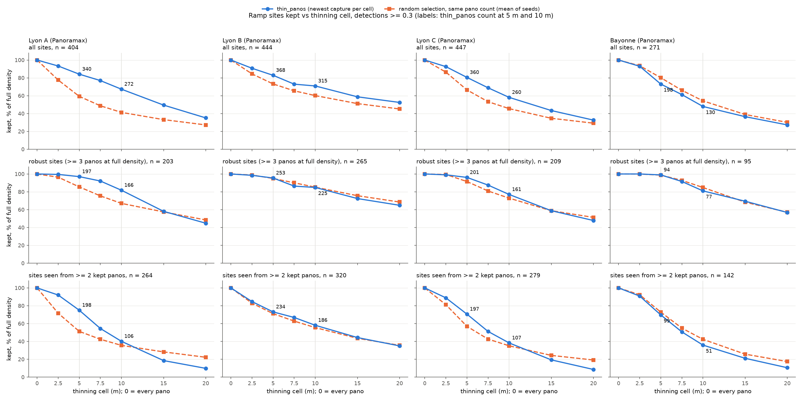
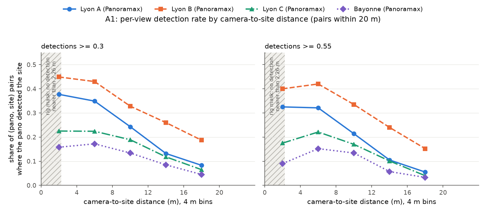

# Lyon thinning: 5 m or 10 m? (#148)

**Question.** Lyon ran at 10 m thinning (86,942 panos), chosen for runtime before
[#144](https://github.com/ProjectSidewalk/sidewalk-auto-labeler/pull/144) measured that 10 m
loses 10-18 points of well-seen sites on Panoramax (Bayonne). Lyon detects about 3x
Bayonne's rate per pano ([docs/panoramax-lyon.md](panoramax-lyon.md)), and #144's own
reading is that density pays most where each view rarely fires. So does Bayonne's result
transfer to Lyon, and is densifying Lyon to 5 m worth its cost?

This doc reuses #144's protocol and script ([docs/thinning-experiment.md](thinning-experiment.md))
unchanged, on three Lyon sub-areas. **Nothing in production changes.**

> **Key takeaways**
>
> 1. **10 m loses well-seen ramp sites in Lyon too, about as much as in Bayonne.** Of the
>    robust sites (>= 3 panos at full density), 5 m keeps 95-98% and 10 m keeps 76-87%,
>    a gap of **8-22 points** across the three boxes and both tiers (Bayonne: 10 and 18).
>    The pre-registered reading (>= 5 points in 2 of 3 boxes at 0.30) **favours 5 m**: the
>    gap is 15, 11 and 19 points. Lyon's ~3x higher per-pano rate did not shrink it.
> 2. **Multi-view support roughly halves at 10 m** in two boxes: sites seen from 2+ kept
>    panos at 0.30 fall 198 -> 106 (A) and 197 -> 107 (C), and 234 -> 186 in B.
> 3. **5 m costs 1.9-2.3x the panos of 10 m** in the boxes (Bayonne 2.0x). For the whole
>    city that is **+87,583 panos, ~9.7 h** at job 41472534's 2.505 panos/s (the box jobs
>    ran at 1.4-1.7 panos/s, so 14-17 h is the pessimistic bound). The 10 m set is an
>    exact subset of the 5 m set, so densifying only adds.
> 4. **Much of what 5 m adds is older imagery.** Newest-wins already gave 10 m the newest
>    pano of each cell; the extra 5 m panos are mostly earlier captures (2026 is 41% of the
>    10 m set, 18% of the added set), owned mostly by the Grand Lyon Métropole account
>    (53-93% of the added panos per box). Of the robust sites 5 m keeps and 10 m loses at
>    0.30, 48% / 93% / 35% (A / B / C) were never detected from a pano newer than 2024,
>    against 15% / 68% / 11% of the robust sites 10 m keeps. The enrichment is real in A
>    and C at 0.30, but box B is old-only almost everywhere, and at 0.55 box A reverses
>    (15% lost vs 21% kept); `lost_vintage.csv`.
> 5. **Unlike Bayonne, newest-wins beats a random same-size draw in every Lyon box**, by
>    24-105 sites, and by up to 30 robust sites in box A, where the raw scan is 75% dense
>    2020 Ladybug coverage that a random draw clumps on.
> 6. **Both sanity checks pass.** Each box's 10 m set sits inside the canonical run apart
>    from 10-15 panos, all in cells cut by the box edge; on the 1,940 panos both runs
>    processed, every detection lands on the same pixel and confidences differ by at most
>    0.00007.
>
> **Recommendation (for Jon to decide): densify Lyon to 5 m if the training plan wants
> multi-view mining or vintage diversity; stay at 10 m if RampNet#159's per-producer caps
> would discard most of the added panos anyway.** The coverage evidence is clear and
> matches Bayonne; whether the extra panos are worth ~10-17 GPU-hours depends on what the
> training set does with old Métropole imagery (section 6).

## 1. Densify cost, from the scan alone (no GPU)

`python scripts/thinning_experiment.py subset runs/lyon --from 10 --to 5 --panos-per-second 2.505 --out docs/figures/thinning-experiment-lyon/data`
reads the canonical run's own `scan.json` (sha256 `20339fea...`, scanned 2026-10-06 04:46 UTC).

| | panos |
|---|---:|
| raw scan | 381,295 |
| 5 m | 174,525 |
| 10 m (the run) | 86,942 |
| 20 m | 38,796 |
| 10 m panos *not* kept at 5 m | **0** |
| added by densifying 10 m -> 5 m | **87,583** |
| GPU time for the added set at Hyak's measured 2.505 panos/s (job 41472534, L40S) | **9.7 h** |

**The 10 m set is an exact subset of the 5 m set**, as it was in Bayonne. Densifying later
only adds panos: letting the 10 m run finish cost nothing.

The added set is **older** than the 10 m set. Newest-capture-wins already gave 10 m the
newest pano in each 10 m cell, so the extra 5 m panos are mostly the next-newest:

| capture year | 10 m set | added by 5 m | share of added |
|---|---:|---:|---:|
| 2026 | 35,200 | 16,170 | 18.5% |
| 2025 | 14,661 | 11,105 | 12.7% |
| 2024 | 1,616 | 752 | 0.9% |
| 2023 | 5,651 | 9,721 | 11.1% |
| 2022 | 13,458 | 22,450 | 25.6% |
| 2021 | 7,041 | 9,410 | 10.7% |
| 2020 | 8,662 | 16,987 | 19.4% |
| <= 2019 | 653 | 988 | 1.1% |

(`data/densify_years.csv`; 2011, 2018 and 2019 summed into `<= 2019`.)

## 2. Pre-registered rule (committed and pushed before any GPU job)

**Why sub-areas, not a full densify.** #144's protocol needs an un-thinned
(`--thin-spacing 0`) run as the full-density denominator, which the 10 m run cannot supply.
A full 5 m densify would take ~9.7 h of ckpt GPU and answers a different question (it has no
denominator either). So: three sub-areas, run un-thinned, scored offline at every spacing.

**Boxes.** Chosen to span the strata RampNet#159's audit cares about (camera and operator),
read from the canonical 10 m run's producer mix inside each box. Each was then sized with
`--scan-only` (fresh scans, 2026-10-07 04:28-04:30 UTC) to fall within the budget.

| box | run name | geojson | centre, size | stratum (10 m set inside the box) | raw panos (scan-only) |
|---|---|---|---|---|---:|
| A | `thinexp_lyon_a` | `example_geojson/lyon_thinexp_a.geojson` | 45.7667 N 4.8452 E, 330 x 330 m (Presqu'île) | ecartip GoPro Max 5760x2880 (70% of the box's 10 m panos; raw scan 75% 2020 Ladybug, which newest-wins mostly drops) | 4,226 |
| B | `thinexp_lyon_b` | `example_geojson/lyon_thinexp_b.geojson` | 45.7487 N 4.8436 E, 520 x 520 m (Confluence) | Grand Lyon 8192x4096 (make-less, 2021 campaign; 72%) | 4,379 |
| C | `thinexp_lyon_c` | `example_geojson/lyon_thinexp_c.geojson` | 45.7487 N 4.8629 E, 550 x 550 m (east bank, 7e) | mixed accounts, no producer > 50% (ecartip 48%, Grand Lyon Ladybug 24%, IGN 10%, others) | 3,941 |
| | | | | **total** | **12,546** |

**Budget rule.**

1. Each box holds 3,000-6,000 raw panos by `--scan-only`; the total is at most 20,000.
   (A box over 8,000 would have been shrunk before submission.)
2. Detection runs on Hyak `ckpt-g2` (one L40S per box, the three in parallel), from a
   separate fresh clone (`repo-thinexp`), never the canonical `repo-main`. Each job runs
   `main.py example_geojson/lyon_thinexp_<x>.geojson --name thinexp_lyon_<x> --source panoramax --thin-spacing 0 --reuse-scan`
   on the scan committed here (uploaded with the run dir), so the processed set is the
   pre-registered one.
3. **Early abort:** after ~500 panos, a job whose failures exceed 5% or whose skips exceed
   10% is cancelled and not blindly retried.
4. **Time box:** if the jobs have not finished ~6 h after submission, what is done is
   written up and the PR stays a draft.

**Analysis (unchanged from #144).** `scripts/thinning_experiment.py runs/thinexp_lyon_<x>`
at 0.55 and with `--min-confidence 0.3`: 7.5 m greedy sites from flat 2.6 m raycasts, rig
mask on, spacings 0 / 2.5 / 5 / 7.5 / 10 / 15 / 20 m, random same-count control over 20
seeds. Figures go to `docs/figures/thinning-experiment-lyon/` (never #144's directory).

**Sanity checks.**

- Each box's 10 m kept set should sit inside the canonical run's processed set
  (`runs/lyon/already_processed.txt`), apart from cells cut by the box edge, where the
  newest pano of the cell can lie outside the box. Report the count.
- Detections on panos shared with the canonical run should match it (same model revision).
  Report the share that match exactly and the largest confidence difference.

**Reading guide for the recommendation** (fixed now; the call stays Jon's). The headline
is the robust-site gap, 5 m minus 10 m, as points of the box's full-density robust count,
at 0.30 (the tier production ships and training mines), read with 0.55 beside it.

- **Favours 5 m** if the gap is >= 5 points in at least 2 of the 3 boxes (Bayonne, #144: 10 points
  at 0.55, 18 at 0.30).
- **Favours staying at 10 m** if the gap is <= 2 points in at least 2 of the 3 boxes.
- **Otherwise mixed**: the per-box pattern (stratum) and the 2+-view counts carry the
  reading.

The 2+-view column (what multi-view mining and fusion need) and all-site retention are
reported beside it, as in #144, but do not change the reading above.

## 3. The runs

All three ran on Hyak `ckpt-g2` (one L40S each) from the fresh clone `repo-thinexp` at
`691fd8f` (this branch's pre-registration commit, pushed 2026-10-07 04:30 UTC; jobs
submitted 04:32 UTC), with `sal_lyon_thinexp.sbatch`.

| box | job | processed / skipped / failed | wall time (UTC) | rate (`detector:` line) |
|---|---|---:|---|---:|
| A | 41493385 | 4,226 / 0 / 0 | 04:36-05:25 | 1.459 panos/s |
| B | 41493386 | 4,379 / 0 / 0 | 04:40-05:23 | 1.703 panos/s |
| C | 41493387 | 3,853 / **88** / 0 | 04:45-05:30 | 1.403 panos/s |

- **Abort rule:** checked at 1,317 (A), 821 (B) and 554 (C) panos: 0 failures, 0 skips.
  C's 88 skips (2.2%, all `No heading (view:azimuth)`, cached) came later and stay under
  the 10% bar. Nothing was cancelled or retried.
- **Skipped panos cannot hold a site.** In C, thinning still keeps some of the 88 (30 of
  the 10 m and added sets; `producers.csv` row `(skipped or unnamed)`), so C slightly
  understates coverage at every spacing, the full-density count included.
- **Position check:** A and B ran it at the end of the job. C's Overpass query failed
  (HTTP 504), so it was re-run locally with
  `python scripts/position_check.py runs/thinexp_lyon_c --report`, as #144 did for
  Richmond; C's manifest therefore has no `position_check` block. Panoramax is never gated.
- The box rates are below the canonical slice 2's 2.505 panos/s on the same partition.
  Short jobs on shared nodes spend proportionally more time on image fetches; the
  densify estimate is given at both rates.

## 4. Results

`gpu_hours` uses main.py's 1.5 s/pano planning rate; only the ratios matter. Percentages
are of the box's own full-density count.

### 5 m against 10 m (the headline)

Robust = at least 3 member panos at full density. Gap = 5 m minus 10 m, in points of the
full-density robust count.

| | A 0.55 | A 0.30 | B 0.55 | B 0.30 | C 0.55 | C 0.30 | Bayonne 0.55 | Bayonne 0.30 |
|---|---|---|---|---|---|---|---|---|
| cost, 5 m / 10 m panos | 2.28x | 2.28x | 1.92x | 1.92x | 2.09x | 2.09x | 1.98x | 1.98x |
| robust kept, 5 m | 127 (97%) | 197 (97%) | 195 (95%) | 253 (95%) | 121 (98%) | 201 (96%) | 38 (95%) | 94 (99%) |
| robust kept, 10 m | 107 (82%) | 166 (82%) | 179 (87%) | 225 (85%) | 94 (76%) | 161 (77%) | 34 (85%) | 77 (81%) |
| **robust gap** | **15.3** | **15.3** | **7.8** | **10.6** | **22.0** | **19.1** | 10 | 18 |
| all sites, 5 m / 10 m | 86% / 66% | 84% / 67% | 84% / 74% | 83% / 71% | 83% / 58% | 81% / 58% | 74% / 49% | 73% / 48% |
| 2+ view sites, 5 m / 10 m | 137 / 68 | 198 / 106 | 188 / 144 | 234 / 186 | 124 / 64 | 197 / 107 | 38 / 21 | 99 / 51 |

**Pre-registered reading: favours 5 m.** At 0.30 the gap is 15.3, 10.6 and 19.1 points,
at least 5 in all three boxes (the rule needed 2). It also holds at 0.55. The smallest gap
is box B, the Métropole's 8192x4096 campaign, whose dense 2020/2021 coverage keeps 10 m's
loss to 8-11 points.

The same at 0.55:
[coverage_vs_spacing_t0.55.png](figures/thinning-experiment-lyon/coverage_vs_spacing_t0.55.png)
(SVG beside each PNG).

### Per box, every spacing

| box | spacing | panos | sites 0.55 | robust 0.55 | 2+ views 0.55 | sites 0.30 | robust 0.30 | 2+ views 0.30 |
|---|---|---:|---:|---:|---:|---:|---:|---:|
| A | all | 4,226 | 285 | 131 | 176 | 404 | 203 | 264 |
| A | 2.5 m | 2,146 | 271 | 131 | 157 | 377 | 202 | 243 |
| A | **5 m** | 1,107 | 246 | 127 | 137 | 340 | 197 | 198 |
| A | **10 m** | 485 | 187 | 107 | 68 | 272 | 166 | 106 |
| A | 20 m | 186 | 89 | 54 | 12 | 142 | 91 | 26 |
| B | all | 4,379 | 314 | 205 | 236 | 444 | 265 | 320 |
| B | 2.5 m | 2,463 | 295 | 205 | 213 | 403 | 261 | 271 |
| B | **5 m** | 1,507 | 265 | 195 | 188 | 368 | 253 | 234 |
| B | **10 m** | 785 | 233 | 179 | 144 | 315 | 225 | 186 |
| B | 20 m | 372 | 172 | 135 | 66 | 233 | 172 | 112 |
| C | all | 3,941 | 300 | 123 | 181 | 447 | 209 | 279 |
| C | 2.5 m | 2,728 | 280 | 123 | 161 | 414 | 207 | 248 |
| C | **5 m** | 1,518 | 249 | 121 | 124 | 360 | 201 | 197 |
| C | **10 m** | 726 | 174 | 94 | 64 | 260 | 161 | 107 |
| C | 20 m | 334 | 94 | 57 | 8 | 146 | 100 | 24 |

The 7.5 m and 15 m rows, and the random-selection means, are in each box's
`spacing_curve.csv`.

**2.5 m.** It adds 2-6 robust sites in A and C, but 8-10 in B, for 1.6-1.9x the cost of
5 m. Not worth it as a default; B's dense Métropole coverage is the exception.

### Who the extra 5 m panos belong to

Per box, the panos 5 m adds over 10 m, and how often their views fire (`producers.csv`:
detections per processed pano, rig mask applied; largest owners only):

| box | added panos | owner (of the added set) | its share | rate @0.30, 10 m set -> added set (that owner) |
|---|---:|---|---:|---|
| A | 622 | grand lyon (2020 Ladybug) | 53% | 1.60 -> 2.04 |
| A | | ecartip | 27% | 1.72 -> 1.96 |
| B | 722 | grand lyon (2020-21, 8192x4096) | 93% | 1.85 -> 2.07 |
| C | 792 | grand lyon + grand-lyon | 57% | 0.77 -> 1.07 and 0.55 -> 0.74 |
| C | | ecartip | 20% | 1.43 -> 1.75 |

The added panos fire **at least as often** as the 10 m set's, for every large owner: they
are not a low-yield tail. What they are is older. Across the city, 2026 is 41% of the
10 m set and 18% of the added set (section 1), and in the boxes most added panos come
from the Métropole's 2020-2022 campaigns.

**Robust sites lost at 10 m are more often seen only in older imagery, against a base
rate that varies by box** (`python scripts/thinning_experiment.py lost-vintage runs/thinexp_lyon_<x> [--min-confidence 0.3]`
-> `lost_vintage.csv`; old-only = no member pano newer than 2024; "lost" = kept at 5 m,
lost at 10 m):

| | A 0.30 | B 0.30 | C 0.30 | A 0.55 | B 0.55 | C 0.55 |
|---|---|---|---|---|---|---|
| robust sites kept at 10 m, old-only | 25 of 166 (15%) | 152 of 225 (68%) | 18 of 161 (11%) | 23 of 107 (21%) | 132 of 179 (74%) | 7 of 94 (7%) |
| robust sites lost 5 m -> 10 m, old-only | **15 of 31 (48%)** | **26 of 28 (93%)** | **14 of 40 (35%)** | 3 of 20 (15%) | 14 of 16 (88%) | 13 of 27 (48%) |

At 0.30 the lost sites are about 3x as often old-only as the kept ones in A and C; box
B's 93% is mostly its base rate (the box is Métropole 2020-21 coverage). At 0.55 box A
reverses, on 20 sites. So the pooled "55 of 99" this section quoted before review
overstated the effect; read it per box. (Against full density instead of 5 m, 10 m loses
37 / 40 / 48 robust sites at 0.30, 17 / 38 / 19 of them old-only: the `lost_full_to_coarse`
row.) Where it holds, it is the vintage confound #144 flagged: a ramp seen only in 2020
imagery may since have been rebuilt or removed. For **training** that hardly matters (the pixels still show a
ramp); for anything that places the ramp in today's street, it does.

### A1: detection rate by camera-to-site distance

| distance | A 0.55 | A 0.30 | B 0.55 | B 0.30 | C 0.55 | C 0.30 | Bayonne 0.55 | Bayonne 0.30 |
|---|---|---|---|---|---|---|---|---|
| 0-4 m | 0.325 | 0.377 | 0.400 | 0.449 | 0.175 | 0.225 | 0.090 | 0.158 |
| 4-8 m | 0.321 | 0.349 | **0.420** | 0.430 | **0.221** | 0.224 | 0.152 | 0.172 |
| 8-12 m | 0.214 | 0.243 | 0.335 | 0.328 | 0.170 | 0.189 | 0.134 | 0.134 |
| 12-16 m | 0.105 | 0.132 | 0.240 | 0.260 | 0.101 | 0.118 | 0.057 | 0.085 |
| 16-20 m | 0.055 | 0.083 | 0.152 | 0.187 | 0.040 | 0.065 | 0.033 | 0.045 |

Proximity helps in every box: the rate falls 2.3-6x from 4-8 m to 16-20 m. Unlike
Bayonne, where 0-4 m dips well below 4-8 m, Lyon A and B read about as high at 0-4 m.
Bin by bin, box C (the mixed accounts) reads 1.2-1.9x Bayonne's rate, A 1.6-3.6x and B
2.4-4.6x. **Even so, the robust gap
matches Bayonne's**, so #144's "density pays most where each view rarely fires" does not
translate into a smaller loss here. What 10 m drops in Lyon is largely whole vintages, not
extra chances at the same one.

### A3: newest-capture selection against random

| sites retained, thin_panos minus random mean | A 0.55 | A 0.30 | B 0.55 | B 0.30 | C 0.55 | C 0.30 |
|---|---|---|---|---|---|---|
| 5 m | +81.3 | +100.4 | +24.1 | +42.9 | +57.1 | +62.6 |
| 10 m | +70.8 | +105.0 | +29.9 | +47.9 | +44.7 | +56.4 |
| robust, 5 m | +11.0 | +23.4 | -1.3 | +1.3 | +8.7 | +9.7 |
| robust, 10 m | +13.2 | +29.9 | +1.0 | -0.8 | +3.2 | +8.6 |

The grid beats random in every Lyon box; in Bayonne it trailed by 5-19 sites. Lyon's raw
coverage is clumped like Mapillary's: box A's scan is 75% 2020 Ladybug, spaced far closer
than 5 m, so a random draw spends its budget on near-duplicates. On robust sites B is a
wash, as both cities were in #144.

## 5. Sanity checks

`python scripts/thinning_experiment.py crosscheck runs/thinexp_lyon_<x> --canonical runs/lyon --spacing 10`
(`crosscheck.csv`):

| | A | B | C |
|---|---:|---:|---:|
| box 10 m kept set | 485 | 785 | 726 |
| ...not in the canonical processed set | 15 | 15 | 10 |
| ...of which within one cell diagonal (14.1 m) of the box edge | 15 | 15 | 10 |
| panos processed by both runs | 470 | 770 | 700 |
| ...with identical detection pixels | 470 | 770 | 700 |
| largest confidence difference on those | 0.000073 | 0.000054 | 0.000066 |

Every box pano outside the canonical set is an edge cell, as expected. The box runs
reproduce the canonical detections pixel for pixel. The confidence differences are GPU
float noise: slice 1 ran on an A40, slice 2 and the boxes on L40S nodes.

## 6. Recommendation (for Jon; the call is his)

**The coverage evidence favours 5 m for Lyon, as it did for Bayonne.** 10 m loses 8-22
points of robust sites, and roughly half the multi-view sites in two of the three boxes.
The pre-registered reading comes out for 5 m in every box. Lyon's higher per-pano rate
does not change that.

**Whether to spend the GPU time depends on how RampNet#159 will use Lyon:**

- **For multi-view mining or fusion**, 5 m is clearly better: sites seen twice nearly
  double in A and C.
- **For a per-producer-capped training sample**, the gain is smaller. Most of the extra
  panos are the Métropole's 2020-2022 imagery (53-93% of the added set per box), and a
  per-producer cap would keep only some of them. They do add vintage and camera diversity:
  Ladybug and make-less 8192x4096 next to ecartip's GoPro Max.
- **Cost:** +87,583 panos, ~9.7 h on ckpt at slice 2's rate (14-17 h at the box rates),
  and the native-res archive (#146) roughly doubles.

If Jon densifies, the subset property makes it a pure addition. Either rebind `runs/lyon`
to 5 m (the #147 pattern) or start a new run name; either way, none of the 86,889
processed panos is redone.

## 7. Caveats

- **Model-derived sites, no GT.** This measures coverage, not recall, and nothing here
  measures precision. Lyon is training-only (RampNet#159), so no Lyon GT will exist.
- **Three boxes, 12,546 raw panos, 123-265 robust sites each.** The direction holds in all
  six box x tier cells; the magnitudes are approximate.
- **Vintage confound** (section 4): at 0.30, 35-93% of the robust sites 10 m loses were
  seen only in pre-2025 imagery, against 11-68% of those it keeps; not consistent at 0.55
  in box A.
- **Box C's 88 skips** understate its coverage slightly at every spacing.
- **Placement approximations**, as in #144: flat 2.6 m raycast, no pose (ecartip's panos
  report pose as exactly 0/0), 7.5 m greedy clustering.
- **Fresh box scans** (2026-10-07) differ trivially from the canonical 2026-10-06 scan
  (box A: 4,226 vs 4,227 raw panos in the same box).

## 8. Replication

Run from the repo root. Steps 2-3 need the network, and step 3 a GPU.

| step | command | needs | time |
|---|---|---|---|
| 1 | `python scripts/thinning_experiment.py subset runs/lyon --from 10 --to 5 --panos-per-second 2.505 --out docs/figures/thinning-experiment-lyon/data` | the canonical `scan.json` | 20 s |
| 2 | `python main.py example_geojson/lyon_thinexp_<x>.geojson --name thinexp_lyon_<x> --source panoramax --thin-spacing 0 --scan-only` (x = a, b, c) | net | ~15 s each |
| 3 | upload `runs/thinexp_lyon_<x>/{scan.json,area.geojson,manifest.json}` to a fresh clone at `691fd8f`, then `sbatch --job-name=sal-thinexp-<x> sal_lyon_thinexp.sbatch <x>` (runs `main.py ... --thin-spacing 0 --reuse-scan --batch-size 1`) | GPU + net | 43-48 min each (L40S) |
| 4 | `python scripts/position_check.py runs/thinexp_lyon_c --report` (only because C's in-job Overpass call failed) | net | 1 min |
| 5 | `python scripts/thinning_experiment.py runs/thinexp_lyon_<x>` and `... --min-confidence 0.3` | scan.json + results.jsonl | ~1 min each |
| 6 | `python scripts/thinning_experiment.py crosscheck runs/thinexp_lyon_<x> --canonical runs/lyon --spacing 10` | box + canonical results.jsonl | ~1 min each |
| 6b | `python scripts/thinning_experiment.py lost-vintage runs/thinexp_lyon_<x>` and `... --min-confidence 0.3` | scan.json + results.jsonl | ~1 min each |
| 7 | `python scripts/thinning_experiment.py figures --runs runs/thinexp_lyon_a runs/thinexp_lyon_b runs/thinexp_lyon_c runs/thinexp_bayonne --out docs/figures/thinning-experiment-lyon` (never the default `--out`, which is #144's) | the committed CSVs only | seconds |

`sal_lyon_thinexp.sbatch` lives on Hyak beside `sal_lyon_ckpt.sbatch`
(`/gscratch/makelab/jfroehli/sidewalk-auto-labeler/`): the same script with
`cd repo-thinexp`, `--time=06:00:00`, the box as `$1` and the command above. Step 7 was
run twice and every PNG and SVG hashed identical. #144's own figures still regenerate
byte for byte with the default arguments.

**Inputs**

| file | sha256 |
|---|---|
| `runs/lyon/scan.json` | `20339fea38e9476e089977de29cccb52c8d3e8497c4f1377d21d4175ea93561b` |
| `runs/lyon/results.jsonl` (86,889 lines) | `6e8a11739a75eac1db85cd971323d95283d7f40c8cad98cc59ec4b8f907578e8` |
| `runs/thinexp_lyon_a/scan.json` | `18a65fe8cd320990d1447f9b4bf1e1aa2e72cfcdc33a52ecdd00993ba9efa12d` |
| `runs/thinexp_lyon_a/results.jsonl` | `fece025df3e13080c5a28de4ba371b5ba097d450bae74800d7763ca715ae0512` |
| `runs/thinexp_lyon_b/scan.json` | `60f5cca515e07586ce26463c358f9163573262dcda9af54440e6c9576687fb45` |
| `runs/thinexp_lyon_b/results.jsonl` | `1843fd9e831a194f0dd279c79c400a5012b20980a7f3ddd4e33b9f60c7cefbfb` |
| `runs/thinexp_lyon_c/scan.json` | `24a9504bbb629160a18977b748bbf54803fbb7ce26e50228adf23e0bb3adb95e` |
| `runs/thinexp_lyon_c/results.jsonl` | `a2b3f3c6b68afed98c241d20ecfde98b2e0dc688cc020a67107c617e6cd751cb` |

The Hyak and local copies were hashed on both sides and agree. The model is
`rampnet-model@606a11956743` throughout.

### Where each number lives

| number | file | column |
|---|---|---|
| raw / 5 / 10 / 20 m counts, 0 missing, 87,583 added, 9.7 h | `docs/figures/thinning-experiment-lyon/data/densify_cost.csv` | `metric`, `value` |
| year mix of the 10 m set and the added set | `.../data/densify_years.csv` | `thin_10m`, `added`, `added_share` |
| box producer mixes used to choose the boxes | canonical `runs/lyon/results.jsonl` (not committed), `pano.copyright` inside each box | — |
| raw box counts 4,226 / 4,379 / 3,941 | `runs/thinexp_lyon_<x>/manifest.json` | `runs[0].panos_before_thinning` |
| processed / skipped / failed, times | same | `runs[0]` |
| rates 1.459 / 1.703 / 1.403 panos/s; 88 azimuth skips | job logs `lyon_thinexp_<job>.log` on Hyak (local `run.log`, not committed) | last `detector:` line; `Skipped` lines |
| sites / robust / 2+ views per spacing, random means, A3 | `runs/thinexp_lyon_<x>/thinning_experiment[_t0.3]/spacing_curve.csv` | `sites_retained`, `robust_retained`, `sites_2plus_views`, `*_random_mean` |
| A1 rates | `.../distance_bins.csv` | `detection_rate`, `opportunities` |
| lost-site profile | `.../sites.csv` | `member_panos`, `max_confidence`, `views_at_<s>m` |
| box vintages (box A raw 75% 2020) | `.../vintages.csv` | `spacing_m`, `capture_year`, `share_of_kept` |
| sanity checks | `runs/thinexp_lyon_<x>/thinning_experiment/crosscheck.csv` | `metric`, `value` |
| added-pano owners and rates | `runs/thinexp_lyon_<x>/thinning_experiment/producers.csv` | `panos_added_by_5m`, `det_per_pano_0.3_*` |
| old-only shares of lost and kept robust sites (section 4) | `runs/thinexp_lyon_<x>/thinning_experiment[_t0.3]/lost_vintage.csv` | `set`, `sites`, `old_only`, `old_only_share` |
| Bayonne columns | `runs/thinexp_bayonne/thinning_experiment[_t0.3]/` (#144) | as above |
| 2.505 panos/s | `runs/lyon/run2.log` last `detector:` line (Hyak `lyon_41472534.log`) | — |

## Figures

| file | question it answers |
|---|---|
| [coverage_vs_spacing_t0.3](figures/thinning-experiment-lyon/coverage_vs_spacing_t0.3.png) (and `_t0.55`) | How much does each spacing keep, against a random draw of the same size? 10 m drops robust sites to 77-87% in Lyon, as in Bayonne. |
| [detection_rate_by_distance](figures/thinning-experiment-lyon/detection_rate_by_distance.png) | Does a closer camera detect more? Yes in every box, and Lyon fires 1.2-4.6x Bayonne's rate. |

Alt text, in order:

1. A grid of 12 line charts. Rows are all sites, robust sites, and sites seen from 2+
   kept panos; columns are Lyon A, Lyon B, Lyon C and Bayonne. Each plots the share kept
   against the thinning cell (0-20 m) for thin_panos (solid blue circles) and a random
   same-count draw (dashed orange squares), with the thin_panos counts labelled at 5 and
   10 m. At 0.30, in the robust row, Lyon A falls from 97% at 5 m to 82% at 10 m, B from
   95% to 85%, C from 96% to 77%, and Bayonne from 99% to 81%. In the three Lyon columns
   the thin_panos line sits above the random line for all sites; in Bayonne it sits below.
2. Two line charts, at 0.30 and 0.55, of the share of (pano, site) pairs where the pano
   detected the site, against camera-to-site distance in 4 m bins, one line per area.
   Lyon B is highest (0.45 at 0-4 m down to 0.19 at 16-20 m, at 0.30), then Lyon A and
   Lyon C, with Bayonne lowest (0.16 down to 0.05). A hatched band below 2.26 m marks the
   rig mask.
