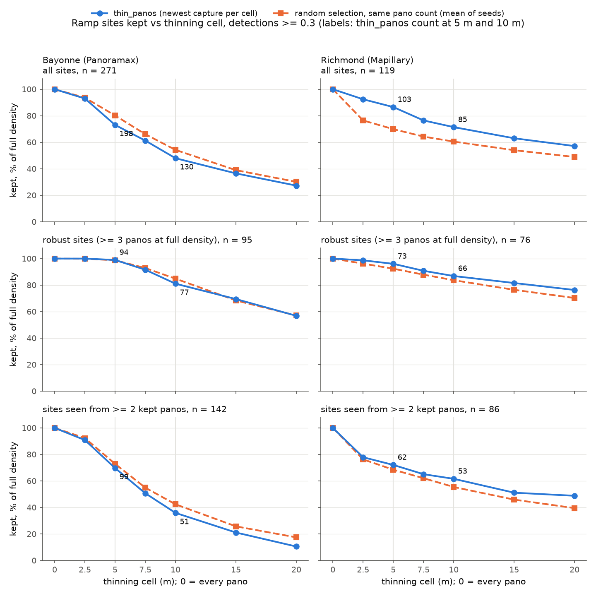
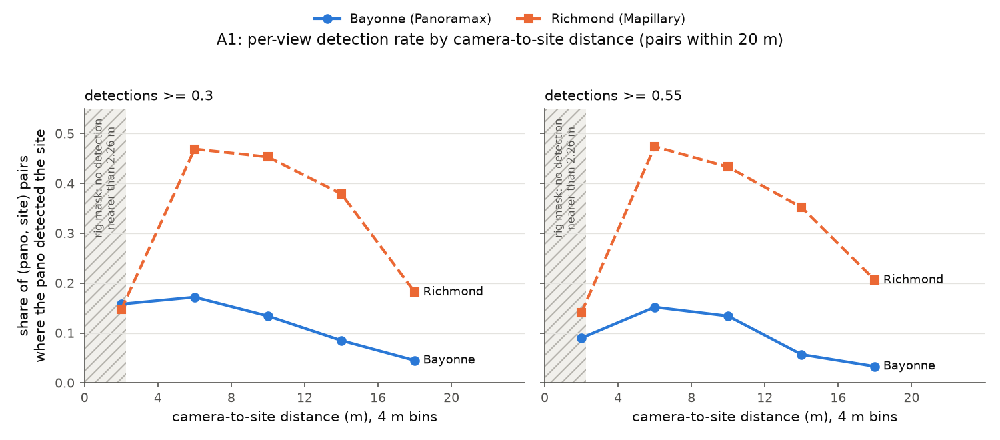

# Thinning spacing for open imagery: 5 m or 10 m?

**Question.** Mapillary and Panoramax coverage is much denser than GSV's ~10 m, so
`main.py` keeps one pano per grid cell (`thin_panos`: newest capture wins, quality /
pixel density breaks ties). The cell is `--thin-spacing`, default 5 m
(`THIN_CELL_METERS`). Bayonne ran at 10 m, chosen only for runtime
([docs/panoramax-bayonne.md](panoramax-bayonne.md), "Thinning decision"). Its sites end up
with a median of 3 views and 2 sequences, against Richmond's 7 and 4 at 5 m. Should the
default for these sources be 5 m or 10 m?

The 5 m default rested on three assumptions nobody had tested. `scripts/thinning_experiment.py`
tests them:

- **A1.** Detection is more reliable the closer the camera is to the ramp.
- **A2.** Denser sampling finds more distinct ramps, with diminishing returns.
- **A3.** `thin_panos`' newest-capture selection loses no more ramps than a random selection
  of the same size.

**Nothing in production changes here.** `THIN_CELL_METERS` stays 5 m for both sources.

> **Key takeaways**
>
> 1. **10 m loses well-seen ramp sites that 5 m keeps, in both cities.** A well-seen
>    ("robust") site is one detected from at least 3 panos at full density. Of those,
>    5 m keeps 95-99% and 10 m keeps 81-93%: 10-18 points lower in Bayonne, 3-9 in
>    Richmond. Over *all* sites the gap is wider:
>    Bayonne 74% vs 49% at 0.55, Richmond 82% vs 71%. "Robust" is a weaker bar on
>    Mapillary, where 3 panos at full density can be near-duplicates ~1.5 m apart, so the
>    Panoramax-vs-Mapillary size of that gap is approximate (see [Caveats](#caveats)).
> 2. **5 m costs 1.6x (Richmond, Mapillary) to 2.0x (Bayonne, Panoramax) the GPU time of
>    10 m.** Over the whole Bayonne commune the scan gives 1.76x (50,528 vs 28,634 panos).
> 3. **Below 5 m there is almost nothing left to gain.** 2.5 m adds at most 2 robust sites
>    per area, for 1.3-1.4x the cost of 5 m.
> 4. **Multi-view support drops sharply at 10 m.** Sites still seen from 2 or more kept
>    panos (what fusion needs) fall by about half in Bayonne (38 -> 21 at 0.55, 99 -> 51
>    at 0.30) and by 15-20% in Richmond (51 -> 41, 62 -> 53).
> 5. **A1 holds past ~8 m, not below it.** The per-pano detection rate peaks at 4-8 m and
>    falls 2-5x by 16-20 m. The 0-4 m bin is *lower* than 4-8 m.
> 6. **A3 splits by source.** At 5 and 10 m, `thin_panos` keeps 10-20 more sites than a
>    random same-size selection in Richmond (at 7.5, 15 and 20 m: 6-9 more at 0.55, 10-15
>    at 0.30). In Bayonne it keeps 5-19 *fewer* at 5 and 10 m. On robust sites the two are
>    within a few sites of each other in both cities, so the Bayonne deficit is mostly in
>    sites seen from one or two panos. Not entirely: at 0.30 and 10 m, `thin_panos` also
>    trails random by 3.6 robust sites (77 vs 80.6) and by 9.2 sites seen from 2+ panos
>    (51 vs 60.2).
>
> **Recommendation: keep 5 m as the default for both sources.** Use 10 m only as a stated
> budget fallback, as Bayonne did. Confidence is moderate: the direction is the same in
> both cities and both tiers, but each city is one sub-area of 115-271 model-derived sites,
> with no ground truth inside it.

## Protocol

1. Pick a compact sub-area in each city: a few hundred metres of mixed street grid with
   intersections, not a single road. Save it as a bare-geometry geojson.
2. Run detection **un-thinned** (`--thin-spacing 0`) over each area. This is the only GPU
   step.
3. `scripts/thinning_experiment.py <run>` then works offline from the run's own `scan.json`
   (the pre-thinning pano list with the attributes `thin_panos` selects on):
   - Every stored detection at or above the tier, and off the camera rig
     (`detectors.on_camera_rig`), is raycast to the ground with `geo.detection_ground_point`
     (flat ground, 2.6 m camera height, no pose; rays beyond 25 m are dropped).
   - Ground points are clustered greedily within 7.5 m into **ramp sites**, an
     approximation of PS label clustering.
   - For each spacing, it applies the source's own `thin_panos` to the scan and counts:
     - sites retained (at least one member pano kept);
     - robust sites retained (at least 3 member panos at full density; on Mapillary those
       can be near-duplicates from one pass, see [Caveats](#caveats));
     - sites still seen from 2 or more kept panos.
   - Each count is also taken for a random same-size selection (mean of 20 seeds), which
     is the A3 test.
   - A1: for every (pano, site) pair within 20 m, the share of pairs where the pano
     contributed a detection to the site, binned by camera-to-site distance.
4. It scores both tiers: 0.55 (the benchmark tier, the script's default) and 0.30 (the
   operational tier production ships at).

The script was written for Mapillary. This PR makes it work for any source with a
`thin_panos` hook (Mapillary, Panoramax), and changes four other things:

- It reads `scan.json` instead of rescanning. Coverage churns, and the run's own scan is
  exactly the list it processed.
- It replaces its private raycast, which **clamped** far rays to 30 m and so created
  sites at that fake range, with `geo.detection_ground_point`.
- It applies the rig mask.
- It adds the robust and 2-or-more-view columns, a per-site `sites.csv`, and fractional
  spacings.

## Areas

| | Bayonne (Panoramax) | Richmond (Mapillary) |
|---|---|---|
| geojson | `example_geojson/bayonne_thinexp.geojson` | `example_geojson/richmond_thinexp.geojson` |
| extent | ~800 m x 500 m of central Bayonne (43.4854-43.4900 N, 1.4760-1.4660 W) | ~400 m x 400 m of the downtown grid (37.5422-37.5458 N, 77.4362-77.4317 W) |
| raw panos (scan) | 3,880, all processed, 0 failed | 1,320, all processed, 0 failed |
| capture vintages | 2022-2026 (23 months; 43% from 2026) | 2024 (1,068) and 2025 (252), 52 sequences |
| ramp sites, 0.55 / 0.30 | 115 / 271 | 94 / 119 |
| robust sites, 0.55 / 0.30 | 40 / 95 | 57 / 76 |
| local rate (RTX 3070, batch 1, GPU shared) | 0.68 panos/s | 0.65 panos/s |

Bayonne was first run over the south-east quarter of this box alone (1,181 panos). That
area held only 14 sites at 0.55, too few to read, so the run was redone over the larger
box above. The first run is not committed and contributes no number here.

The two sources thin very differently:

- **Mapillary** is near-duplicate-heavy. 2.5 m already drops Richmond from 1,320 panos to
  487, and 5 m keeps 27%, matching the full Richmond run (35k -> 9k).
- **Panoramax** pictures are already spaced. 5 m keeps 63% and 10 m keeps 32% (39% over
  the whole commune).

So "the same spacing" is a 1.6x cost step between 5 m and 10 m on Mapillary, and a 2.0x
step on Panoramax.

## Results

`gpu_hours` uses main.py's 1.5 s/pano planning rate. Only the ratios matter. Percentages
are of the area's own total, at spacing 0.

### Bayonne (Panoramax)

| spacing | panos | GPU-h | sites 0.55 | robust 0.55 | 2+ views 0.55 | sites 0.30 | robust 0.30 | 2+ views 0.30 |
|---|---|---|---|---|---|---|---|---|
| all | 3,880 | 1.62 | 115 | 40 | 56 | 271 | 95 | 142 |
| 2.5 m | 3,392 | 1.41 | 105 (91%) | 40 (100%) | 51 | 252 (93%) | 95 (100%) | 129 |
| **5 m** | 2,455 | 1.02 | **85 (74%)** | **38 (95%)** | 38 | **198 (73%)** | **94 (99%)** | 99 |
| 7.5 m | 1,708 | 0.71 | 68 (59%) | 36 (90%) | 27 | 166 (61%) | 87 (92%) | 72 |
| **10 m** | 1,238 | 0.52 | **56 (49%)** | **34 (85%)** | 21 | **130 (48%)** | **77 (81%)** | 51 |
| 15 m | 751 | 0.31 | 42 (37%) | 30 (75%) | 13 | 99 (37%) | 66 (69%) | 30 |
| 20 m | 514 | 0.21 | 28 (24%) | 21 (53%) | 3 | 74 (27%) | 54 (57%) | 15 |

### Richmond (Mapillary)

| spacing | panos | GPU-h | sites 0.55 | robust 0.55 | 2+ views 0.55 | sites 0.30 | robust 0.30 | 2+ views 0.30 |
|---|---|---|---|---|---|---|---|---|
| all | 1,320 | 0.55 | 94 | 57 | 69 | 119 | 76 | 86 |
| 2.5 m | 487 | 0.20 | 84 (89%) | 56 (98%) | 54 | 110 (92%) | 75 (99%) | 67 |
| **5 m** | 363 | 0.15 | **77 (82%)** | **55 (96%)** | 51 | **103 (87%)** | **73 (96%)** | 62 |
| 7.5 m | 284 | 0.12 | 69 (73%) | 52 (91%) | 48 | 91 (76%) | 69 (91%) | 56 |
| **10 m** | 230 | 0.10 | **67 (71%)** | **53 (93%)** | 41 | **85 (71%)** | **66 (87%)** | 53 |
| 15 m | 169 | 0.07 | 56 (60%) | 47 (82%) | 35 | 75 (63%) | 62 (82%) | 44 |
| 20 m | 131 | 0.05 | 53 (56%) | 46 (81%) | 32 | 68 (57%) | 58 (76%) | 42 |

### Coverage against spacing, as figures

Each panel is a share of that row's full-density count (n in the panel title). Solid
blue circles are `thin_panos`; dashed orange squares are the random same-count mean. The
numbers beside the 5 m and 10 m points are the `thin_panos` counts.

The same at the 0.55 benchmark tier:
[coverage_vs_spacing_t0.55.png](figures/thinning-experiment/coverage_vs_spacing_t0.55.png)
(SVG beside each PNG).

### 5 m against 10 m

| | Bayonne 0.55 | Bayonne 0.30 | Richmond 0.55 | Richmond 0.30 |
|---|---|---|---|---|
| cost, 5 m / 10 m panos | 1.98x | 1.98x | 1.58x | 1.58x |
| sites gained by 5 m | +29 (+52%) | +68 (+52%) | +10 (+15%) | +18 (+21%) |
| robust sites gained by 5 m | +4 | +17 | +2 | +7 |
| 2+ view sites gained by 5 m | +17 | +48 | +10 | +9 |

**What the sites lost at 10 m look like** (`sites.csv`). Their median is **one** member pano
at full density, against 3-15 for the sites 10 m keeps. In Bayonne their highest member
confidence is lower (median 0.67 vs 0.79 at 0.55, 0.44 vs 0.62 at 0.30). In Richmond it
is not (0.88 vs 0.93 at 0.55). So most of what 10 m gives up is one-view sites, the kind
most likely to be false positives. But not all of it:

- Richmond 0.55 loses 10 sites at 10 m that 5 m keeps. Their seed confidences run from
  0.60 to 0.95, and two were seen from 5-6 panos.
- Richmond 0.30 loses one site of 24 panos and one of 63 at 10 m. A site that large can
  only vanish if a newer pano won every cell its members fell in, so these were
  plausibly seen in one vintage only (not checked pano by pano).

### A1: detection rate by camera-to-site distance

Each cell is the share of (pano, site) pairs within 20 m where the pano contributed a
detection.

| distance | Bayonne 0.55 | Bayonne 0.30 | Richmond 0.55 | Richmond 0.30 |
|---|---|---|---|---|
| 0-4 m | 0.090 | 0.158 | 0.141 | 0.147 |
| 4-8 m | **0.152** | **0.172** | **0.474** | **0.469** |
| 8-12 m | 0.134 | 0.134 | 0.433 | 0.453 |
| 12-16 m | 0.057 | 0.085 | 0.352 | 0.379 |
| 16-20 m | 0.033 | 0.045 | 0.206 | 0.182 |

(Points sit at the centre of each 4 m bin; the hatched band is the rig mask, below.)

Proximity helps past ~8 m: the rate falls 2.3-2.6x by 16-20 m in Richmond and 3.8-4.6x
in Bayonne. Under 4 m it drops again. A
ramp almost under the camera sits steep in the frame, near the masked rig band, and its
site centroid is placed by other, farther views. Part of that dip is structural: the rig
mask drops every detection more than 49° below the horizon (`NADIR_MASK_DEG`), which at
the 2.6 m raycast height is any ground point nearer than 2.6 / tan 49° = 2.26 m. So a
pano can detect a site in the 0-4 m bin only in the bin's outer part.

The per-view rate is lower in Bayonne than in Richmond, by an amount that depends on
distance (`distance_bins.csv`, Richmond / Bayonne):

| distance | 0.55 | 0.30 |
|---|---|---|
| 0-4 m | 0.141 / 0.090 = 1.6x | 0.147 / 0.158 = 0.9x (Bayonne higher) |
| 4-8 m | 0.474 / 0.152 = 3.1x | 0.469 / 0.172 = 2.7x |
| 8-12 m | 0.433 / 0.134 = 3.2x | 0.453 / 0.134 = 3.4x |
| 12-16 m | 0.352 / 0.057 = 6.2x | 0.379 / 0.085 = 4.5x |
| 16-20 m | 0.206 / 0.033 = 6.2x | 0.182 / 0.045 = 4.0x |

So Bayonne is ~3x lower at 4-12 m and 4-6x lower beyond 12 m. At 0-4 m the gap is small,
and at 0.30 Bayonne is higher. This is the low Panoramax detection rate already
noted in [docs/panoramax-bayonne.md](panoramax-bayonne.md). When each view fires that
rarely, extra views are extra chances, which is why Bayonne gains more from 5 m.

### A3: newest-capture selection against random

| sites retained, thin_panos minus random mean | Bayonne 0.55 | Bayonne 0.30 | Richmond 0.55 | Richmond 0.30 |
|---|---|---|---|---|
| 5 m | -4.8 | -19.3 | +11.5 | +19.8 |
| 10 m | -5.5 | -17.0 | +10.2 | +13.0 |
| robust, 5 m | -1.6 | +0.2 | +1.8 | +2.8 |
| robust, 10 m | +0.5 | -3.6 | +4.2 | +2.4 |

- **Richmond.** The grid wins because a random draw over near-duplicates clumps: it keeps
  several panos 1.5 m apart and leaves gaps.
- **Bayonne.** The pictures are already spaced, so clumping costs random little. Random
  also keeps a mix of five vintages, while newest-wins keeps mostly 2026 (685 of 1,238 at
  10 m, against 1,652 of 3,880 in the scan; `vintages.csv`). A ramp missed in one vintage gets another chance in a different one, so the
  vintage mix plausibly explains why random does better here.
- **Robust sites:** the two selections are within a few sites of each other in both
  cities. The largest Bayonne gap is at 0.30 and 10 m: `thin_panos` keeps 77 robust sites
  against random's 80.6, and 51 sites seen from 2+ panos against 60.2. So the Bayonne
  deficit is mostly, not entirely, in one- and two-view sites.

Read this as a hypothesis, not a finding: a vintage-diverse selection might help a
low-recall source, but this experiment cannot tell those extra one-view sites apart from
false positives.

## Recommendation

**Keep `--thin-spacing 5` as the default for Mapillary and Panoramax.**

- On the sites that are most likely real, 10 m keeps 81-93%, while 5 m keeps 95-99% of
  what processing everything finds. The gap is 10-18 points on Panoramax and 3-9 on
  Mapillary (a cross-source contrast that carries the robust-site caveat below).
- 10 m roughly halves the Panoramax sites that fusion can see twice, and cuts
  Mapillary's by 15-20%.
- The cost of 5 m is linear and known: 1.6-2.0x the GPU time of 10 m. For a whole city
  that is hours on one GPU (Bayonne: ~11.8 h at 5 m against the 6.7 h it took at 10 m on
  the A40), not a blocker.
- 2.5 m is not worth it: at most 2 more robust sites per area, for 1.3-1.4x the cost of
  5 m.

10 m stays a legitimate, stated fallback when a city's estimate exceeds the budget, as
Bayonne's rule did. Expect it to cost 10-18% of the well-seen ramps on Panoramax and
less on Mapillary.

### Caveats

Reasons this is moderate confidence, not high:

- **The sites are model-derived.** This measures detection coverage, not recall, and
  says nothing about precision. The sites 5 m adds over 10 m are mostly seen from one
  pano. In Bayonne they are lower-confidence, and the French-kerb labelling question from
  the Bayonne doc applies to them. Neither box has ground truth: Richmond's RampNet
  benchmark has 4 judged panos inside the box, and Bayonne has no bundle yet.
- **"Robust" is a weaker bar on Mapillary.** A robust site has 3 or more member panos
  at full density. Mapillary coverage runs ~1 pano per 1.5 m of street, so those can be
  three near-duplicates from one pass, a few metres apart; Panoramax pictures are already
  spaced, so 3 members there are more independent looks. The within-city 5-vs-10 m
  comparison is unaffected (the same sites are scored at every spacing). The cross-source
  contrast, 10-18 points lost on Panoramax against 3-9 on Mapillary, compares robust sets
  of different strength: read its direction, not its size.
- **Each city is one sub-area.** There are 40-95 robust sites per city and tier, so a
  difference of a few sites is noise. The 5-vs-10 m direction holds in all four
  city x tier cells. The magnitudes are not precise.
- **Vintage confound.** The un-thinned denominator pools every capture year, and thinning
  keeps the newest. Part of what any spacing "loses" is ramps visible only in older
  imagery, which may be gone, or may have been missed in the newer imagery. Both 5 m and
  10 m carry this; the comparison between them does not depend on it.
- **Placement is approximate.** Sites use a flat-ground 2.6 m raycast with no pose and
  7.5 m greedy clustering, so site counts move with the radius. The Richmond position
  check flags 1 of its sequences for SfM drift (`position_check.json`), which can split
  that sequence's detections off into sites of their own. This run is never submitted,
  so the flag only matters for placement here. The comparison across
  spacings uses the same sites throughout.

## Replication

Run from the repo root. Network is needed for the scan and imagery, and the GPU for
step 2. `MAPILLARY_ACCESS_TOKEN` must be in `.env` for Richmond.

| step | command | needs | time |
|---|---|---|---|
| 1 | `python main.py example_geojson/bayonne_thinexp.geojson --name thinexp_bayonne --source panoramax --thin-spacing 0 --scan-only` (same for `richmond_thinexp` / `thinexp_richmond` / `--source mapillary`) | net | < 1 min |
| 2 | `python main.py example_geojson/bayonne_thinexp.geojson --name thinexp_bayonne --source panoramax --thin-spacing 0 --reuse-scan --batch-size 1` and `python main.py example_geojson/richmond_thinexp.geojson --name thinexp_richmond --source mapillary --thin-spacing 0 --reuse-scan --batch-size 1` | GPU + net | 95 min / 34 min (RTX 3070) |
| 3 | `python scripts/thinning_experiment.py runs/thinexp_bayonne` and `... --min-confidence 0.3` (same for `runs/thinexp_richmond`); also prints the capture-vintage mix per spacing and writes it to `vintages.csv` | scan.json + results.jsonl | ~1 min each |
| 4 | `python scripts/thinning_experiment.py figures` | the committed CSVs only (matplotlib) | seconds |

A re-run of step 1 sees today's coverage, which churns, so the counts can differ slightly.
The committed manifests record each run's scan time and pano counts.

**Where each number lives:**

| number | file | column |
|---|---|---|
| panos, GPU-h, sites / robust / 2+ views by spacing, random means (A2, A3) | `runs/thinexp_<city>/thinning_experiment[_t0.3]/spacing_curve.csv` (and `report.md`) | `panos_kept`, `gpu_hours`, `sites_retained`, `robust_retained`, `sites_2plus_views`, `*_random_mean` |
| A1 detection rate by distance | `.../distance_bins.csv` | `detection_rate`, `opportunities` |
| lost-site profile (members, confidence) | `.../sites.csv` | `member_panos`, `max_confidence`, `views_at_<s>m` (0 = lost at that spacing) |
| raw pano counts, run rate, thinning | `runs/thinexp_<city>/manifest.json` | run entry; `thin_spacing_m` = 0 |
| capture vintages, kept-set vintages (Bayonne: 23 capture months, 1,652 of 3,880 = 43% from 2026; 685 of 1,238 at 10 m; Richmond: 1,068 from 2024, 252 from 2025) | `.../vintages.csv` (step 3 derives it from the uncommitted `scan.json`; tier-independent, so the `_t0.3` copy is identical) | `spacing_m`, `capture_year` (`all` = the whole kept set), `panos`, `share_of_kept`, `capture_months` |
| Richmond's 52 sequences | distinct `source_metadata.sequence` in `runs/thinexp_richmond/results.jsonl` (not committed) | — |
| coverage-vs-spacing figures (0.30, 0.55) | `docs/figures/thinning-experiment/coverage_vs_spacing_t{0.3,0.55}.{png,svg}` | drawn from `spacing_curve.csv` by step 4 |
| A1 figure | `docs/figures/thinning-experiment/detection_rate_by_distance.{png,svg}` | drawn from `distance_bins.csv` by step 4; the 2.26 m mask band is `2.6 / tan(NADIR_MASK_DEG)` |
| Bayonne commune 5 m / 10 m counts, 6.7 h | [docs/panoramax-bayonne.md](panoramax-bayonne.md) | run table |

`results.jsonl`, `scan.json`, `osm_streets.json` and the logs stay local, as for every run.
The position check (`position_check.json` / `position_report.html`) is committed beside
each manifest, as usual. Richmond's Overpass query timed out at the end of step 2, so its
check was re-run by hand: `python scripts/position_check.py runs/thinexp_richmond --report`.
